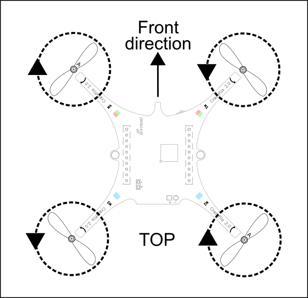

# 四轴飞行器基础知识

## 前言

由于MicroPython的高度封装，底层工程师花了大量时间来优化飞控核心控制模块，而我们顶层使用起来是非常方便的。甚至只关心飞行器的一些常规动作就好。我们认为结合一些四轴飞行器的基础知识，会让大家更好的理解其工作原理。

## 飞行器姿态

每一个飞行器（飞机、直升机、无人机等）都有其特定的姿态，以下图为例，通过构建X、Y、Z坐标。

我们让飞行器沿着这个坐标轴旋转，可以得出对应的Roll（沿X轴旋转）、Pictch（沿Y轴旋转），Yaw（沿Z轴旋转），利用这3个参数就可以表示出飞行器的所有实时姿态。如下图：

飞机在飞行过程中实时监测姿态，如果姿态偏离过大，可能导致坠毁。这些姿态信息通常会被记录在“黑匣子”，以便用于事故调查。

由于飞机没有直接向上的升力，因此起飞需要一个爬升过程，也就是我们看到为什么飞机场那么的大。

## 直升机飞行原理

接下来我们了解一下直升机，与飞机不同，直升机顶部有螺旋状，转动时候提供升力，可以让直升机原地起飞。

由于螺旋状转动，那么理论上会对机身产生反作用力，使得机身以相反方向旋转，那么为什么直升机可以保持机身不转动的，答案就是尾翼，尾翼通过转动产生作用力，保持了机身的稳定。

那么直升机是如何前后左右运动的呢？这里以前进为例，参考前面的坐标系，我们改变机身的俯仰角。将机身向下倾斜一点，那么螺旋转升力与重力的合力就会产生一个向前的力，使得直升机向前飞。其它运动方式原理也类似。

## 四轴飞行器原理

四轴的飞行原理与直升机较为接近，四轴有4个螺旋转，通常有A、B浆两类（对角线相同）。如下图为例，正上方为机头方向，左上角起逆时针依次为电机M1,M2,M3,M4。可以看到M1和M3逆时针旋转，M2和M4顺时针旋转，四轴就是通过自身4个电机的转动方向对称性来低消螺旋桨对机身的作用力。

当4个螺旋桨旋转提供的升力大于四轴飞行器的重力，四轴就表现为上升。

四轴飞行器内置姿态检测传感器（六轴传感器），用于实时监测其姿态，若姿态发生变化则通过控制4个电机实时调整。

四轴通过3个姿态值Roll（沿Y轴旋转）、Pictch（沿X轴旋转），Yaw（沿Z轴旋转）姿态变化和1个抬升/下降值可实现四轴的各种运动（这里X、Y轴与前面飞机坐标系不一样，它们是可以对换的，根据传感器坐标而定）。如前后运动（改变Pitch俯仰角），左右运动（改变Roll横滚角），自转（改变YAW偏航角）。

这些变化值通常由遥控器发送，四轴飞行器接收后处理并实现相关动作。下图是pyDrone的坐标系：

