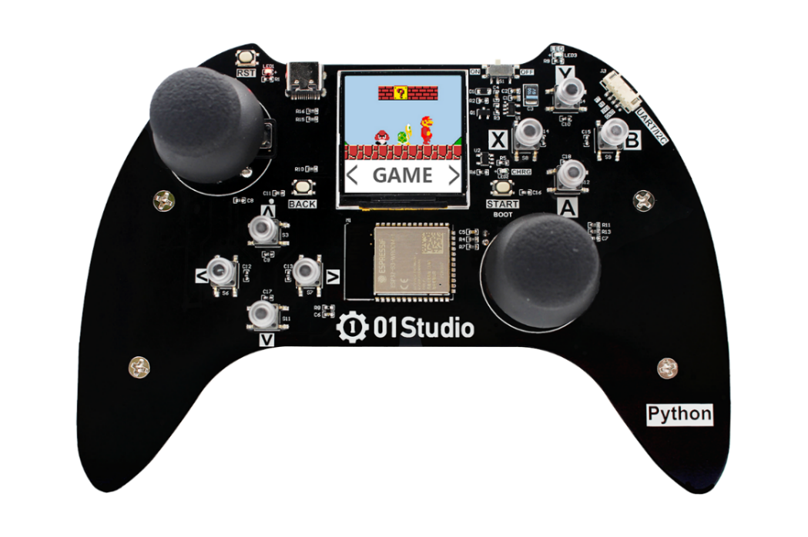
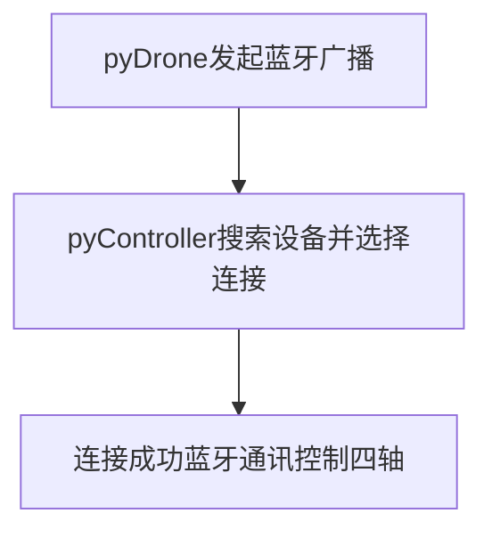
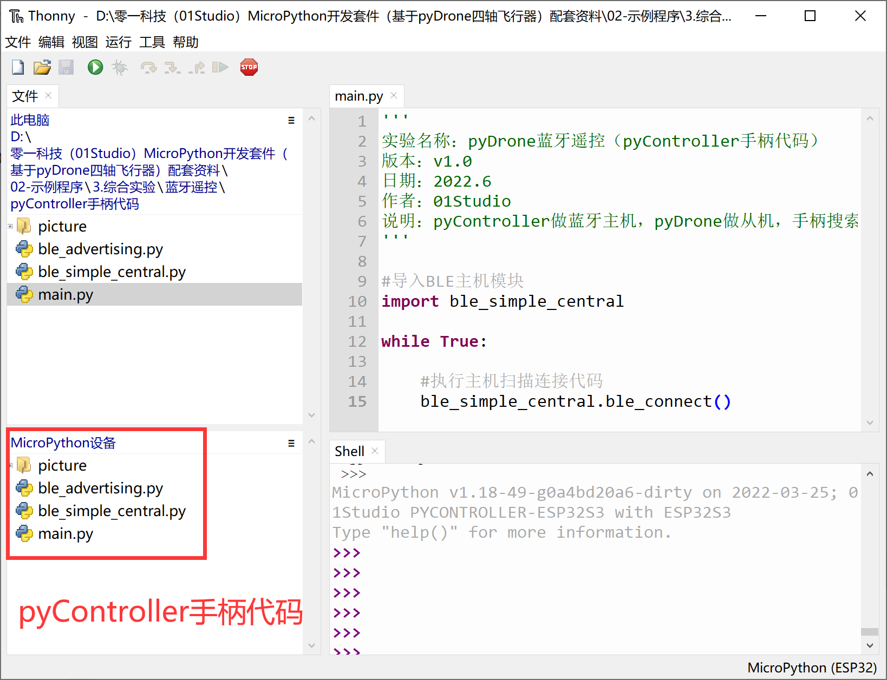
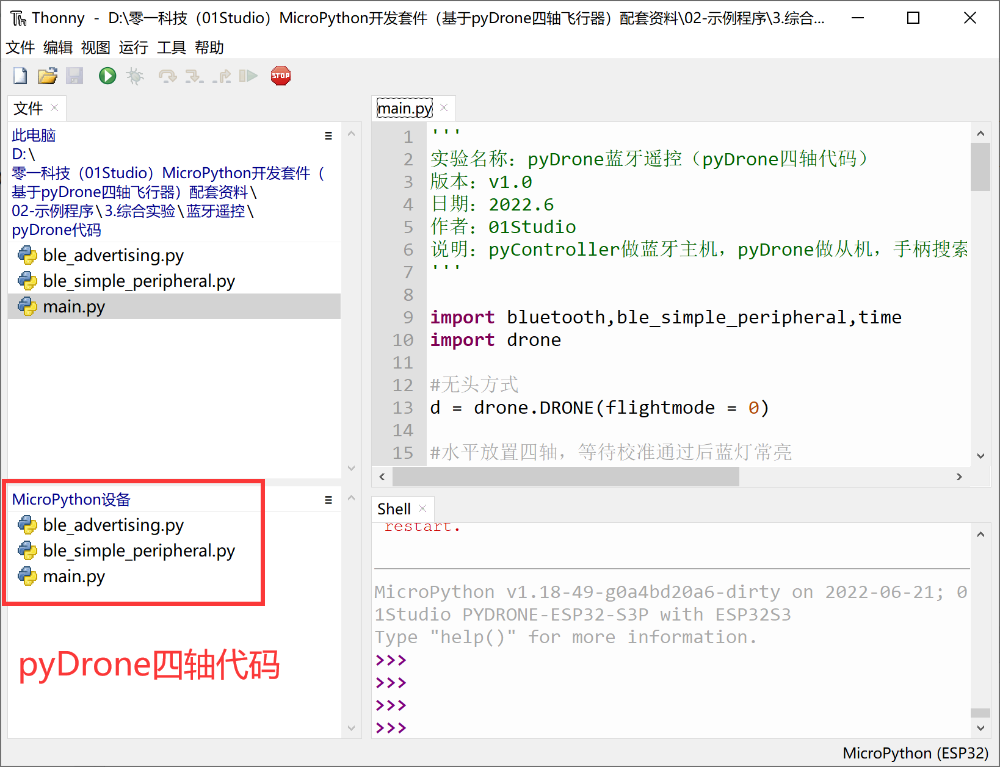
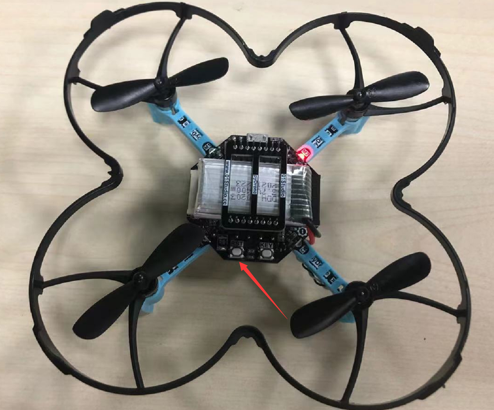
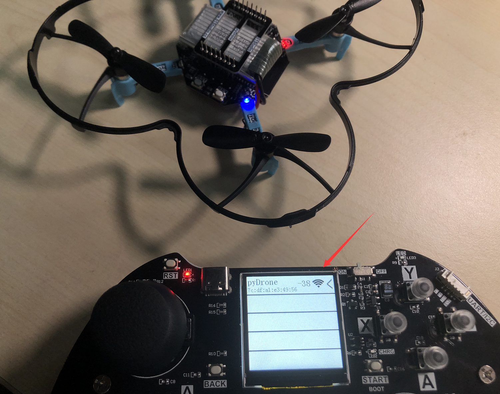
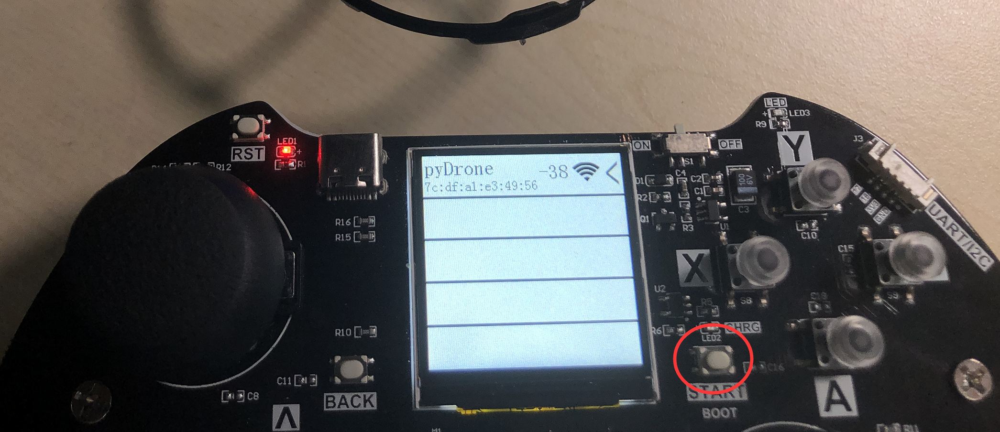
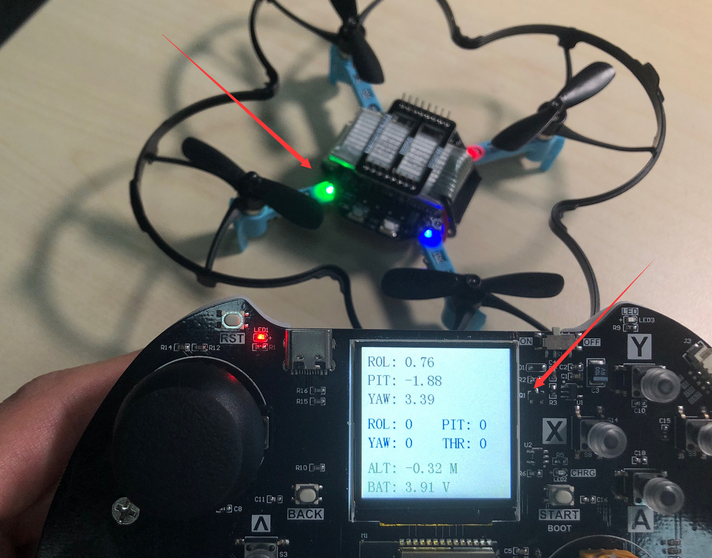
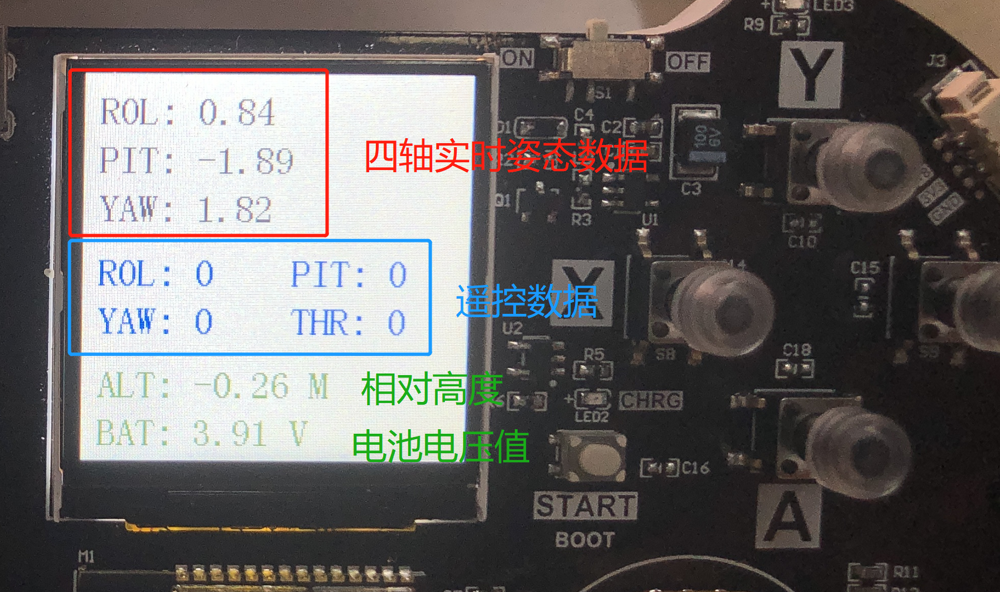
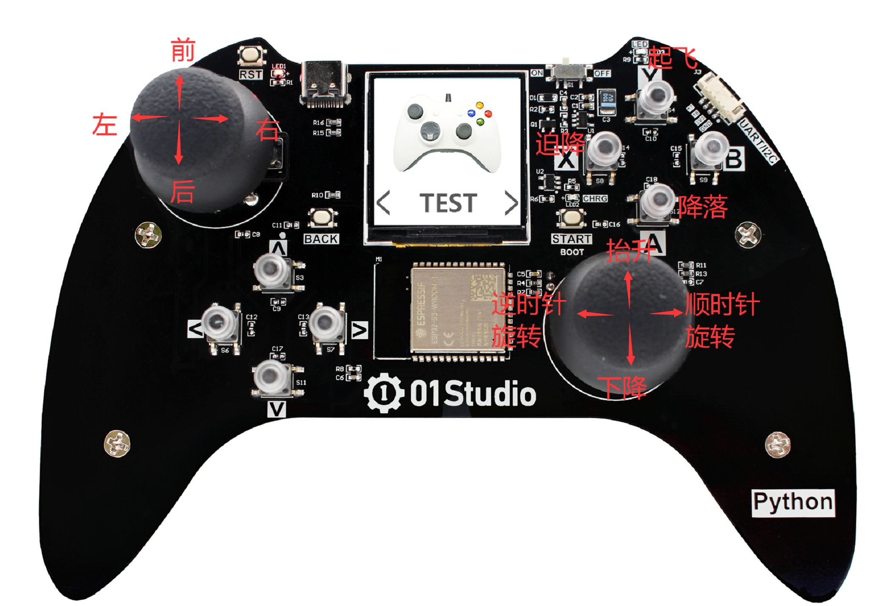

# 蓝牙控制

## 前言

在上一节学习了四轴飞行器的原理后，这一节我们便直接进入编程实现pyDrone控制。四轴离不开遥控器，这里使用pyController手柄为例（手柄的摇杆比手机更有触感，体验更好），通过手柄发出信号，pyDrone接收后进行相应动作的变化。

## 实验平台

pyDrone和pyController手柄。




## 实验目的 

编程实现手柄通过pyController手柄蓝牙（BLE）方式控制pyDrone。

## 实验讲解

关于01Studio pyController遥控/游戏手柄学习教程见：https://wiki.01studio.cc/docs/pycontroller

由于四轴飞行器对实时性要求非常高，因此核心部分在01Studio pyDrone固件底层实现，通过开放出micropython接口，让用户通过简单的python语句便可实现pyDrone四轴的各种控制。

我们先来看看pyDrone对象的构造函数和使用方法。

## DRONE对象

### 构造函数
```python
d = drone.DRONE(flightmode = 0)
```
构建pyDrone四轴对象。

- ``flightmode`` 飞行模式。

    - ``0`` - 无头模式。表示以周围环境为参照系，飞行的前后左右方向跟机身无关，通常用于室内飞行 (默认模式)；
    - ``1`` - 有头模式。表示以四轴机身为参照系，飞行的前后左右方向跟机身有关。四轴自转后保持机头方向为正前方，通常用于室外飞行。

### 使用方法
```python
d.read_cal_data()
```
获取校准数据。返回3个融合的X/Y/Z校准数据值，当3个值均少于5000时候，校准通过。

<br></br>

```python
d.read_calibrated()
```
获取校准状态。校准通过返回1，不通过返回0。**对象构建后自动开始校准，请尽量将四轴水平放置以便提高校准速度。校准时间通常在启动后10秒内完成。**

<br></br>

```python
d.take_off(distance = 80)
```
起飞。

- ``distance`` 起飞后悬停高度，默认80cm。可以设置范围 30-2000cm：

<br></br>

```python
d.landing()
```
降落。四轴飞行器缓慢降落，这时候依然可以控制前后左右方向，降到地面后电机停止转动。

<br></br>

```python
d.stop()
```
停止。所有电机立刻停止转动，用于突发情况迫降。

<br></br>

```python
d.control(rol = 0, pit = 0, yaw = 0, thr = 0)
```
四轴飞行器姿态控制:

- ``rol`` Roll横滚角，控制四轴左右运动。范围: -100 ~ 100 ，“-”表示左，正表示右，绝对值越大，角度/油门越大。
- ``pit`` Pitch俯仰角，控制四轴前后运动。范围: -100 ~ 100 ，“-”表示后，正表示前，绝对值越大，角度/油门越大。
- ``yaw`` Yaw偏航角，控制四轴自转运动。范围: -100 ~ 100 ，“-”表示逆时针自转，正表示顺时针自转，绝对值越大，角度/油门越大。
- ``thr`` Thrust推力，控制四轴上下运动。范围: -100 ~ 100 ，“-”表示下降，正表示抬升，绝对值越大，油门越大。

<br></br>

```python
d.read_states()
```
读取四轴飞行器状态信息。返回9个数据的元组。

1、	roll值，范围[-18000 ~ 18000 ] ，角度放大100倍。

2、	pitch值，范围[-18000 ~ 18000 ] ，角度放大100倍。

3、	yaw值，范围[-18000 ~ 18000 ] ，角度放大100倍。

4、	遥控器 roll 控制量，范围[-1000 ~ 1000 ]   

5、	遥控器 pitch控制量，范围[-1000 ~ 1000 ]  

6、	遥控器 yaw 控制量，范围[-200 ~ 200 ]   

7、	遥控器 Thrust控制量，范围[0 ~ 100 ] ,百分比，摇杆回中时候约为50，即50%。

8、	电池电量,单位10mV。 

9、	相对高度，单位cm（与校准时候的相对高度）。    


<br></br>

ESP32-S3固件集成了BLE库，支持低功耗蓝牙（BLE）主从机功能。关于BLE的应用细节不会在本节内容展开，这里我们只需要搞清楚主机(central)和从机（peripheral）的概念区别即可，蓝牙设备在连接过程如下：

**从机发起广播 –> 主机搜索广播的设备 –> 发起连接 –> 连接成功后通讯**

一般来说子设备通常作为从机，控制设备作为主机，比如我有一个蓝牙耳机（从机），开机后发起广播，而手机（主机）在搜索，搜索到这个蓝牙耳机后就发起连接，连接成功后相互通讯。

本节中，我们将四轴设定从机，上电后发出广播，广播名称设为“pyDrone”，然后pyController手柄作为主机，上电后不断搜索周围的四轴设备，搜索后发起连接，连接成功后将手柄摇杆和按键原始数据发送给pyDrone，pyDrone接收到数据后执行各种飞行动作。

结合上述讲解，总结出代码编写流程图如下：



## 参考代码

### pyDrone（四轴从机）代码

- `main.py`代码

```python
'''
实验名称：pyDrone蓝牙遥控（pyDrone四轴代码）
版本：v1.0
日期：2022.6
作者：01Studio
说明：pyController做蓝牙主机，pyDrone做从机，手柄搜索到'pyDrone'后发起连接，然后控制。
'''

import bluetooth,ble_simple_peripheral,time
import drone

#无头方式
d = drone.DRONE(flightmode = 0,debug =1)

#水平放置四轴，等待校准通过后蓝灯常亮
while True:
    
    #打印校准信息，当返回3个值均少于5000时校准通过。
    print(d.read_cal_data())
    
    #校准通过
    if d.read_calibrated():
        
        print(d.read_cal_data())
        
        break
    
    time.sleep_ms(100)

#初始化蓝牙BLE从机,广播名称为pyCar
ble = bluetooth.BLE()
p = ble_simple_peripheral.BLESimplePeripheral(ble,name='pyDrone')

#接收到蓝牙数据处理函数
def on_rx(text):
    
    control_data = [None]*4
    
    #接收的蓝牙数据
    #print("RX:", text)
    
    #对收到的手柄8字节数据进行判断
    for i in range(len(text)):
        print(i,text[i])
        
    #将摇杆值转化为飞控控制值。
    for i in range(4):
        if  100 < text[i+1] < 155 :
            control_data[i] = 0
            
        elif text[i+1] <= 100 :      
            control_data[i] = text[i+1] - 100
            
        else:
            control_data[i] = text[i+1] - 155
    
    print('control:',control_data)
            
    #rol:[-100:100],rol:[-100:100],yaw:[-100:100],thr:[-100:100]
    d.control(rol = control_data[0], pit = control_data[1], yaw = control_data[2], thr = control_data[3])

    
    #检测X/Y/A/B按键
    if text[5] == 24: #Y键按下
        print('Y')
        #起飞，起飞后120cm位置悬停。distance范围:30~2000 cm
        d.take_off(distance = 120)
        
    if text[5] == 72: #A键按下
        print('A')
        #降落，允许control
        d.landing()

    if text[5] == 40: #B键按下，可以自己添加功能。
        print('B')
        
    if text[5] == 136: #X键按下,紧急停止
        print('X')
        #降落，不允许control
        d.stop()
        
    
    states = d.read_states()
    print('states: ',states)
    state_buf = [None]*18
    for i in range(9):
        for j in range(2):
            if j == 0:
                state_buf[i*2+j] = int((states[i]+32768)/256)
            else:
                state_buf[i*2+j] = int((states[i]+32768)%256)
                
    p.send(bytes(state_buf)) #蓝牙回传数据
    

#注册从机接收回调函数，收到数据会进入on_rx函数。
p.on_write(on_rx)

#系统会自动广播, 连接断开后重新自动广播。
# while True:
#     
#     time.sleep_ms(200)
```

### pyController遥控手柄（蓝牙主机）代码

- `main.py`代码

```python
'''
实验名称：pyDrone蓝牙遥控（pyController手柄代码）
版本：v1.0
日期：2022.6
作者：01Studio
说明：pyController做蓝牙主机，pyDrone做从机，手柄搜索到'pyDrone'后发起连接，然后控制。
'''

#导入BLE主机模块
import ble_simple_central

while True:
    
    #执行主机扫描连接代码
    ble_simple_central.ble_connect()
```

- `ble_simple_central.py`关键代码：

```python

...

#扫描连接函数
def ble_connect():
    
    ble = bluetooth.BLE()
    central = BLESimpleCentral(ble)

    not_found = False
    
    def on_scan(addr_type, addr, name):
        if addr_type is not None:
            print("Found peripheral:", addr_type, addr, name)
            central.connect()
        else:
            global not_found
            not_found = True
            print("No peripheral found.")

    central.scan(callback=on_scan)

    # Wait for connection...
    while not central.is_connected():
        time.sleep_ms(100)
        if not_found:
            break

    print("Connected")

    
    #接收信息处理
    def on_rx(v):
        
        #print("RX", len(v))
        state_buf = [None]*9
        
        #解码接收到的9个数据
        for i in range(9):
                
                state_buf[i] = v[i*2]*256+v[i*2+1] - 32768
                
        print(state_buf)
        
        #飞控姿态 ROL、PIT、YAW数据显示。
        l.printStr('ROL: '+str('%.2f'%(state_buf[0]/100))+'  ',10,10,color=BLACK,size=2)
        l.printStr('PIT: '+str('%.2f'%(state_buf[1]/100))+'  ',10,40,color=BLACK,size=2)
        l.printStr('YAW: '+str('%.2f'%(state_buf[2]/100))+'  ',10,70,color=BLACK,size=2)

        #遥控器控制量显示 ROL、PIT、YAW、THRUST
        l.printStr('ROL: '+str(int(state_buf[3]/10))+'   ',10,110,color=BLUE,size=2)
        l.printStr('PIT: '+str(int(state_buf[4]/10))+'   ',130,110,color=BLUE,size=2)
        l.printStr('YAW: '+str(int(state_buf[5]/200))+'   ',10,140,color=BLUE,size=2)
        l.printStr('THR: '+str(state_buf[6]*2-100)+'   ',130,140,color=BLUE,size=2)

        #四轴相对高度
        l.printStr('ALT: ' + str('%.2f'%(state_buf[8]/100))+' M   ',10,180,color=DEEPGREEN,size=2)
        
        #电池电量显示，低于3.1V表示低电量，红色字体显示。
        if state_buf[7] > 310 :
            l.printStr('BAT: '+str('%.2f'%(state_buf[7]/100))+' V      ',10,210,color=DEEPGREEN,size=2)
            
        else: #低电量
            l.printStr('BAT: '+str('%.2f'%(state_buf[7]/100))+' V (LOW)',10,210,color=RED,size=2)

    central.on_notify(on_rx)

    with_response = False

    while central.is_connected():

        try:
            a = gamepad.read() #读取手柄数据
            #print("TX", a) #打印手柄原始数据
            central.write(bytes(a), with_response) #发送手柄数据
        except:
            print("TX failed")
        time.sleep_ms(400 if with_response else 50) #50ms发送一次
        
    print("Disconnected")

...

```

## 实验结果

将**示例程序--综合实验--蓝牙遥控**的所有库代码文件分别发送到pyController和pyDrone。





给四轴接上电池，水平放置**（务必水平放置，否则校准不通过）**，然后按一下复位键。



等待校准，通常在10秒内可以完成校准。校准过程蓝灯闪亮，校准通过后蓝灯常亮。


然后启动手柄，可以看到搜索到pyDrone，信息包含mac地址和信号强度。（支持多台pyDrone同时搜索）。



信号强的范围是 0 ~ -99, 值越接近0表示信号越好。


如果搜索到多台，可以通过按手柄的上、下键来选择，长按START键即可连接pyDrone。



四轴的绿灯常亮表示成功连接，连接成功后手柄显示屏出现pyDrone发送的实时信息界面。



从上到下分别是四轴姿态数据、遥控器数据、相对高度、电池电压值（飞行时低于3.1V为低电量）。



这时候即可遥控四轴。手柄控制说明如下：



摄像头接口方向为机头方向。


- 先按“Y”键起飞，待抬升到一定高度后即可通过手柄进行各种飞行动作控制。需要降落时候按“A”键，四轴缓缓下降，这时候可以通过控制方向键将四轴降落到指定位置。

- 当四轴飞行器与地面夹角大于60°会判断为失控，电机立即停转。

- 遇到突发情况时候可以按下“X”键，电机会立即停止转动。

**总结：四轴飞行器对控制实时性要求非常高，通过micropython封装后使用变得非常简单易用。而且可完成各类飞行动作。使用蓝牙遥控的优势是低功耗，连接简单。**
