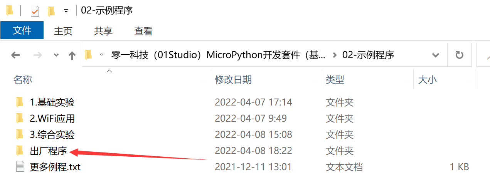
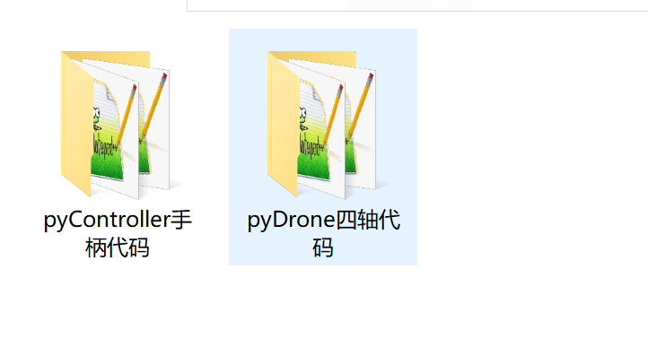

# 出厂例程

在资料包示例程序里面有一个出厂例程。

该例程包含pyDrone和pyController两部分代码。

其中pyDrone代码使用蓝牙方式遥控，跟本教程[蓝牙遥控](./ble_control.md)例程类似。

pyController则整合了NES游戏、pyCar遥控车、pyDrone四轴飞行器和手柄控制测试功能，并配有图例UI。

用户可以将出厂代码所有文件分别使用thonny ide上传到pyDrone和pyController即可实现出厂功能。这些功能实际上是将综合实验内容整合，用户可以自行研究相关代码。

