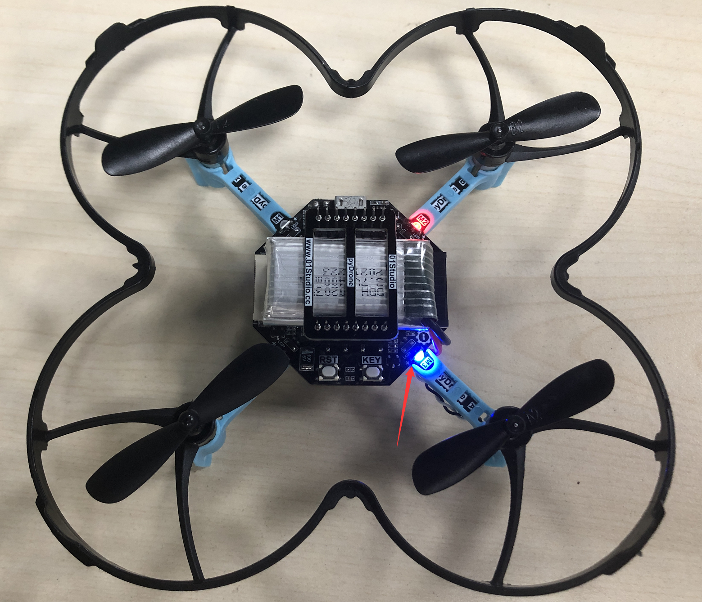
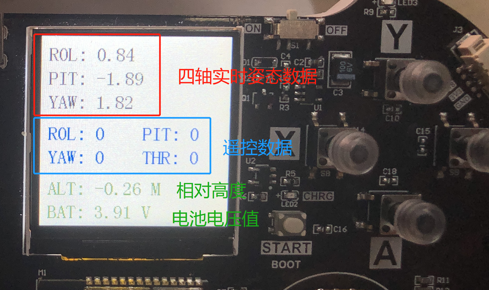
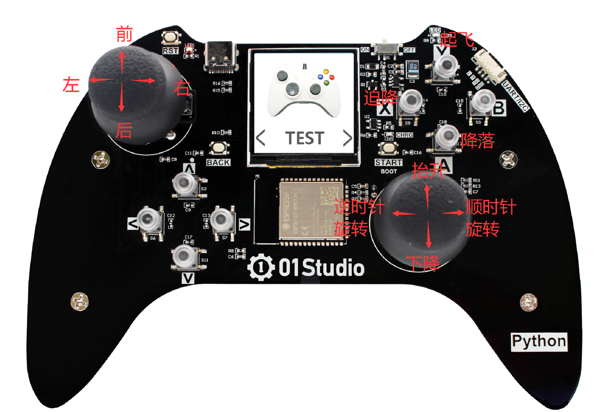

# WiFi控制

## 前言

上一节使用蓝牙方式遥控，优点是连接简单。但自带蓝牙的通讯距离会比较短。空旷地方实测最大50米。而使用WiFi方式，实测空旷最大控制距离为150米。本节我们就来学习使用WiFi方式控制pyDrone。

## 实验平台

pyDrone和pyController手柄。


## 实验目的 

编程实现手柄通过pyController手柄WiFi方式控制pyDrone。

## 实验讲解

关于01Studio pyController遥控/游戏手柄学习内容可以在下载站找到：
https://download.01studio.cc/zh_CN/latest/project/pyController/pyController.html

上一节我们已经学习过蓝牙遥控方式，WiFi方式也基本类似，只需要改变传输方式即可，传输内容和控制原理不变。

由于四轴飞行器对实时性要求非常高，因此核心部分在01Studio pyDrone固件底层实现，通过开放出micropython接口，让用户通过简单的python语句便可实现pyDrone四轴的各种控制。

我们先来看看pyDrone对象的构造函数和使用方法。

## DRONE对象

### 构造函数
```python
d = drone.DRONE(flightmode = 0)
```
构建pyDrone四轴对象。

- ``flightmode`` 飞行模式。

    - ``0`` - 无头模式。表示以周围环境为参照系，飞行的前后左右方向跟机身无关，通常用于室内飞行 (默认模式)；
    - ``1`` - 有头模式。表示以四轴机身为参照系，飞行的前后左右方向跟机身有关。四轴自转后保持机头方向为正前方，通常用于室外飞行。

### 使用方法
```python
d.read_cal_data()
```
获取校准数据。返回3个融合的X/Y/Z校准数据值，当3个值均少于5000时候，校准通过。

<br></br>

```python
d.read_calibrated()
```
获取校准状态。校准通过返回1，不通过返回0。**对象构建后自动开始校准，请尽量将四轴水平放置以便提高校准速度。校准时间通常在启动后10秒内完成。**

<br></br>

```python
d.take_off(distance = 80)
```
起飞。

- ``distance`` 起飞后悬停高度，默认80cm。可以设置范围 30-2000cm：

<br></br>

```python
d.landing()
```
降落。四轴飞行器缓慢降落，这时候依然可以控制前后左右方向，降到地面后电机停止转动。

<br></br>

```python
d.stop()
```
停止。所有电机立刻停止转动，用于突发情况迫降。

<br></br>

```python
d.control(rol = 0, pit = 0, yaw = 0, thr = 0)
```
四轴飞行器姿态控制:

- ``rol`` Roll横滚角，控制四轴左右运动。范围: -100 ~ 100 ，“-”表示左，正表示右，绝对值越大，角度/油门越大。
- ``pit`` Pitch俯仰角，控制四轴前后运动。范围: -100 ~ 100 ，“-”表示后，正表示前，绝对值越大，角度/油门越大。
- ``yaw`` Yaw偏航角，控制四轴自转运动。范围: -100 ~ 100 ，“-”表示逆时针自转，正表示顺时针自转，绝对值越大，角度/油门越大。
- ``thr`` Thrust推力，控制四轴上下运动。范围: -100 ~ 100 ，“-”表示下降，正表示抬升，绝对值越大，油门越大。

<br></br>

```python
d.read_states()
```
读取四轴飞行器状态信息。返回9个数据的元组。

1、	roll值，范围[-18000 ~ 18000 ] ，角度放大100倍。

2、	pitch值，范围[-18000 ~ 18000 ] ，角度放大100倍。

3、	yaw值，范围[-18000 ~ 18000 ] ，角度放大100倍。

4、	遥控器 roll 控制量，范围[-1000 ~ 1000 ]   

5、	遥控器 pitch控制量，范围[-1000 ~ 1000 ]  

6、	遥控器 yaw 控制量，范围[-200 ~ 200 ]   

7、	遥控器 Thrust控制量，范围[0 ~ 100 ] ,百分比，摇杆回中时候约为50，即50%。

8、	电池电量,单位10mV。 

9、	相对高度，单位cm（与校准时候的相对高度）。    


<br></br>

本实验通过WiFi控制四轴，使用[Socket通信](../network/socket.md)，使用UDP模式（提高控制实时性）。

ESP32-S3固件集成了WiFi库，我们将四轴设置为热点（AP），热点名称为设为“pyDrone”，无需密码连接。手柄为终端（STA），手柄上电后搜索四轴发出的wifi信号，连接并定时发送遥控数据，四轴收到后回传自身状态数据。：

结合上述讲解，总结出代码编写流程图如下：


## 参考代码

### pyDrone（AP）代码

```python
'''
实验名称：WiFi遥控四轴飞行器（pyDrone四轴代码）
版本：v1.0
日期：2022.6
作者：01Studio
说明：通过Socket UDP连接，周期接收手柄发来的控制信息，并回传自身姿态信息。
'''

#导入相关模块
import network,socket,time
from machine import Timer
import drone

#构建四轴对象，无头方式
d = drone.DRONE(flightmode = 0)

#水平放置四轴，等待校准通过后蓝灯常亮
while True:
    
    #打印校准信息，当返回3个值均少于5000时校准通过。
    print(d.read_cal_data())
    
    #校准通过
    if d.read_calibrated():
        
        print(d.read_cal_data())
        
        break
    
    time.sleep_ms(100)

#开启AP热点
def startAP():
    
    wlan_ap = network.WLAN(network.AP_IF)
    
    print('Connect pyDrone AP to Config WiFi.')

    #启动热点，名称为pyDrone，不加密。
    wlan_ap.active(True)
    wlan_ap.config(essid='pyDrone',authmode=0)

    while not wlan_ap.isconnected(): #等待AP接入
        
        pass

#启动AP
startAP()

#创建socket UDP接口。
s=socket.socket(socket.AF_INET, socket.SOCK_DGRAM)
s.bind(('0.0.0.0', 2390)) #本地IP：192.168.4.1;端口:2390

#等待设备Socket接入，获取对方IP地址和端口
data,addr = s.recvfrom(128)
print(addr)

#连接对方IP地址和端口
s.connect(addr)
s.setblocking(False) #非阻塞模式

#Socket接收数据
def Socket_fun(tim):
    
    try:
        text=s.recv(128) #单次最多接收128字节
        
        control_data = [None]*4
        
        #将摇杆值转化为飞控控制值。
        for i in range(4):
            if  100 < text[i+1] < 155 :
                control_data[i] = 0
                
            elif text[i+1] <= 100 :      
                control_data[i] = text[i+1] - 100
                
            else:
                control_data[i] = text[i+1] - 155
        
        print('control:',control_data)
                
        #rol:[-100:100],rol:[-100:100],yaw:[-100:100],thr:[-100:100]
        d.control(rol = control_data[0], pit = control_data[1], yaw = control_data[2], thr = control_data[3])
        
        #检测X/Y/A/B按键
        if text[5] == 24: #Y键按下
            print('Y')
            #起飞，起飞后120cm位置悬停。distance范围:30~2000 cm
            d.take_off(distance = 120)
            
        if text[5] == 72: #A键按下
            print('A')
            #降落，允许control
            d.landing()

        if text[5] == 40: #B键按下，可以自己添加功能。
            print('B')
            
        if text[5] == 136: #X键按下,紧急停止
            print('X')
            #降落，不允许control
            d.stop()
            
        
        states = d.read_states()
        print('states: ',states)
        state_buf = [None]*18
        for i in range(9):
            for j in range(2):
                if j == 0:
                    state_buf[i*2+j] = int((states[i]+32768)/256)
                else:
                    state_buf[i*2+j] = int((states[i]+32768)%256)
                    
        s.send(bytes(state_buf)) #WiFi回传数据
        
    except OSError:
        pass

#开启定时器,周期50ms，执行socket通信接收任务
tim = Timer(1)
tim.init(period=50, mode=Timer.PERIODIC,callback=Socket_fun)


# while True:
#     
#     time.sleep_ms(200)
```

### pyController遥控手柄（sta）代码

```python
'''
实验名称：WiFi遥控四轴飞行器（pyController手柄代码）
版本：v1.0
日期：2022.6
作者：01Studio
说明：通过Socket UDP连接四轴，周期发送控制信息，将接收到四轴的姿态信息
      显示在LCD屏。
'''

#导入相关模块
import network,usocket,time,controller
from machine import Pin,Timer
import tftlcd

# # 公司WiFi热点、IP和端口信息。
SSID = 'pyDrone'
PASSWORD = ''
addr=('192.168.4.1',2390) #服务器IP和端口

#自身IP
ip_local = ''

#构建手柄对象
gamepad = controller.CONTROLLER()

#LCD初始化
l = tftlcd.LCD15()

#定义常用颜色
RED = (255,0,0)
GREEN = (0,255,0)
BLUE = (0,0,255)
BLACK = (0,0,0)
WHITE = (255,255,255)
DEEPGREEN = (0,139,0)

#清屏，白色
l.fill(WHITE)

#WIFI连接函数
def WIFI_Connect():
    
    global ip_local
    
    WIFI_LED=Pin(46, Pin.OUT) #初始化WIFI指示灯

    wlan = network.WLAN(network.STA_IF) #STA模式
    wlan.active(True)                   #激活接口
    start_time=time.time()              #记录时间做超时判断

    if not wlan.isconnected():
        print('Connecting to network...')
        l.printStr('Connecting WiFi...',10,10,color=BLUE,size=2)
        l.printStr('SSID: pyDrone',10,60,color=BLACK,size=2)
        l.printStr('KEY: None',10,100,color=BLACK,size=2)
        wlan.connect(SSID,PASSWORD) #输入WIFI账号密码

        while not wlan.isconnected():

            #LED闪烁提示
            WIFI_LED.value(1)
            time.sleep_ms(300)
            WIFI_LED.value(0)
            time.sleep_ms(300)

            #超时判断,15秒没连接成功判定为超时
            if time.time()-start_time > 15 :
                print('WIFI Connected Timeout!')
                wlan.active(False)
                break

    if wlan.isconnected():
        #LED点亮
        WIFI_LED.value(1)

        #串口打印信息
        print('network information:', wlan.ifconfig())
        
        ip_local = wlan.ifconfig()[0]
        
        return True

    else:
        return False

#判断WIFI是否连接成功
while not WIFI_Connect():
    
    pass

#清屏，白色
l.fill(WHITE)

#创建socket UDP接口。
s=usocket.socket(usocket.AF_INET, usocket.SOCK_DGRAM)
s.bind((ip_local, 2390)) #本地端口2390
s.setblocking(False) #非阻塞模式
s.connect(addr)

#Socket接收数据
def Socket_fun(tim):

    try:
        text = s.recv(128) #单次最多接收128字节
#         print(text)
        
        state_buf = [None]*9
        
        #解码接收到的9个数据
        for i in range(9):
                
                state_buf[i] = text[i*2]*256+text[i*2+1] - 32768
                
        print(state_buf)
        
        #飞控姿态 ROL、PIT、YAW数据显示。
        l.printStr('ROL: '+str('%.2f'%(state_buf[0]/100))+'  ',10,10,color=BLACK,size=2)
        l.printStr('PIT: '+str('%.2f'%(state_buf[1]/100))+'  ',10,40,color=BLACK,size=2)
        l.printStr('YAW: '+str('%.2f'%(state_buf[2]/100))+'  ',10,70,color=BLACK,size=2)

        #遥控器控制量显示 ROL、PIT、YAW、THRUST
        l.printStr('ROL: '+str(int(state_buf[3]/10))+'   ',10,110,color=BLUE,size=2)
        l.printStr('PIT: '+str(int(state_buf[4]/10))+'   ',130,110,color=BLUE,size=2)
        l.printStr('YAW: '+str(int(state_buf[5]/200))+'   ',10,140,color=BLUE,size=2)
        l.printStr('THR: '+str(state_buf[6]*2-100)+'   ',130,140,color=BLUE,size=2)

        #四轴相对高度
        l.printStr('ALT: ' + str('%.2f'%(state_buf[8]/100))+' M   ',10,180,color=DEEPGREEN,size=2)
        
        #电池电量显示，低于3.1V表示低电量，红色字体显示。
        if state_buf[7] > 310 :
            l.printStr('BAT: '+str('%.2f'%(state_buf[7]/100))+' V      ',10,210,color=DEEPGREEN,size=2)
            
        else: #低电量
            l.printStr('BAT: '+str('%.2f'%(state_buf[7]/100))+' V (LOW)',10,210,color=RED,size=2)
            
    except OSError:
        pass


#开启定时器，周期50ms，执行socket通信接收任务
tim = Timer(1)
tim.init(period=50, mode=Timer.PERIODIC,callback=Socket_fun)


while True:
    
    v = gamepad.read() #获取手柄数据
    
    s.send(bytes(v)) #Socket发送数据
    
    time.sleep_ms(50) #发送间隔
```

## 实验结果

将上述代码代码改成`main.py`文件分别发送到pyController和pyDrone。

给四轴接上电池，水平放置**（务必水平放置，否则校准不通过）**，然后按一下复位键。


等待校准，通常在10秒内可以完成校准。校准过程蓝灯闪亮，校准通过后蓝灯常亮。



然后启动手柄，可以看到手柄在连接pyDrone的WiFi热点。


四轴的绿灯常亮表示成功连接。连接成功后手柄显示屏出现pyDrone发送的实时信息界面，


从上到下分别是四轴姿态数据、遥控器数据、相对高度、电池电压值（飞行时低于3.1V为低电量）。



这时候即可遥控四轴。手柄控制说明如下：



摄像头接口方向为机头方向。


- 先按“Y”键起飞，待抬升到一定高度后即可通过手柄进行各种飞行动作控制。需要降落时候按“A”键，四轴缓缓下降，这时候可以通过控制方向键将四轴降落到指定位置。

- 当四轴飞行器与地面夹角大于60°会判断为失控，电机立即停转。

- 遇到突发情况时候可以按下“X”键，电机会立即停止转动。

**总结：四轴飞行器对控制实时性要求非常高，通过micropython封装后使用变得非常简单易用。而且可完成各类飞行动作。使用WiFi遥控的优势是距离远（空旷150米），但功耗会增大。**
