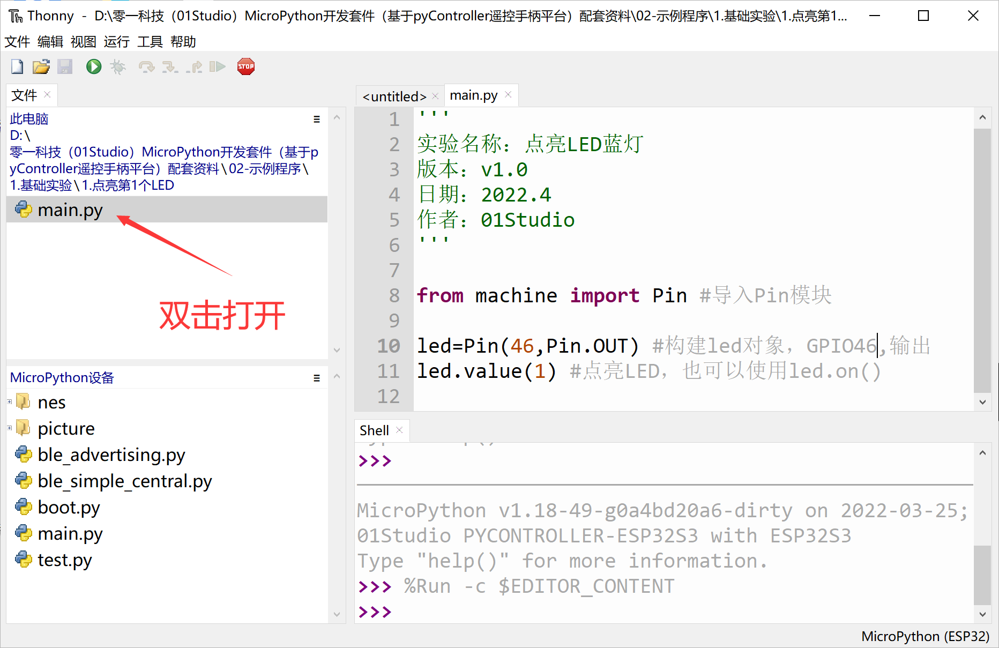
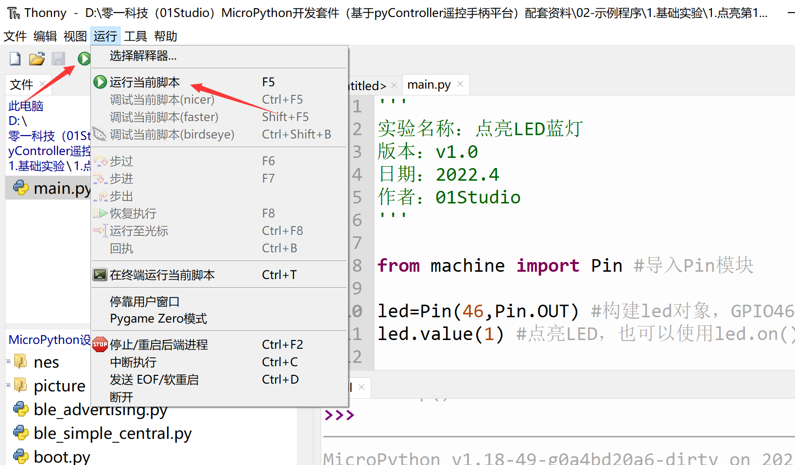
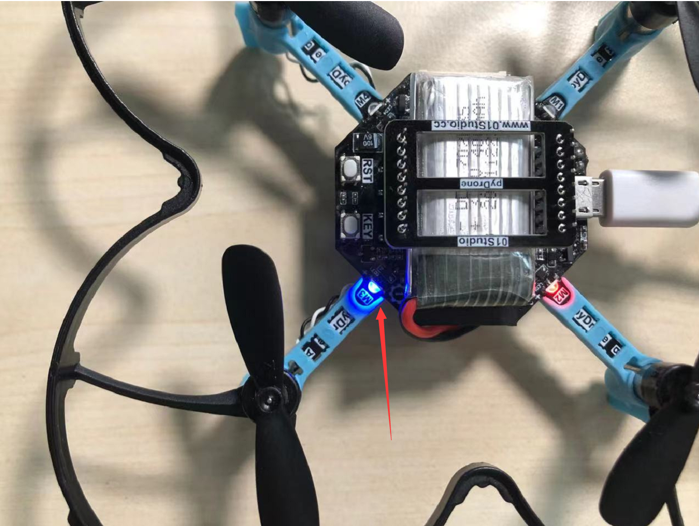

# 第1个代码测试

前面我们已经安装好了Thonny IDE和配置，接下来我们使用最简单的方式来做一个点亮LED蓝灯的实验，大家暂时先不用理解代码意思，后面章节会有解释。这里主要是为了让大家了解一下MicroPython编程软件Thonny的使用方法和原理。具体如下：

连接开发板，在thonny左上角本地文件区域找到 零一科技（01Studio）MicroPython开发套件（基于ESP32平台）配套资料\02-示例程序\1.基础实验\1.点亮第1个LED 下的main.py文件，双击打开后看到右边编程区出现相关代码。

点击 **运行—运行** 当前脚本 或者直接点绿色按钮：

这时候可以看到开发板上的蓝灯被点亮：

