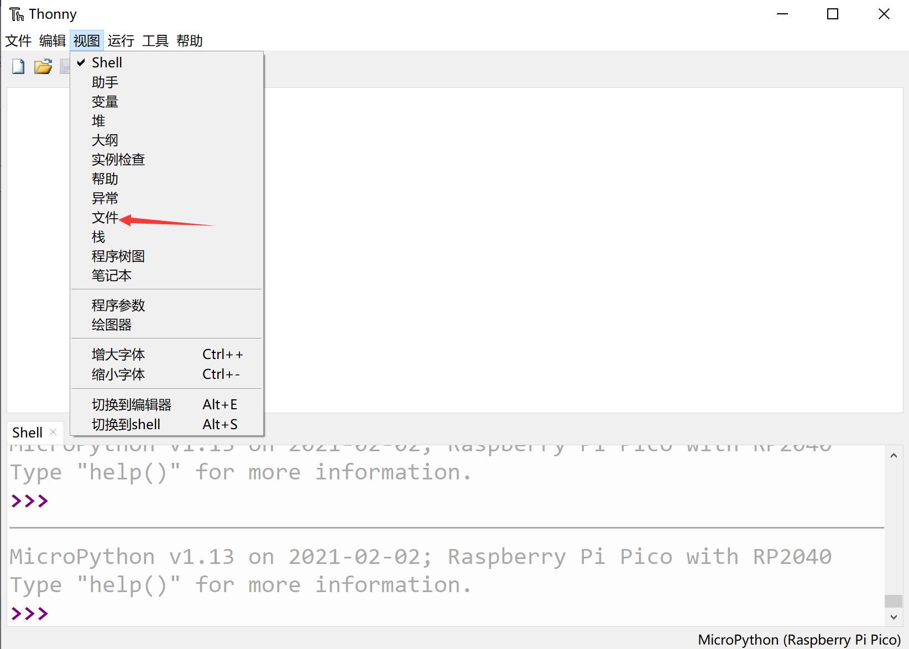
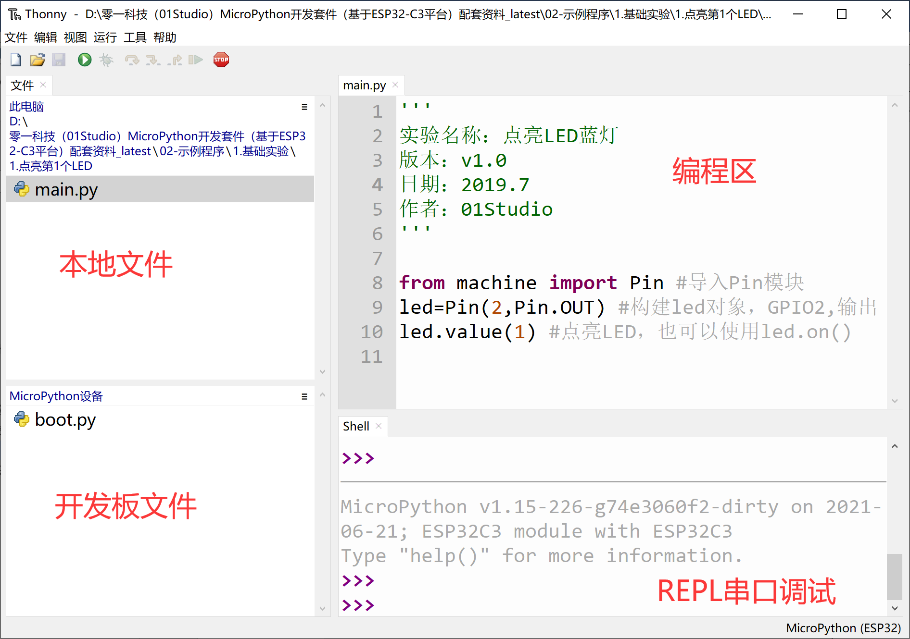
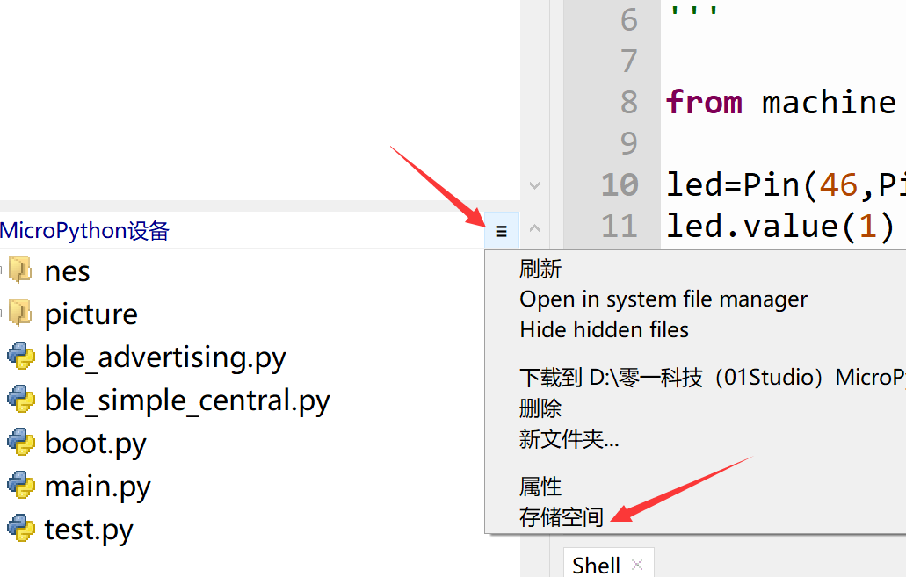
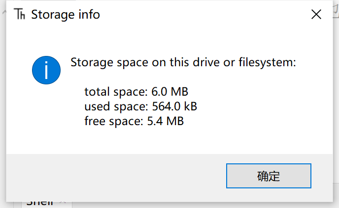

# 文件系统

pyDrone里面内置了文件系统，可以简单理解成上电后运行的python文件，这个可以通过Thonny非常方便地读写。

点击 视图--文件 ：

可以看到左边出现本地和开发板的实时文件浏览窗口：

通过设备的 **下拉列表—存储空间** 可以查询到开发板的Flash所有空间和剩余空间。

可以看到pyDrone的总空间是6M（固件占掉了2M）。也就是可以存放总大小为6M的py代码、数据文件或图片文件。

