# REPL串口交互调试

## 连接开发板

pyDrone的MicroPython固件集成了交互解释器REPL 【读取(Read)-运算(Eval)-输出(Print)-循环(Loop) 】，开发者可以直接通过串口终端来调试开发板。

我们打开Thonny，将开发板连接到电脑。点击右下角：

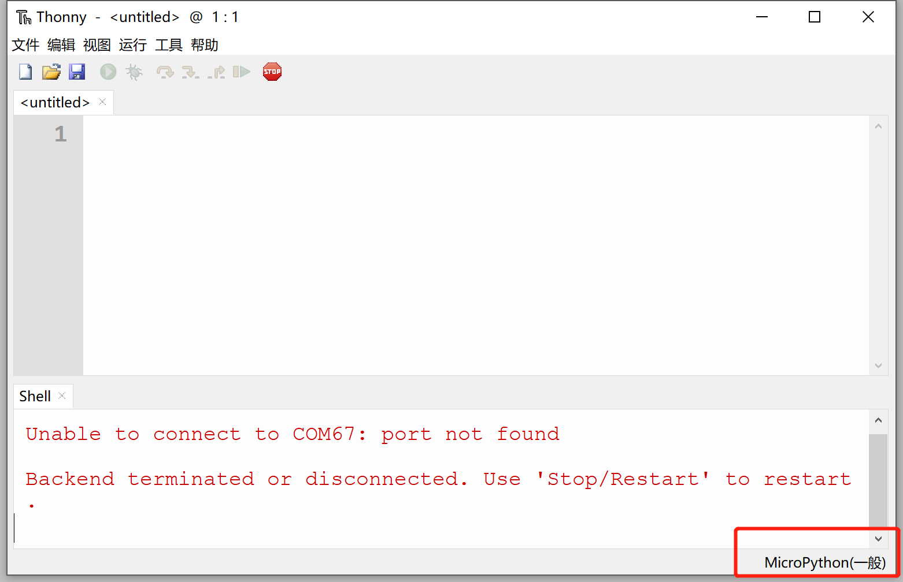


在弹出的列表选择：**Configure interpreter**

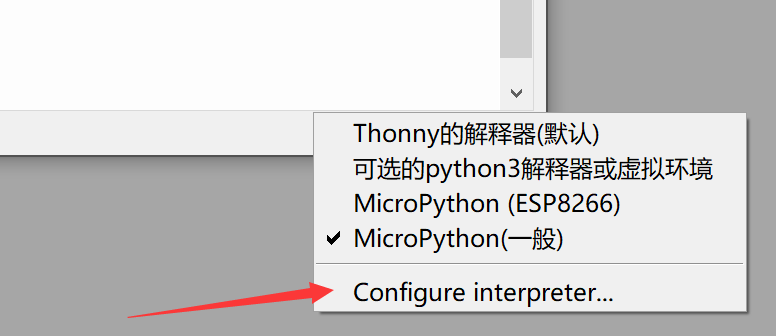

选择“MicroPython（ESP32）”和开发板对应的串口号，点击确认。

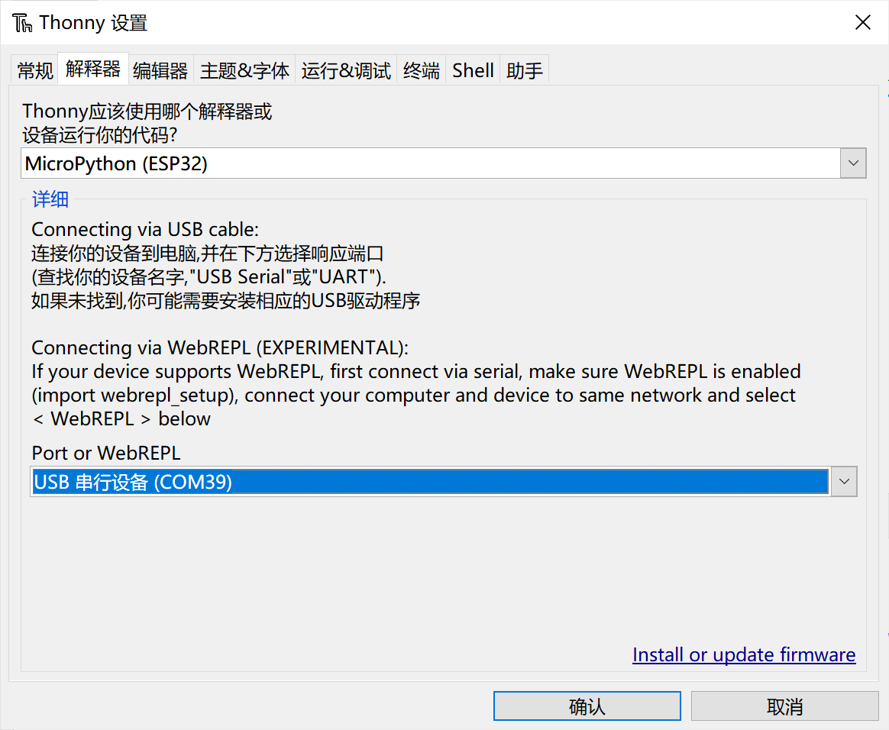

连接成功后可以在shell（串口终端）看到固件的相关信息：

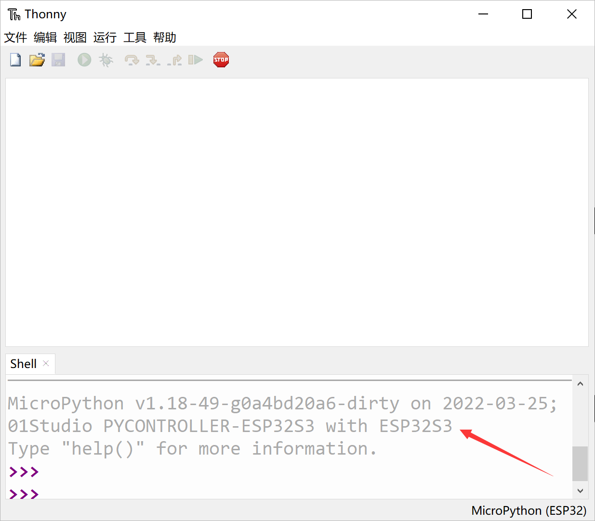

如果连接后出现下图错误提示，那么请检查串口驱动是否安装成功以及开发板的串口号是否选对。

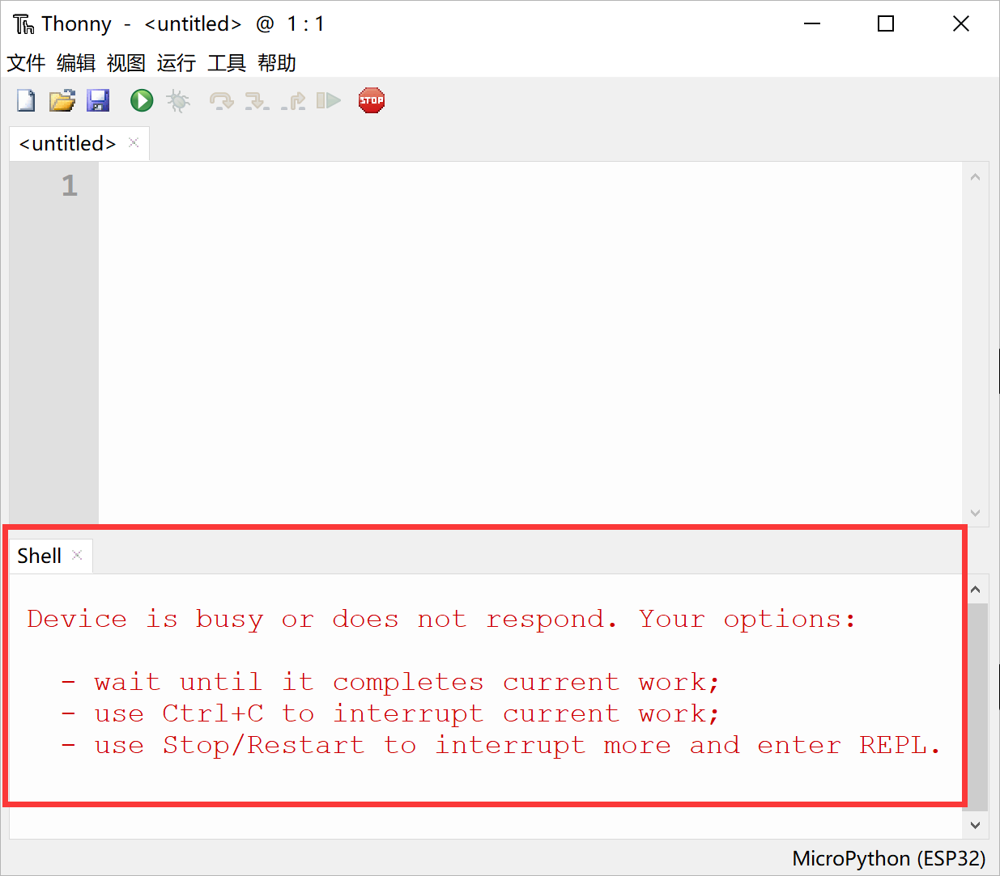

驱动正常以及串口号选对的话那么就是有程序在跑阻塞了IO，这时候可以按一下 运行—中断执行 打断程序。

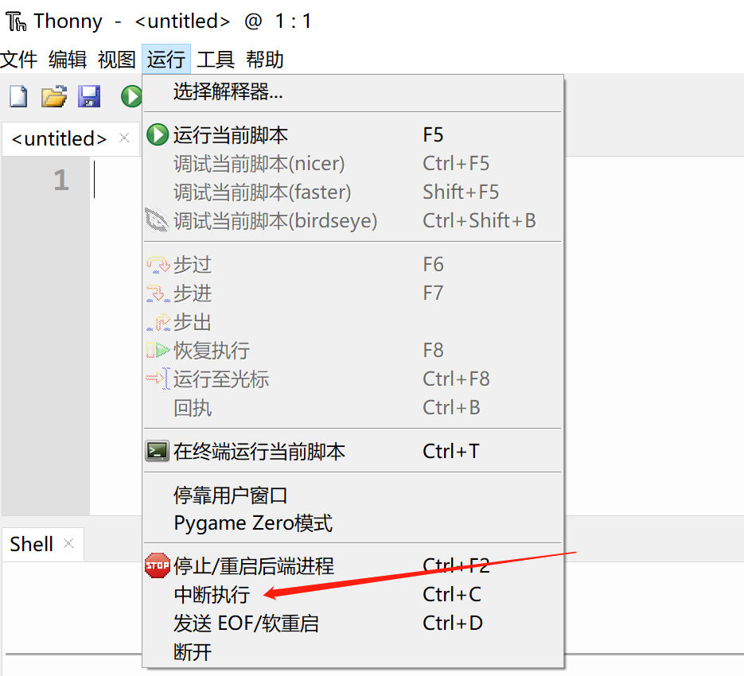

或者直接按复位键复位一下开发板，然后按“停止/重启后端进程”按钮，即可出现REPL。

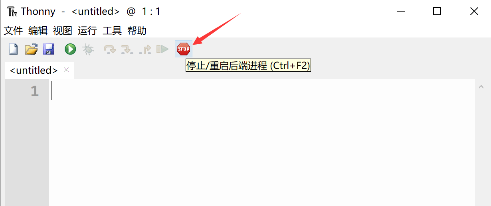

如果上述方法无效，请按后面 固件更新 章节重烧固件。

## 终端交互指令测试

我们在Shell（终端）里面输入 print(“Hello 01Studio!”) , 按回车，可以看到打印出Hello 01Studio字符：

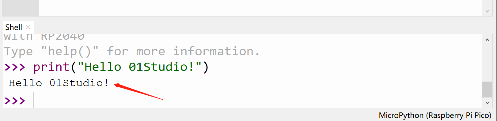


再输入 1+1 ，按回车，可以看到输出计算结果2：

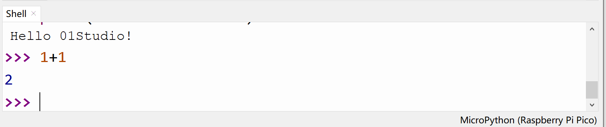


接下来我们将下面三行代码逐行输入和逐行按回车，可以看到LED灯也被点亮（后面会有针对LED控制实详细讲解）：

```python
from machine import Pin
LED = Pin(46, Pin.OUT) 
LED.value(1) 
```

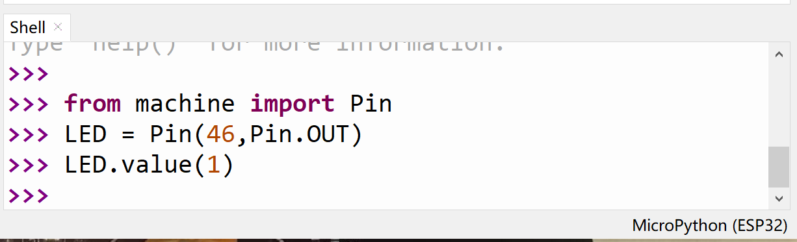


REPL还有一个强大的功能就是打印错误的代码来调试程序，在后面代码运行时候，如果程序出错，出错信息将通过REPL打印。 

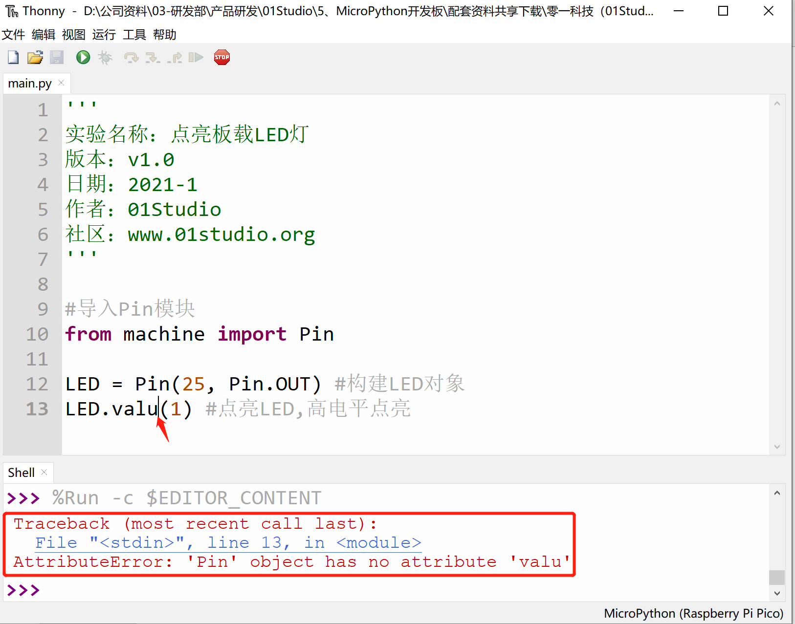