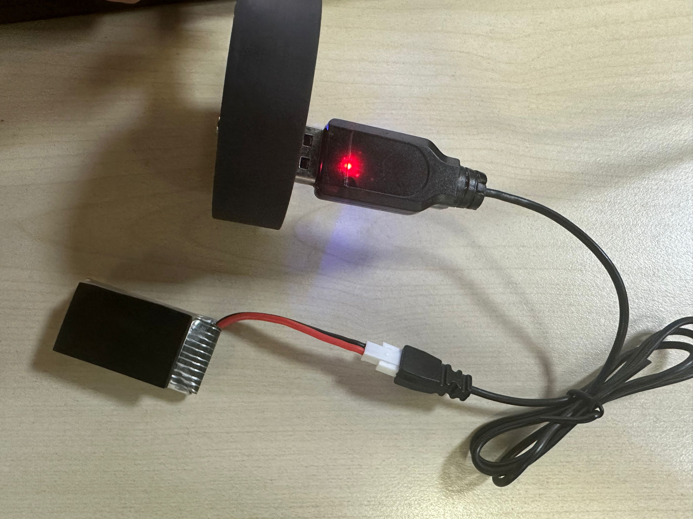
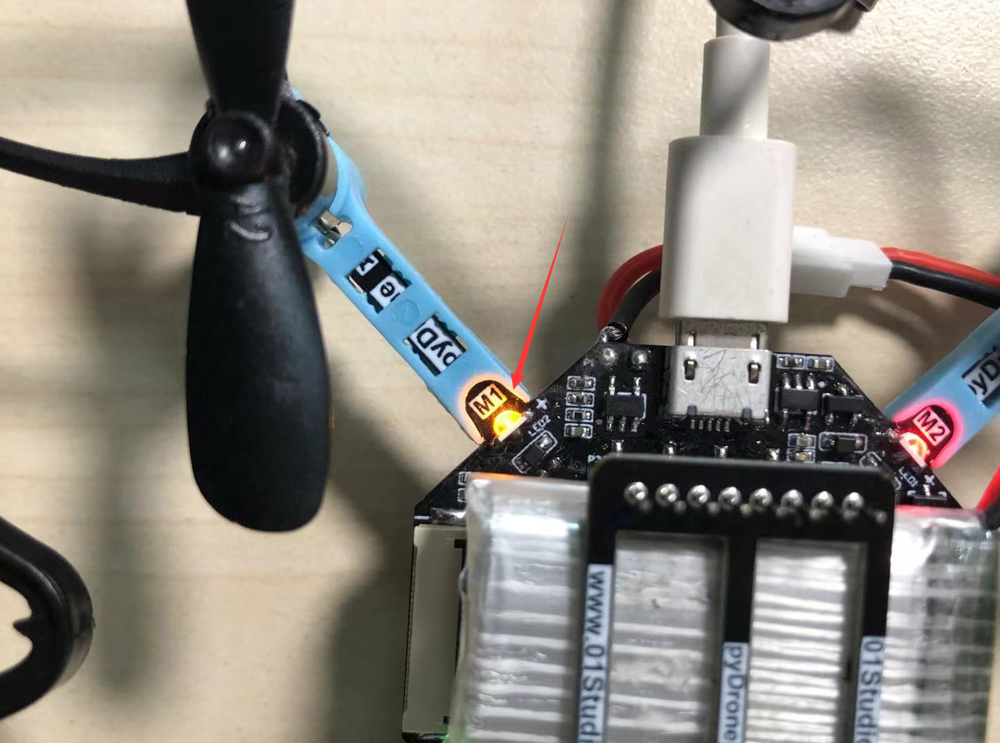

# 充电

## 使用充电线（推荐）

使用配套的USB充电线即可给锂电池充电，红灯亮表示正在充电，充满后熄灭。

## 使用主板

pyDrone板载锂电池充电电路，直接插入MicroUSB线即可充电。充电过程中橙色色指示灯亮。充满熄灭。

（由于pyDrone没有做开关，所以使用板载充电电路充电过程是边充电边工作，因此可能无法完全充满，用万用表测试充锂电池为大于4.1V左右即表示充满）。

