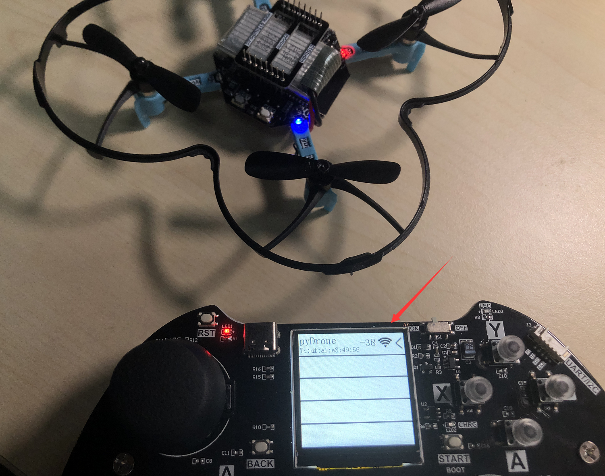
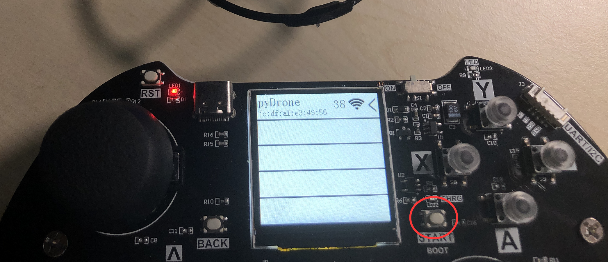

# 飞行教程

- **组装&飞行视频教程**

<iframe src="//player.bilibili.com/player.html?isOutside=true&aid=983867819&bvid=BV1ct4y1V7qG&cid=782533338&p=1" scrolling="no" border="0" frameborder="no" framespacing="0" allowfullscreen="true" width="100%" height="500"></iframe>

  
  

pyDrone默认出厂例程需使用pyController手柄控制，使用蓝牙（BLE）方式。

- pyDrone坐标系：

- pyController遥控手柄

## 校准

给四轴飞行器接上电池，水平放置（**不水平会导致无法校准通过**），然后按一下复位键。

等待校准，通常在10秒内可以完成校准。校准过程蓝灯闪亮，校准通过后蓝灯常亮。

## 连接手柄

启动手柄，通过左右按键选择，等“pyDrone”界面出来后按“START”键进入飞控控制模式。

可以看到搜索到pyDrone，信息包含蓝牙mac地址和信号强度。（支持多台pyDrone同时搜索）。

信号强的范围是 0 ~ -99, 值越接近0表示信号越好。

如果搜索到多台，可以通过按手柄的上、下键来选择对应设备，然后长按START键即可连接pyDrone。

四轴飞行器的绿灯常亮表示成功连接。连接成功后手柄显示屏出现pyDrone发送的实时信息界面

从上到下分别是四轴姿态数据、遥控器数据、相对高度、电池电压值（**飞行电压比静止电压低一点，当飞行时电压低于3.1V为低电量**）。

## 飞行控制

摄像头接口方向为机头方向。出厂代码默认为**无头飞行模式**。

- 无头模式。表示以周围环境为参照系，飞行的前后左右方向跟机身无关，通常用于室内飞行；
- 有头模式。表示以四轴机身为参照系，飞行的前后左右方向跟机身有关。四轴自转后保持机头方向为正前方，通常用于室外穿越机飞行。

这时候可使用遥控pyDrone四轴飞行器。手柄控制说明如下：

先按“Y”键起飞，待抬升到一定高度后即可通过手柄进行各种飞行动作控制。

需要降落时候按“A”键，四轴缓缓下降，降落过程依然可以控制方向。

**遇到突发情况时候可以按下“X”键，电机会立即停止转动。**

当四轴飞行器与地面夹角大于60°会判断为失控，电机立即停转。

