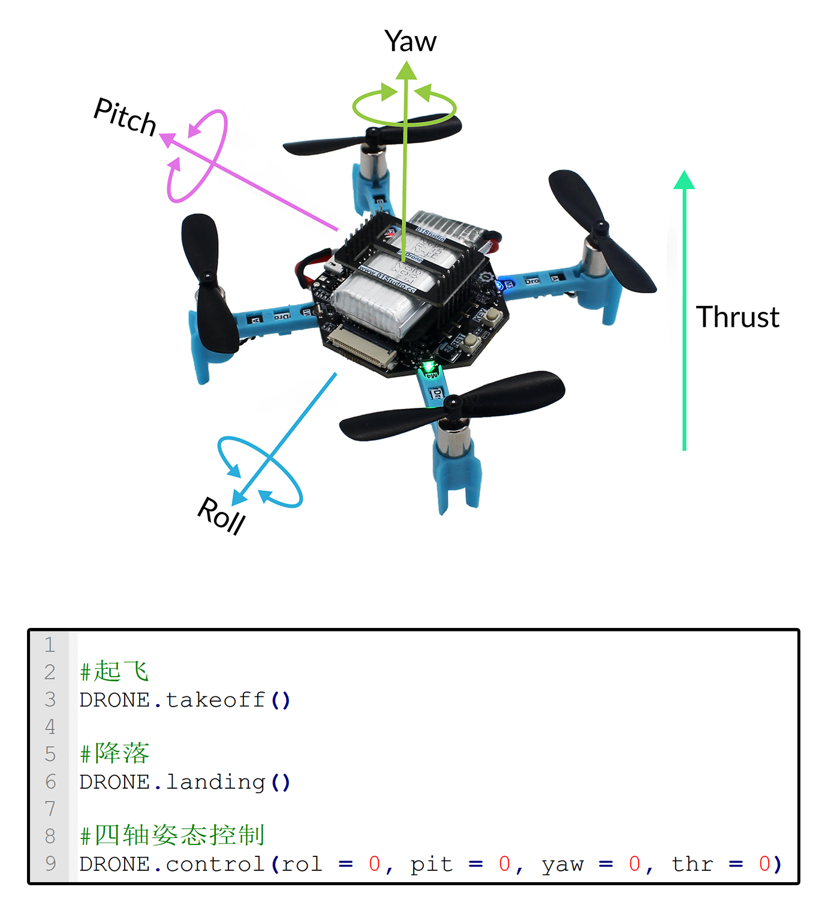
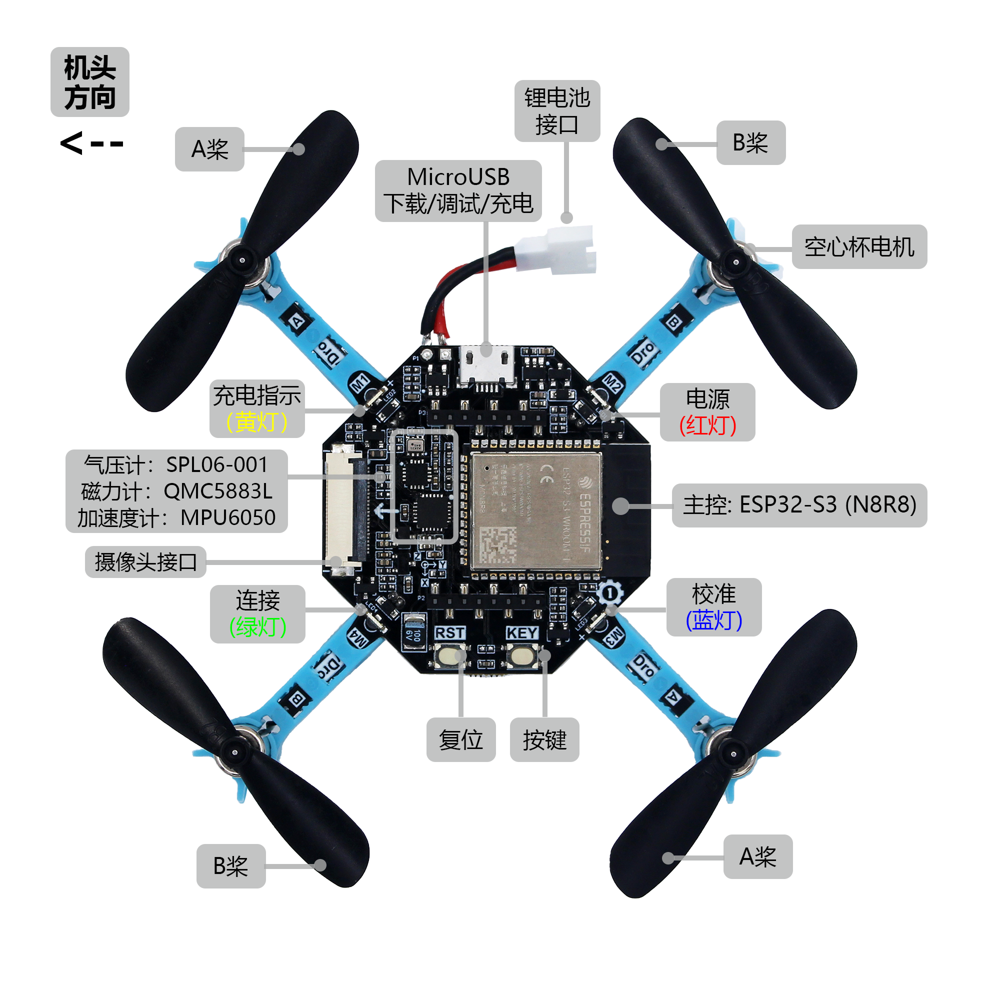
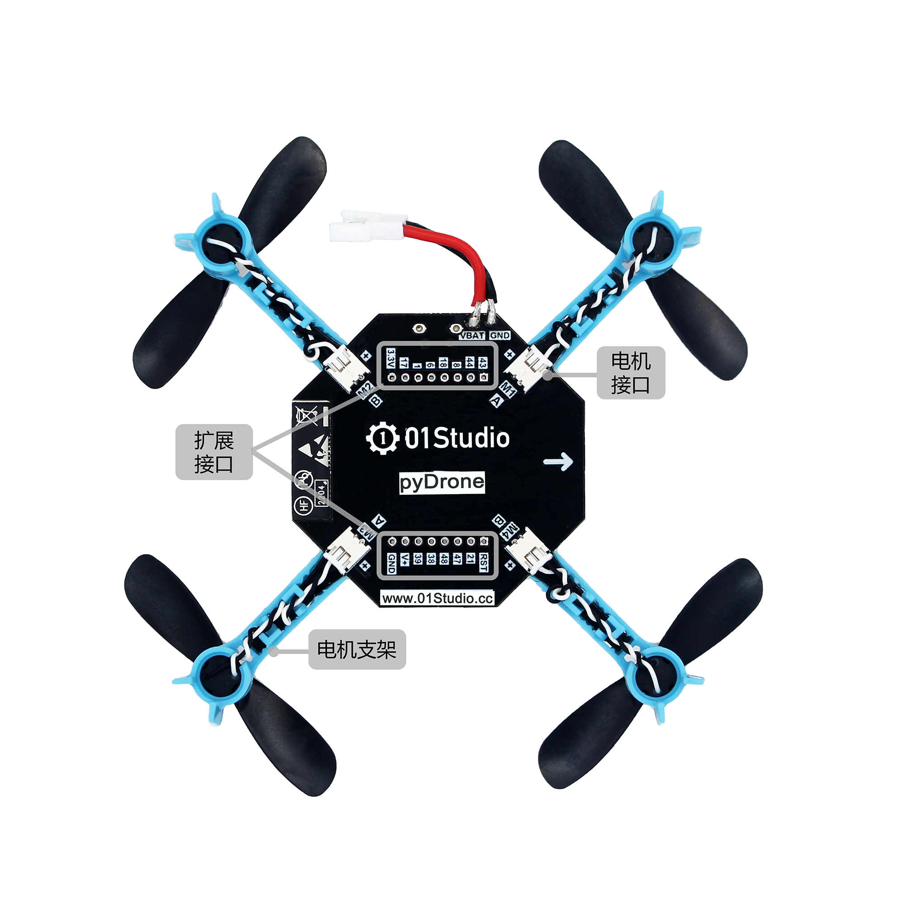
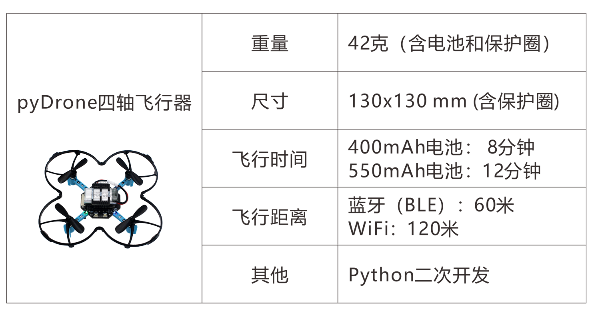
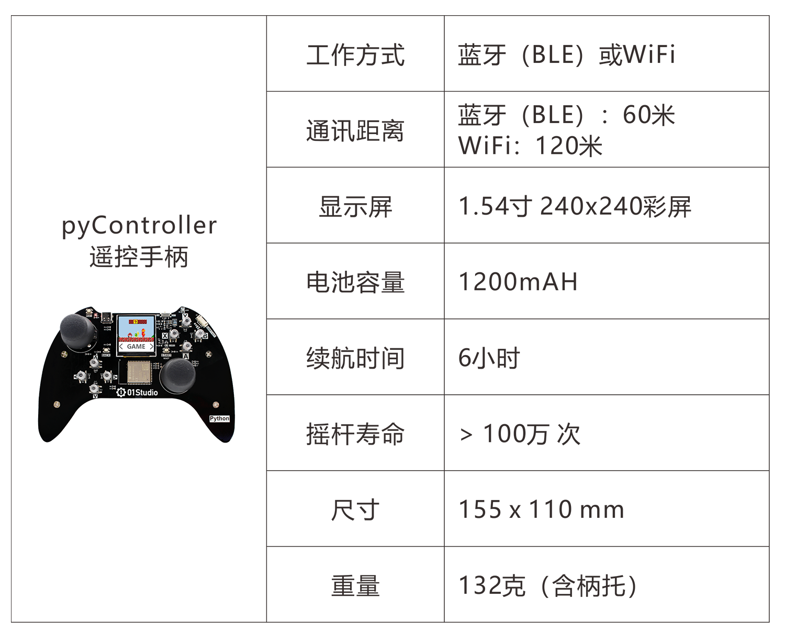
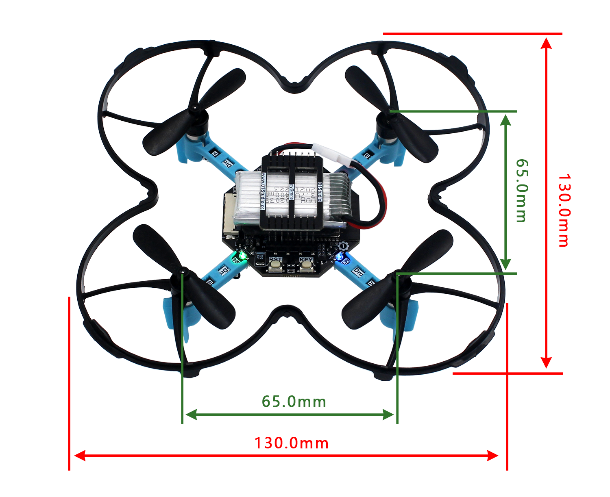

# pyDrone简介

## CanMV是什么

pyDrone是由01Studio(01科技)发起的MicroPython开源四轴飞行器项目。

Micropython是指使用Python做各类嵌入式硬件设备编程。MicroPython发展势头强劲，01Studio一直致力于Python嵌入式编程，特此推出pyDrone开源项目，旨在让MicroPython变得更加流行。使用MicroPython，你可以轻松地实现四轴飞行器的起飞、降落、悬停、移动、自转等各种姿态和动作。

## 硬件资源

01Studio pyDrone使用乐鑫科技ESP32-S3(N8R8)主控。

## 基本参数

## 详细参数

|  产品参数 |
|  :---:  | ---  |
| 主控  | ESP32-S3-WROOM-1 （N8R8，Flash:8MBytes，RAM:8MBytes）;支持WiFi/BLE |
| LED  | x4    ● 电源指示灯：红色    ● 充电指示灯：橙色    ● 校准指示灯：蓝色    ● 无线连接指示灯：绿色 |
| 按键  | x2：可编程按键，复位键 |
| 加速度计  | MPU6050 |
| 气压计  | SPL06-001 |
| 电子罗盘  | QMC5883L |
| MicroUSB口  | 烧录/调试/充电多合一 |
| 电机  | x4：716空心杯电机，轴径0.8mm |
| 桨叶  | x4：46mm桨叶 |
| 航模锂电池  | x1: 标配400mAh, 可选大容量550mAh |
| 电池盖板  | x1 |
| 保护圈  | x1 |

## 尺寸图

