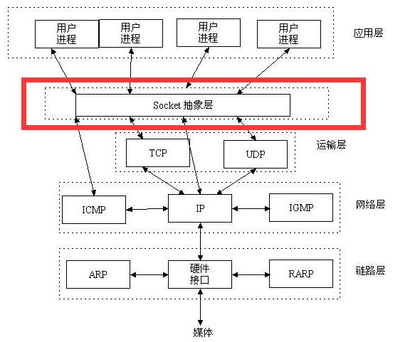
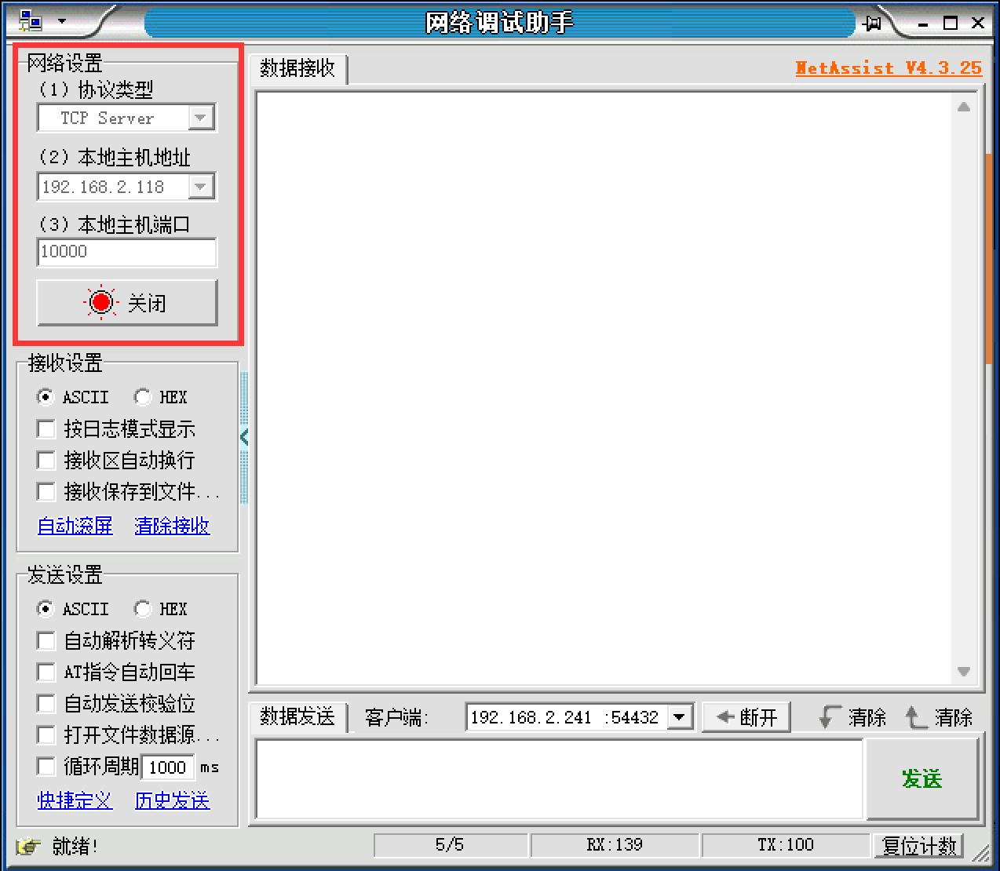
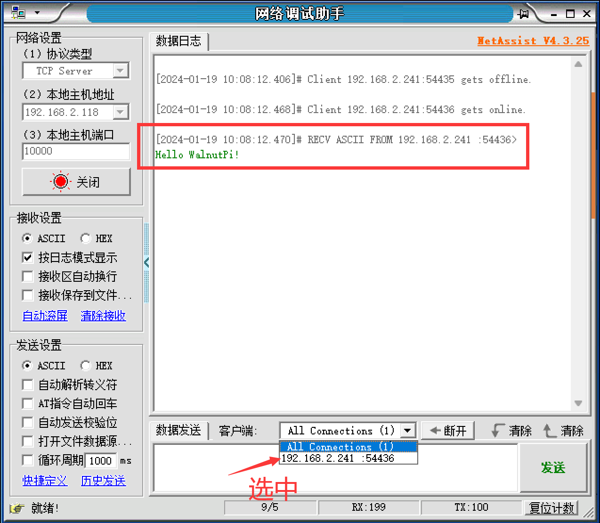
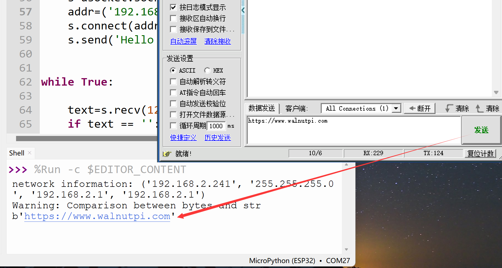

# Socket通讯

## 前言
上一节我们学习了如何通过MicroPython编程实现让pyDrone连接到无线路由器。这一节我们则来学习一下Socket通信实验。Socket几乎是整个互联网通信的基础。

## 实验目的
通过Socket编程实现pyDrone与电脑服务器助手建立连接，相互收发数据。

## 实验讲解
Socket我们听得非常多了，但由于网络工程是一门系统工程，涉及的知识非常广，概念也很多，任何一个知识点都能找出一堆厚厚的的书，因此我们经常会混淆。在这里，我们尝试以最容易理解的方式来讲述Socket，如果需要全面了解，可以自行查阅相关资料学习。

我们先来看看网络层级模型图，这是构成网络通信的基础：


我们看看TCP/IP模型的传输层和应用层，传输层比较熟悉的概念是TCP和UDP，UDP协议基本就没有对IP层的数据进行任何的处理了。而TCP协议还加入了更加复杂的传输控制，比如滑动的数据发送窗口（Slice Window），以及接收确认和重发机制，以达到数据的可靠传送。应用层中网页常用的则是HTTP。那么我们先来解析一下这TCP和HTTP两者的关系。

我们知道网络通信是最基础是依赖于IP和端口的，HTTP一般情况下默认使用端口80。举个简单的例子：我们逛淘宝，浏览器会向淘宝网的网址（本质是IP）和端口发起请求，而淘宝网收到请求后响应，向我们手机返回相关网页数据信息，实现了网页交互的过程。而这里就会引出一个多人连接的问题，很多人访问淘宝网，实际上接收到网页信息后就断开连接，否则淘宝网的服务器是无法支撑这么多人长时间的连接的，哪怕能支持，也非常占资源。

也就是应用层的HTTP通过传输层进行数据通信时，TCP会遇到同时为多个应用程序进程提供并发服务的问题。多个TCP连接或多个应用程序进程可能需要通过同一个 TCP协议端口传输数据。为了区别不同的应用程序进程和连接，许多计算机操作系统为应用程序与TCP／IP协议交互提供了套接字(Socket)接口。应用层可以和传输层通过Socket接口，区分来自不同应用程序进程或网络连接的通信，实现数据传输的并发服务。

简单来说，Socket抽象层介于传输层和应用层之间，跟TCP/IP并没有必然的联系。Socket编程接口在设计的时候，就希望也能适应其他的网络协议。



套接字（socket）是通信的基石，是支持TCP/IP协议的网络通信的基本操作单元。它是网络通信过程中端点的抽象表示，包含进行网络通信必须的五种信息：**连接使用的协议（通常是TCP或UDP），本地主机的IP地址，本地进程的协议端口，远地主机的IP地址，远地进程的协议端口。**

所以，socket的出现只是可以更方便的使用TCP/IP协议栈而已，简单理解就是其对TCP/IP进行了抽象，形成了几个最基本的函数接口。比如**create，listen，accept，connect，read和write**等等。以下是通讯流程：


从上图可以看到，建了Socket通信需要一个服务器端和一个客户端，以本实验为例，开发板作为客户端，电脑使用网络调试助手作为服务器端，双方使用TCP协议传输。对于客户端，则需要知道电脑端的IP和端口即可建立连接。（端口可以自定义，范围在0~65535，注意不占用常用的80等端口即可。）

以上的内容，简单来说就是如果用户面向应用来说，那么开发板只需要知道**通讯协议是TCP或UDP、服务器的IP和端口号**这3个信息，即可向服务器发起连接和发送信息。就这么简单。

MicroPython已经封装好相关模块socket,对象如下介绍：

## socket对象

### 构造函数
```python
s=usocket.socekt(af=AF_INET, type=SOCK_STREAM,proto=IPPROTO_TCP)
```
构建socket对象。
- `af`: IPV类型
    - `AF_INET`: IPV4；
    - `AF_INET6`: IPV6；

- `type`: 
    - `SCOK_STREAM`: TCP；
    - `SOCK_DGRAM`: UDP;

- `proto`:  
    - `IPPROTO_TCP`: TCP协议;
    - `IPPROTO_UDP`: UDP协议;

（如果要构建TCP连接，可以使用默认参数配置，即不输入任何参数。）

### 使用方法
```python
addr=usocket.getaddrinfo('https://www.walnutpi.com', 80)[0][-1]
```
获取Socket通信格式地址。返回：('106.52.127.213', 80)
<br></br>

```python
s.connect(address)
```
创建连接。
- `address` :地址格式为IP+端口。例：('192.168.1.115',10000)    

<br></br>

```python
s.send(bytes)
```
发送数据。
- `bytes`：发送内容格式为字节。

<br></br>

```python
s.recv(bufsize)
```
接收数据。
- `bufsize`：单次最大接收字节个数。

<br></br>

```python
s.bind(address)
```
绑定，用于服务器角色。

<br></br>

```python
s.listen([backlog])
```
监听，用于服务器角色。
- `backlog`: 允许连接个数，必须大于0。

<br></br>

```python
s.accept()
```
接受连接，用于服务器角色。

<br></br>

更多用法请阅读官方文档：<br></br>
https://docs.micropython.org/en/latest/library/socket.html#module-socket

本实验中开发板属于客户端，因此只用到客户端的函数即可。实验代码编写流程如下：

```mermaid
graph TD
    导入相关模块-->初始化相关模块-->判断WiFi是否连接成功--是-->建立socket连接-->判断Socket是否连接成功--是-->相互收发数据;
    判断WiFi是否连接成功--否-->结束;
    判断Socket是否连接成功--否-->结束;
```


## 参考代码

```python
'''
实验名称：Socket通讯
版本：v1.0
作者：01Studio
平台：pyDrone
说明：通过Socket编程实现pyDrone与电脑服务器助手建立TCP连接，相互收发数据。
'''

#导入相关模块
import network,usocket,time
from machine import Pin,Timer

#WIFI连接函数
def WIFI_Connect():

    WIFI_LED=Pin(46, Pin.OUT) #初始化WIFI指示灯

    wlan = network.WLAN(network.STA_IF) #STA模式
    wlan.active(True)                   #激活接口
    start_time=time.time()              #记录时间做超时判断

    if not wlan.isconnected():
        print('Connecting to network...')
        wlan.connect('01Studio', '88888888') #输入WIFI账号密码

        while not wlan.isconnected():

            #LED闪烁提示
            WIFI_LED.value(1)
            time.sleep_ms(300)
            WIFI_LED.value(0)
            time.sleep_ms(300)

            #超时判断,15秒没连接成功判定为超时
            if time.time()-start_time > 15 :
                print('WIFI Connected Timeout!')
                break

    if wlan.isconnected():
        #LED点亮
        WIFI_LED.value(1)

        #串口打印信息
        print('network information:', wlan.ifconfig())

        return True

    else:
        return False


#判断WIFI是否连接成功
if WIFI_Connect():

    #创建socket连接TCP类似，连接成功后发送“Hello WalnutPi！”给服务器。
    s=usocket.socket()
    addr=('192.168.2.118',10000) #服务器IP和端口
    s.connect(addr)
    s.send('Hello WalnutPi!')


while True:
    
    text=s.recv(128) #单次最多接收128字节
    if text == '':
        pass

    else: #打印接收到的信息为字节，可以通过decode('utf-8')转成字符串
        print(text)
        s.send('I got:'+text.decode('utf-8'))
    
    time.sleep_ms(300)
```

WIFI连接代码在上一节已经讲解，这里不再重复，程序在连接成功后建了Socket连接，连接成功发送‘Hello 01Studio!’信息到服务器。另外RTOS定时器设定了了每300ms处理从服务器接收到的数据。将接收到数据通过串口打印和发送给服务器。

## 实验结果

保证电脑和pyDrone在同一个网段下（通常是指连接在同一个路由器），同时最好关闭电脑防火墙。

在电脑端打开网络调试助手并建立服务器，软件在 <u>开发板配套资料\01-开发工具\网络调试助手</u> 下的 NetAssist.exe ，直接双击打开即可！

电脑打开网络调试助手：


以下是新建服务器的方法，打开网络调试助手后在左上角协议类型选择 TCP Server；中间的本地IP地址是自动识别的，不要修改，这个就是服务器的IP地址。然后端口写10000（0-65535都可以。），点击连接，成功后红点亮。如下图：



这时候服务器已经在监听状态！用户需要根据自己的实际情况自己输入WIFI信息和服务器IP地址+端口。即修改上面的代码以下部分内容。（服务器IP和端口可以在网络调试助手找到。）

**WiFi网络改成自己的无线路由器账号密码，只支持2.4G信号。不支持5G或者2.4G&5G混合信号。**

```python
wlan.connect('01Studio', '88888888') #输入WIFI账号密码
```

**服务器IP和地址根据网络助手修改：**
```python
addr=('192.168.2.128',10000) #服务器IP和端口
```

运行程序，开发板成功连接WIFI后，发起了socket连接，连接成功可以可以看到网络调试助手收到了开发板发来的信息。在下方列表多了一个连接对象，点击选中：



选中后我们在发送框输入信息 **https://www.walnutpi.com** , 点击发送，可以看到开发板的串行终端打印出来该信息，类型为字节数据。



通过本节学习，我们了解了socket通信原理以及使用MicroPython进行socket编程并且通信的实验。得益于优秀的封装，让我们可以直接面向socket对象编程就可以快速实现socket通信，从而开发更多的网络应用，例如将前面采集到的传感器数据发送到服务器。
