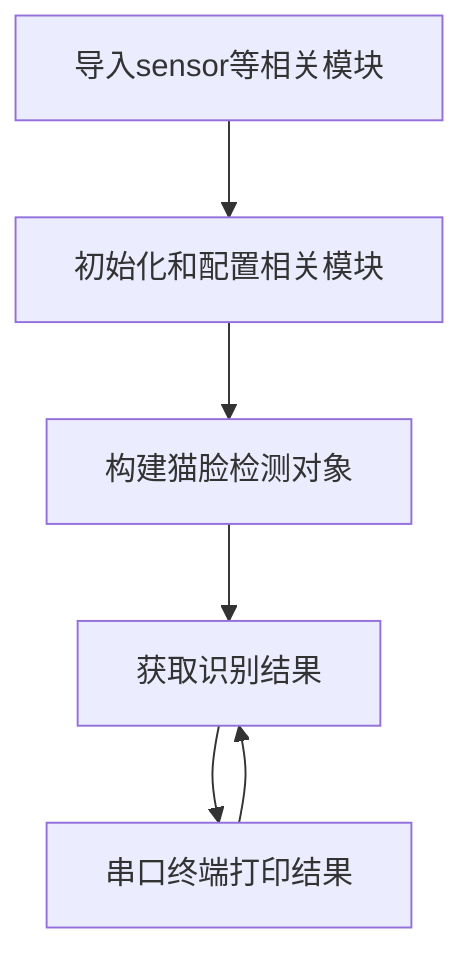

# 猫脸检测

## 前言
猫脸检测，简单来说就是告诉你将一幅图片中哪些是猫的脸部。今天我们来学习一下如何通过MicroPython编程快速实现猫脸检测。

## 实验平台
pyWiFi-ESP32-S3开发套件，OV2640摄像头，3.2寸显示屏。


## 实验目的
识别摄像头画面中的猫脸。

## 实验讲解

对于pyWiFi-ESP32-S3而言，相关AI功能已经集成在esp_ai模块下，用户可以通过构造函数和对象使用轻松实现猫脸检测。具体说明如下：

## esp_ai.cat_detection对象

### 构造函数
```python
c = esp_ai.cat_detection()
```
构建猫脸检测对象。

### 使用方法

```python
c.start()
```
启动功能。

<br></br>

```python
c.read()
```
识别摄像头图像中的猫脸并返回数据。

**结果说明：**

返回矩形区域数量和对应的左上角和右下角坐标（4个值）。

无检测结果返回(0)

1个结果，返回(1,A[x0],A[y0],A[x1],A[y1])

...

当前最大支持返回1个结果。


<br></br>

从上表可以看到构建对象后启动识别即可直接识别猫脸。具体编程思路如下：



## 参考代码

```python
'''
实验名称：猫脸检测
版本：v1.0
平台：pyWiFi ESP32-S3
作者：01Studio
说明：识别摄像头中的猫脸。
'''

import esp_ai,time
import sensor,tftlcd

#摄像头初始化
cam = sensor.OV2640()
cam.reset()
cam.set_framesize(sensor.LCD) #240*240分辨率
cam.set_hmirror(1) #后置摄像头模式

#LCD初始化
d = tftlcd.LCD32(portrait=1)

c = esp_ai.cat_detection() #构建猫脸检测对象

c.start() #启动检测，可以通过LCD观察结果

while True:
    
    #获取猫脸检测结果，返回矩形区域数量和对应的左上角和右下角坐标（4个值）。
    #无检测结果返回(0)
    #1个结果，返回(1,A[x0],A[y0],A[x1],A[y1])
    #当前只支持返回1个结果。    
    value = c.read()
    
    print(value)
    
    time.sleep_ms(50)
```

## 实验结果

将pyWiFi-ESP32-S3的摄像头设置为后置模式，LCD装在核心板上，这样更方便观察。


运行代码，将摄像头正对猫脸，可以看到LCD框识别出猫脸。

- 原图：


- 识别结果：


串口终端打印识别结果


本节学习了猫脸检测，可以看到pyWiFi-ESP32-S3通过AI库可以轻松实现猫脸检测，而且检测的准确率非常高。 
