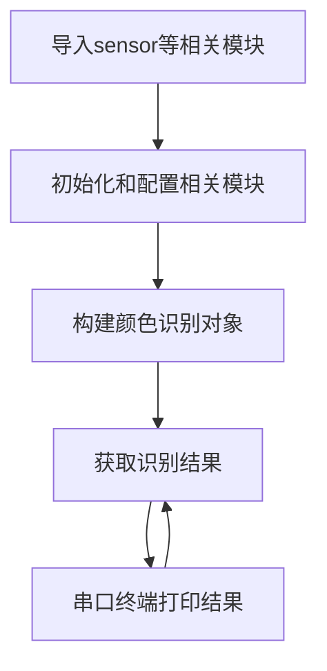
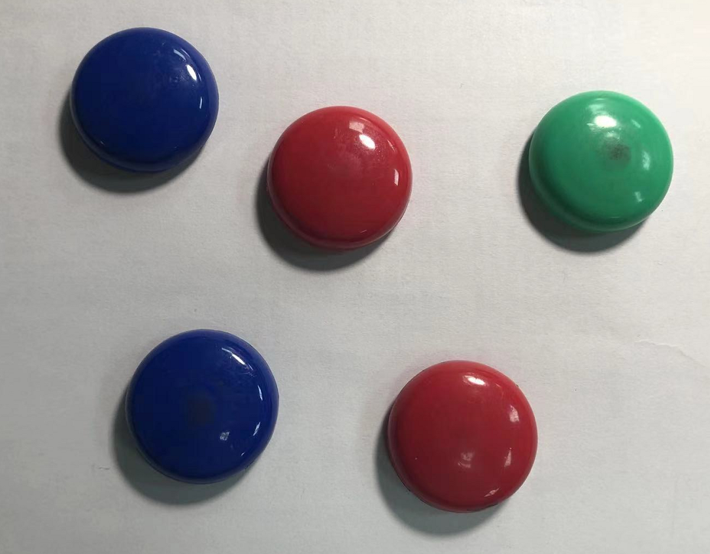
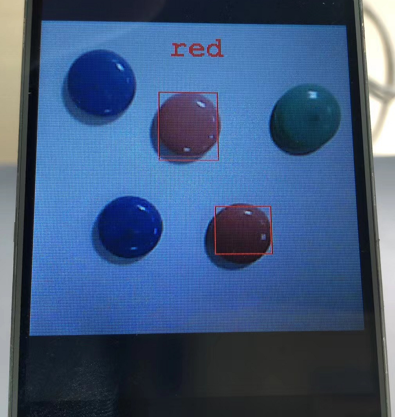
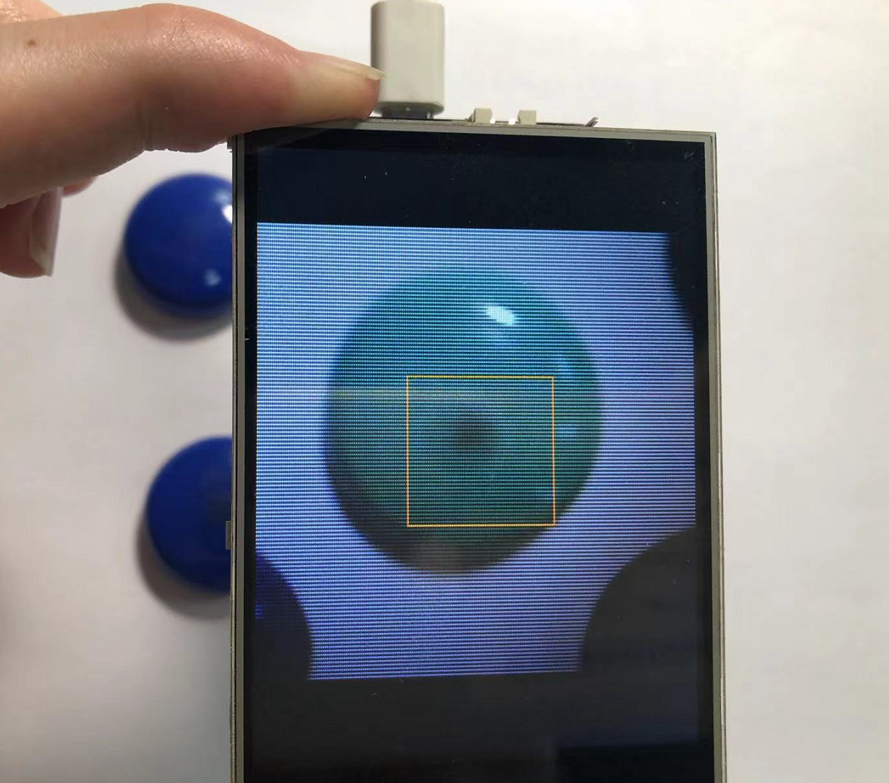
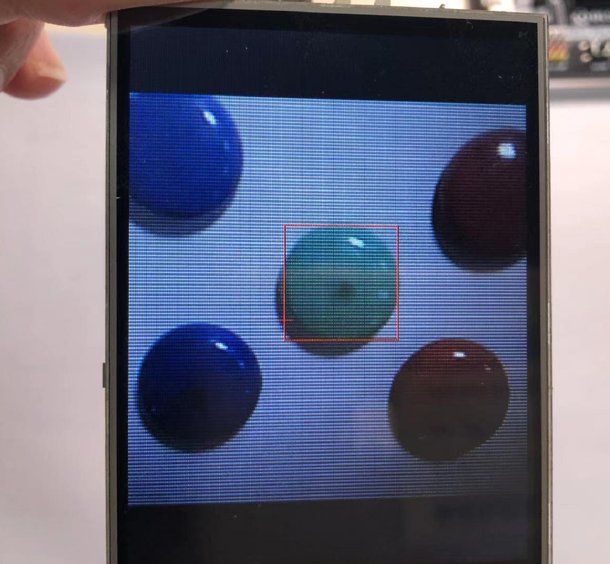

# 颜色识别

## 前言
我们活在一个色彩斑斓的世界里。本节我们来学习机器视觉中的颜色识别。

## 实验平台
pyWiFi-ESP32-S3开发套件，OV2640摄像头，3.2寸显示屏。


## 实验目的
通过编程实现pyWiFi-ESP32-S3识别指定颜色。

## 实验讲解

对于pyWiFi-ESP32-S3而言，相关AI功能集成在esp_ai模块下，用户可以通过构造函数和对象使用轻松实现指定颜色识别或自学习颜色识别。具体说明如下：

## esp_ai.color_detection对象

### 构造函数
```python
c = esp_ai.color_detection(color=0)
```
构建颜色识别识别对象。
- `color`: 指定颜色编号.
    - `0` : RED(红色);
    - `1` : ORANGE(橙色);
    - `2` : YELLOW(黄色);
    - `3` : GREEN(绿色);
    - `4` : CYAN(青色);
    - `5` : BLUE(蓝色);
    - `6` : PURPLE(紫色);
    - `7` : WHITE(白色);
    - `8` : GRAY(灰色);
    - `9` : STUDY(自定义学习); 对于参数color=9自定义颜色，构建对象后LCD图像中心出现橙色框，为学习状态，将橙色框对准要识别的颜色，然后延时几秒后再启动即可。


### 使用方法

```python
c.start()
```
启动功能。

<br></br>

```python
c.read()
```
识别摄像头图像中的色块并返回数据。

**获取颜色采集结果说明：**
返回矩形区域数量和对应的左上角和右下角坐标（4个值）。

无检测结果返回(0)

1个结果，返回(1,A[x0],A[y0],A[x1],A[y1])

2个结果，返回(2,A[x0],A[y0],A[x1],A[y1],B[x0],B[y0],B[x1],B[y1])

...

如此类推，最大支持返回5个结果。  

<br></br>

了解了找色块函数应用方法后，我们可以理清一下编程思路，代码编写流程如下：



## 参考代码

```python
'''
实验名称：颜色识别
版本：v1.0
平台：pyWiFi ESP32-S3
作者：01Studio
说明：实现颜色识别。
'''

import esp_ai,time
import sensor,tftlcd

#摄像头初始化,需要初始化为双层模式 frame=2
cam = sensor.OV2640(frame=2)
cam.reset()
cam.set_framesize(sensor.LCD) #240*240分辨率
cam.set_hmirror(1) #后置摄像头模式

#LCD初始化
d = tftlcd.LCD32(portrait=1)

'''
构建颜色检测对象。
颜色参数 【color】:
0:RED(红色), 1:ORANGE(橙色), 2:YELLOW(黄色), 3:GREEN(绿色), 4:CYAN(青色), 5:BLUE(蓝色),
6:PURPLE(紫色), 7:WHITE(白色), 8:GRAY(灰色), 9:STUDY(自定义学习)
'''
c = esp_ai.color_detection( color=0 ) #检测红色

'''
对于参数color=9自定义颜色，构建对象后LCD图像中心出现橙色框，为学习状态，将橙色框对准要识别的颜色，
然后延时几秒后再启动即可。
'''
#time.sleep(5) #color=9自定义颜色时需要用到延时来学习颜色，可以根据自己需要延长时间。

c.start() #启动检测，可以通过LCD观察结果

while True:
    
    #获取颜色采集结果，返回矩形区域数量和对应的左上角和右下角坐标（4个值）。
    #无检测结果返回(0)
    #1个结果，返回(1,A[x0],A[y0],A[x1],A[y1])
    #2个结果，返回(2,A[x0],A[y0],A[x1],A[y1],B[x0],B[y0],B[x1],B[y1])
    #如此类推，最大支持返回5个结果。    
    value = c.read()
    print(value)
    
    time.sleep_ms(50)
```

## 实验结果

将pyWiFi-ESP32-S3的摄像头设置为后置模式，LCD装在核心板上，这样更方便观察。


本例程默认是color=0，即识别红色，在IDE中运行代码，可以看到实验结果如下： 

- 原图：



- 识别结果：



## 自定义颜色识别

该颜色对象支持自定义颜色识别，方法如下：

将上面代码初始化构建参数改为9；
```python
c = esp_ai.color_detection(color=9) 
```

将延时代码取消注释，用于学习识别颜色，有需要可以加长时间。
```python
time.sleep(5) #color=9自定义颜色时取消这个注释。
```

运行代码，可以看到显示屏中心出现一个橙色框，将橙色框对准要识别的颜色，框完全在物体颜色内。



代码运行到c.start()后自动开始识别刚刚学习的颜色。



本节学习了通过MicroPython编程在pyWiFi-ESP32-S3上实现单种颜色识别。支持标准颜色和自定义颜色识别。有了这个功能，就可以制作色球追踪小车或者相关应用了。
