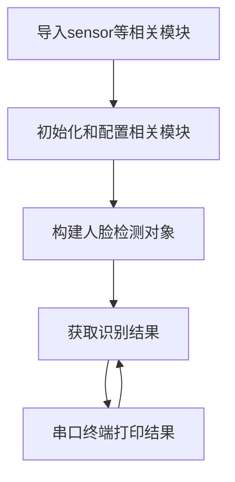
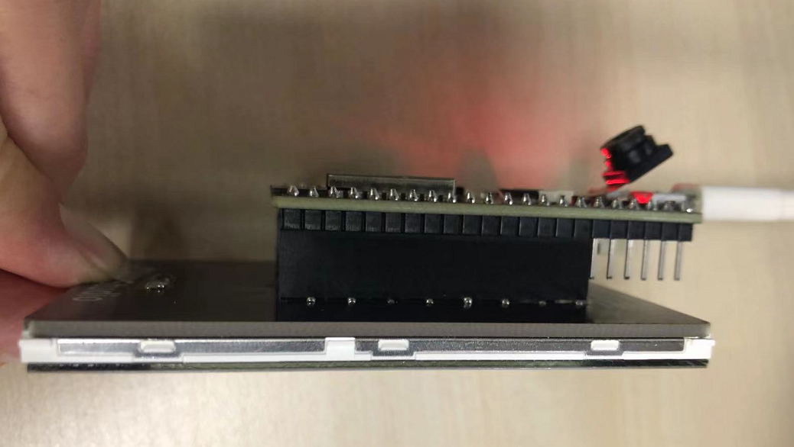
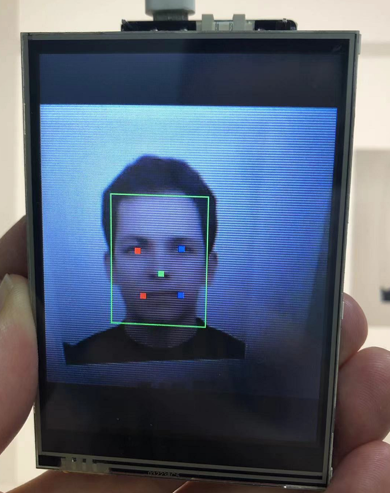
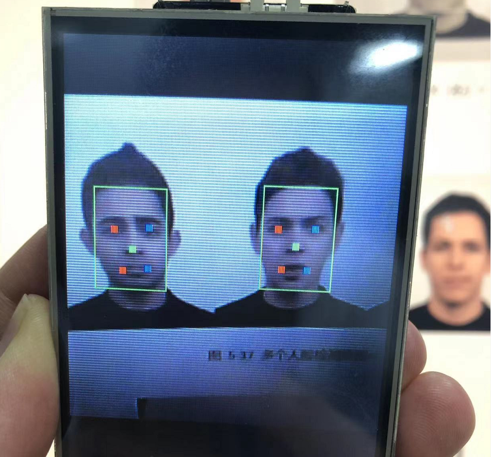

# 人脸检测

## 前言
本节人脸检测跟上一节猫脸检测类似，简单来说就是告诉你将一幅图片中哪些是人脸。今天我们来学习一下如何通过MicroPython编程快速实现人脸检测。

## 实验平台
pyWiFi-ESP32-S3开发套件，OV2640摄像头，3.2寸显示屏。


## 实验目的
识别摄像头画面中的人脸。

## 实验讲解

对于pyWiFi-ESP32-S3而言，相关AI功能已经集成在esp_ai模块下，用户可以通过构造函数和对象使用轻松实现人脸检测。具体说明如下：

## esp_ai.face_detection对象

### 构造函数
```python
c = esp_ai.face_detection()
```
构建人脸检测对象。

### 使用方法

```python
c.start()
```
启动功能。

<br></br>

```python
c.read()
```
识别摄像头图像中的猫脸并返回数据。

**结果说明：**

返回矩形区域数量和对应的左上角和右下角坐标（4个值）。

无检测结果返回(0)

1个结果，返回15个值。(1,A[x0],A[y0],A[x1],A[y1],A[left_eye_X],A[left_eye_Y],A[right_eye_X],A[right_eye_Y],A[nose_X],A[nose_Y],A[left_mouth_X],A[left_mouth_Y],A[right_mouth_X],A[right_mouth_Y])

详细说明：v[0]：人脸数量；v[1-4]:矩形左上角和右下角坐标；v[5-14]:左眼、右眼、鼻子、左嘴角、右嘴角坐标。

2个结果，返回29个值。(2,.......)
说明：v[0]：人脸数量；v[1-14]:人脸1数据；v[15-28]人脸2数据。

...

当前最大支持返回2个结果。


<br></br>

从上表可以看到构建对象后启动识别即可直接检测人脸。具体编程思路如下：



## 参考代码

```python
'''
实验名称：人脸检测
版本：v1.0
平台：pyWiFi ESP32-S3
作者：01Studio
说明：识别摄像头中的人脸。
'''

import esp_ai,time
import sensor,tftlcd

#摄像头初始化
cam = sensor.OV2640()
cam.reset()
cam.set_framesize(sensor.LCD) #240*240分辨率
cam.set_hmirror(1) #后置摄像头模式

#LCD初始化
d = tftlcd.LCD32(portrait=1)

c = esp_ai.face_detection() #构建人脸检测对象

c.start() #启动检测，可以通过LCD观察结果

while True:
 
    #获取人脸检测结果，返回矩形区域数量、对应的矩形框左边以及五点关键特征值。
    #无检测结果返回(0)
    
    #1个结果，返回15个值.
    #(1,A[x0],A[y0],A[x1],A[y1],A[left_eye_X],A[left_eye_Y],A[right_eye_X],A[right_eye_Y],
    # A[nose_X],A[nose_Y],A[left_mouth_X],A[left_mouth_Y],A[right_mouth_X],A[right_mouth_Y])
    #说明：v[0]：人脸数量；v[1-4]:矩形左上角和右下角坐标；v[5-14]:左眼、右眼、鼻子、左嘴角、右嘴角坐标。
    
    #2个结果，返回29个值。(2,.......)
    #说明：v[0]：人脸数量；v[1-14]:人脸1数据；v[15-28]人脸2数据。
    
    #当前最大支持返回2个结果。   
    value = c.read()
    
    print(value)
    
    time.sleep_ms(20)
```

## 实验结果

将pyWiFi-ESP32-S3的摄像头设置为后置模式，LCD装在核心板上，这样更方便观察。



运行代码，将摄像头正对人脸，可以看到LCD框识别出人脸。

### 单个人脸检测

- 原图：


- 识别结果：



### 2个人脸检测

- 原图：


- 识别结果：

