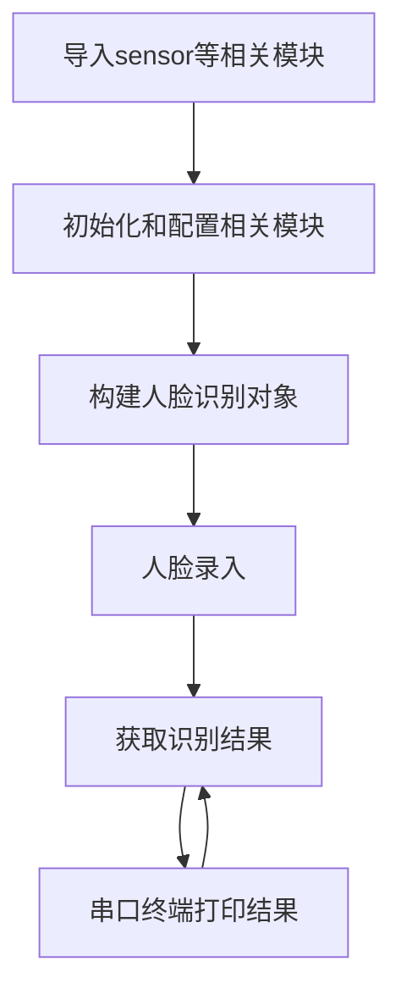
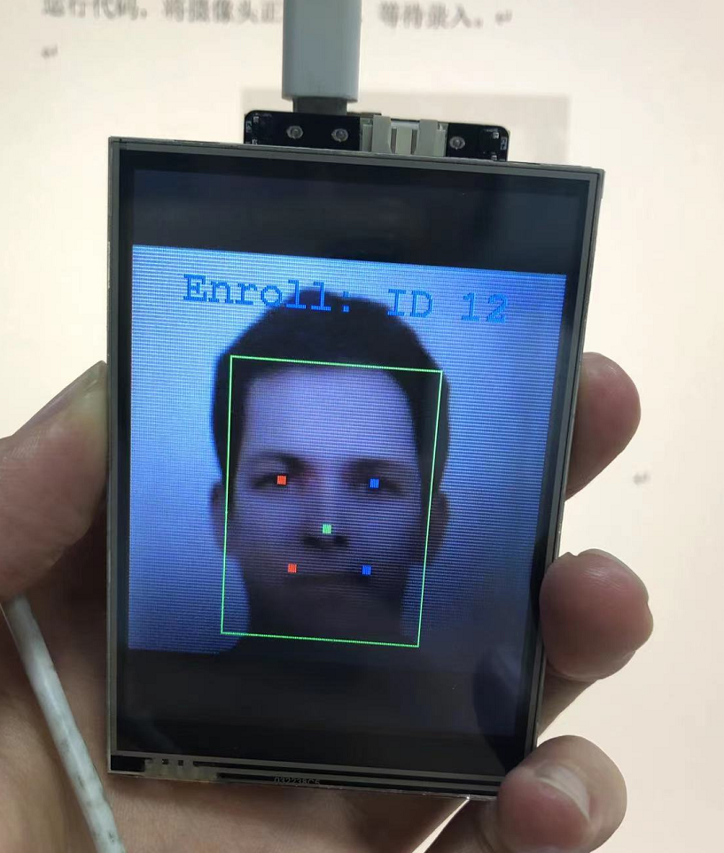
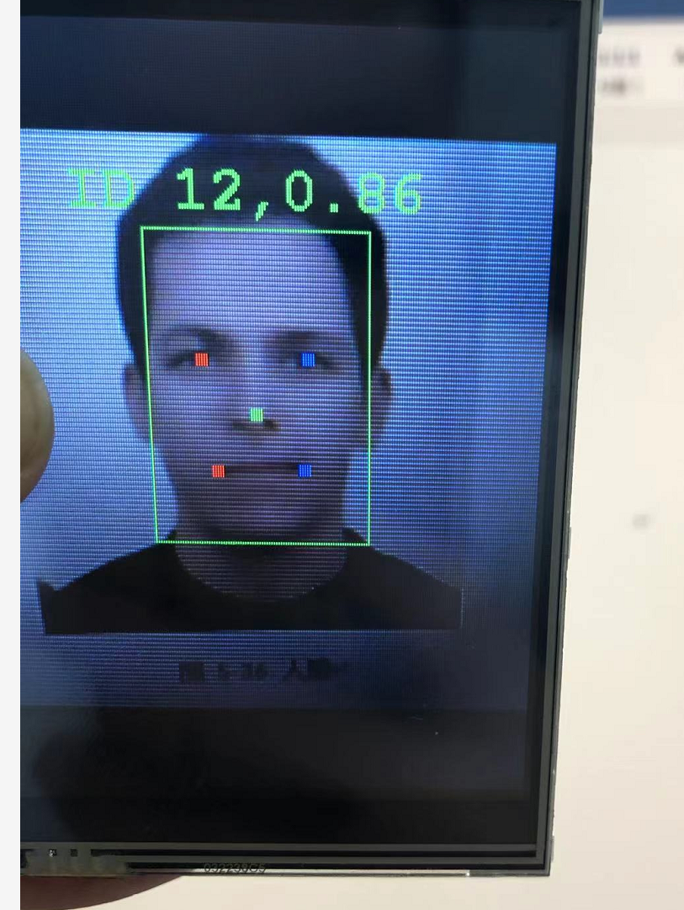
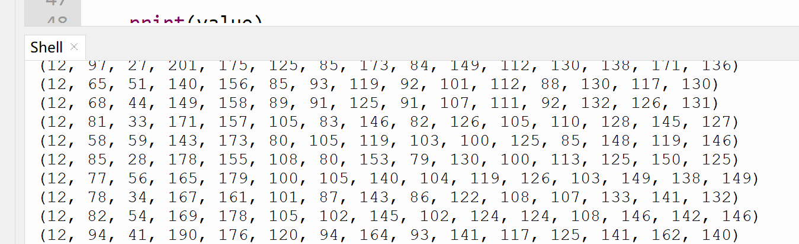

# 人脸识别

## 前言
上一节人脸检测只是识别有人脸，而本节人脸识别则是在人脸检测基础上对人脸进行学习，记录特定ID，然后再次识别。简单来说就是告诉识别到的人脸是谁。

## 实验平台
pyWiFi-ESP32-S3开发套件，OV2640摄像头，3.2寸显示屏。


## 实验目的
录入人脸信息，然后进行识别。

## 实验讲解

对于pyWiFi-ESP32-S3而言，相关AI功能已经集成在esp_ai模块下，用户可以通过构造函数和对象使用轻松实现人脸识别功能。具体说明如下：

## esp_ai.face_recognition对象

### 构造函数
```python
c = esp_ai.face_recognition()
```
构建人脸识别对象。

### 使用方法

```python
c.start()
```
启动功能。

<br></br>

```python
c.enroll()
```
人脸录入。录入成功返回人脸的ID编号，ID编号从1开始。不成功返回None。

<br></br>

```python
c.recognize()
```
人脸识别并返回数据。

**结果说明：**

无检测结果返回 **None**

有结果，返回15个值元组，对应矩形区域数量、对应的矩形框左边以及五点关键特征值。

(ID,A[x0],A[y0],A[x1],A[y1],A[left_eye_X],A[left_eye_Y],A[right_eye_X],A[right_eye_Y],A[nose_X],A[nose_Y],A[left_mouth_X],A[left_mouth_Y],A[right_mouth_X],A[right_mouth_Y])

详细说明：v[0]：人脸ID编号；v[1-4]:矩形左上角和右下角坐标；v[5-14]:左眼、右眼、鼻子、左嘴角、右嘴角坐标。

<br></br>

```python
c.delete(id=0)
```
删除人脸ID信息。

- `id` : 默认为0，表示删除最后一个。

说明：人脸ID从1开始编号。新录入ID始终位于最后一个，不会填补中间被删除的ID。

<br></br>

本节实现内容为先录入人脸，然后再识别人脸的过程，具体编程思路如下：



## 参考代码

```python
'''
实验名称：人脸识别
版本：v1.0
平台：pyWiFi ESP32-S3
作者：01Studio
说明：录入人脸并进行识别。
'''

import esp_ai,time
import sensor,tftlcd

#摄像头初始化
cam = sensor.OV2640()
cam.reset()
cam.set_framesize(sensor.LCD) # 240*240分辨率
cam.set_hmirror(1) #后置摄像头模式

#LCD初始化
d = tftlcd.LCD32(portrait=1)

c = esp_ai.face_recognition() #人脸识别

c.start() #启动检测，可以通过LCD观察结果

#录入人脸,支持约500张人脸录入
while True:
    
    ID = c.enroll() #录入人脸，返回ID编号。没有的话返回None
    print(ID)
    
    if ID: 
        break

#识别人脸
while True:
    
    #获取人识别结果，返回人脸ID（ID从1开始）、矩形区域和和对应的5点坐标。
    
    #无检测结果返回None
    
    #有结果，返回返回15个值.
    #(ID,A[x0],A[y0],A[x1],A[y1],A[left_eye_X],A[left_eye_Y],A[right_eye_X],A[right_eye_Y],
    #A[nose_X],A[nose_Y],A[left_mouth_X],A[left_mouth_Y],A[right_mouth_X],A[right_mouth_Y])

    #说明：v[0]：人脸ID；v[1-4]:矩形左上角和右下角坐标；v[5-14]:左眼、右眼、鼻子、左嘴角、右嘴角坐标。
    
    value = c.recognize()
    
    print(value)
```

## 实验结果

将pyWiFi-ESP32-S3的摄像头设置为后置模式，LCD装在核心板上，这样更方便观察。


运行代码，将摄像头正对人脸，等待录入。


- 人脸录入成功：



录入完毕程序自动进入识别状态，识别到后会显示人脸ID和置信度（识别概率）。



串口中断输出识别结果：



本节学习了人脸识别，可以看到pyWiFi-ESP32-S3通过AI库可以轻松实现人脸识别，而且检测的准确率非常高。 有兴趣的小伙伴可以结合前面按键等章节内容，打造自己简单的人脸考勤机。