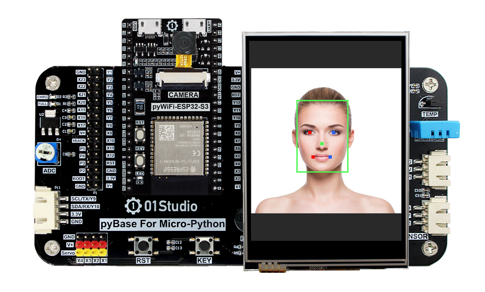
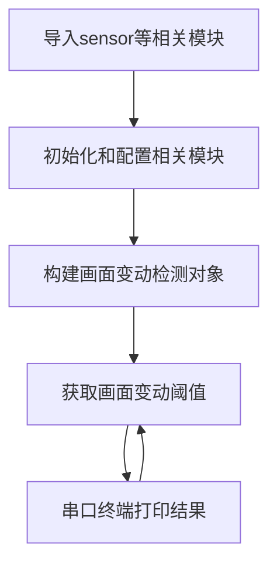
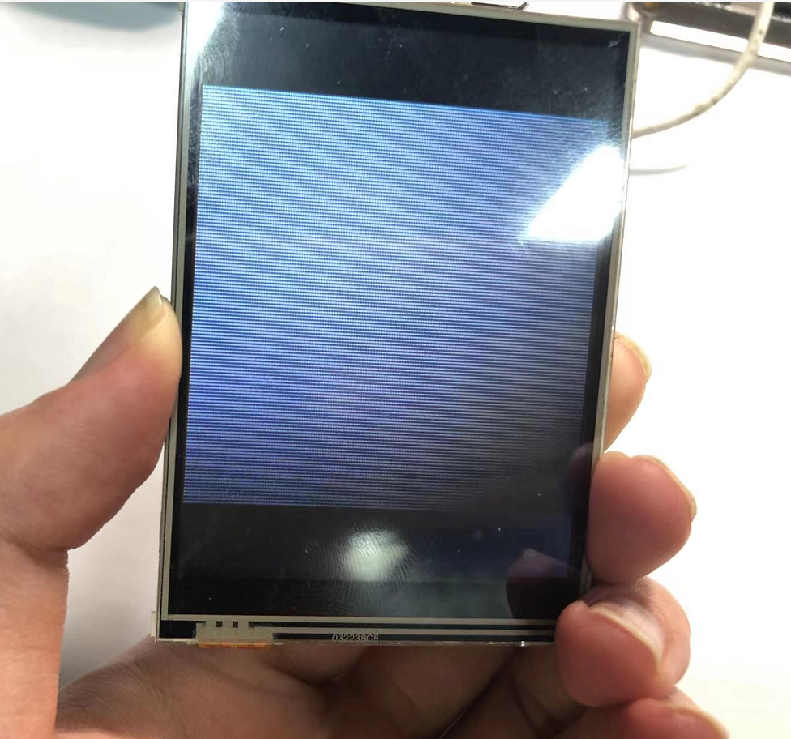
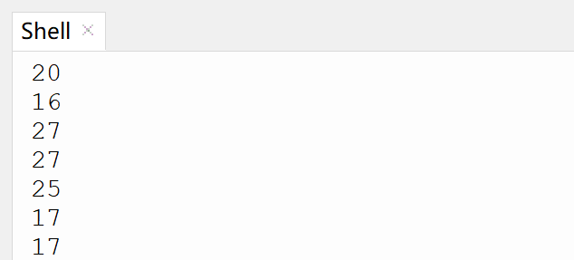
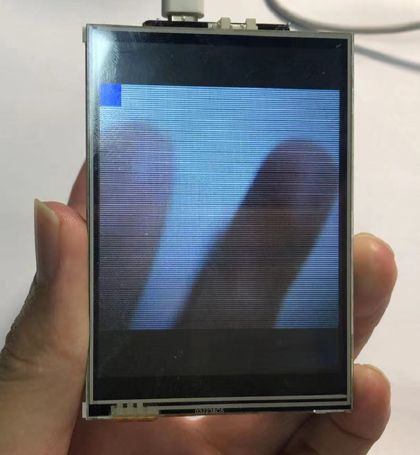
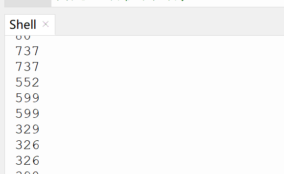

# 画面变动检测

## 前言
画面变动检测用于判断摄像头画面有无物体移动，可以用于安防监控，一旦有人或物体进入摄像头区域即触发响应。

## 实验平台
pyWiFi-ESP32-S3开发套件，OV2640摄像头，3.2寸显示屏。




## 实验目的
编程实现画面变动检测，判断摄像头界面是否有物体移动。

## 实验讲解

对于pyWiFi-ESP32-S3而言，相关AI功能集成在esp_ai模块下，用户可以通过构造函数和对象使用轻松实现运动检测。具体说明如下：

## esp_ai.motion_recognition对象

### 构造函数
```python
c = esp_ai.motion_recognition(threshold = 100)
```
构建画面变动检测对象。
- `threshold`: 触发阈值，默认100。数值越低，灵敏度越大。

### 使用方法

```python
c.start()
```
启动功能。

<br></br>

```python
c.read()
```
返回画面变动阈值。当超过预设阈值时，LCD图像左上角显示蓝色方块提示。

<br></br>

从上表可以看到，使用MicroPython编程我们只需要简单地调用esp_ai. motion_recognition()函数，对得到的结果再进行处理即可，非常方便。代码编写流程如下图所示：



## 参考代码

```python
'''
实验名称：画面变动检测
版本：v1.0
平台：pyWiFi ESP32-S3
作者：01Studio
说明：识别画面是否有变动，常用于安防中物体移动监控。
'''

import esp_ai,time
import sensor,tftlcd

#LCD初始化
d = tftlcd.LCD32(portrait=1)

#摄像头初始化,需要初始化为双层模式 frame=2
cam = sensor.OV2640(frame=2)
cam.reset()
cam.set_framesize(sensor.LCD) # 240*240分辨率
cam.set_hmirror(1) #后置摄像头模式

'''
构建画面变动检测对象。
'''
c = esp_ai.motion_recognition( threshold = 100) #阈值默认100，数值越小灵敏度越高。

c.start() #启动检测，可以通过LCD观察结果

while True:
    
    #获取颜色采集结果，返回矩形区域数量和对应的左上角和右下角坐标（4个值）。 
    value = c.read()
    
    print(value)
    
    time.sleep_ms(100) #间隔100ms
```

## 实验结果

将pyWiFi-ESP32-S3的摄像头设置为后置模式，LCD装在核心板上，这样更方便观察。


运行程序，画面静止时阈值较低。





将手或物体在界面移动，看到左上角蓝色方块提示有移动。阈值也比较大。




