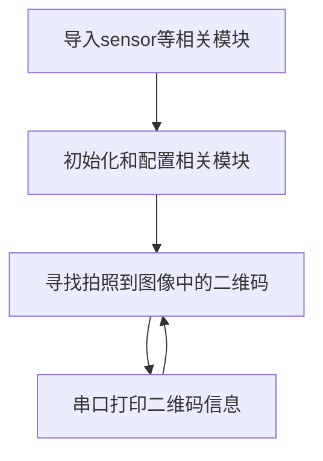
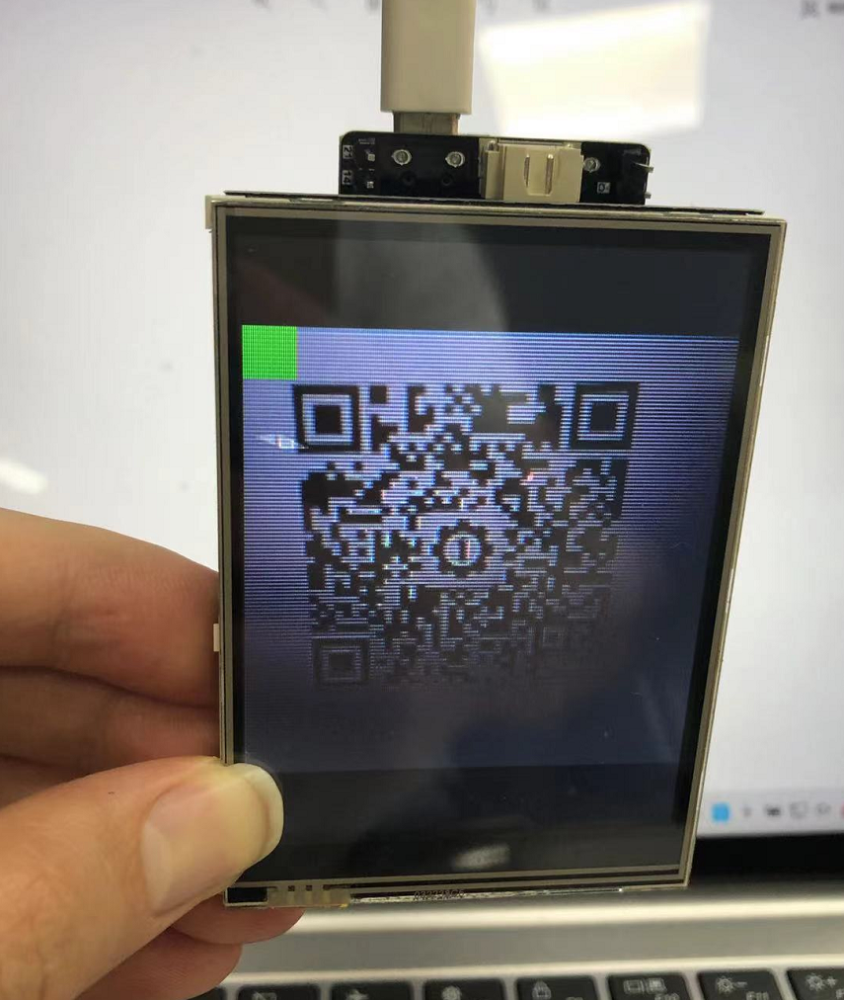
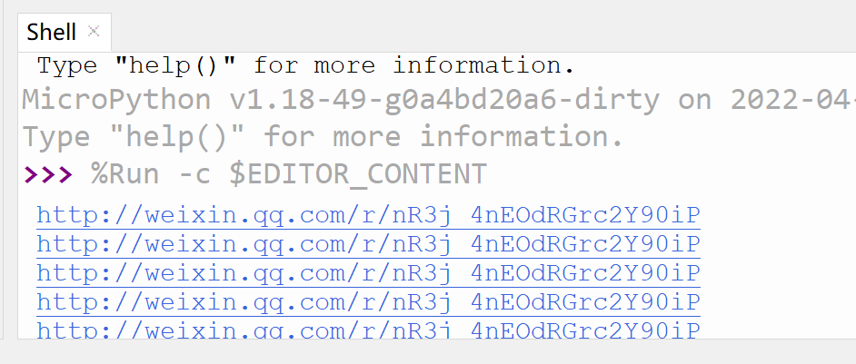

# 二维码识别

## 前言
相信大家都知道二维码了，特别是在扫码支付越来越流行的今天，二维码的应用非常广泛。今天我们就来学习如何使用用pyWiFi ESP32-S3开发套件实现二维码信息识别。

## 实验平台
pyWiFi-ESP32-S3开发套件，OV2640摄像头，3.2寸显示屏。


## 实验目的
编程实现二维码识别，并将识别到的信息通过串口终端打印出来。

## 实验讲解

二维码又称二维条码，常见的二维码为QR Code，QR全称Quick Response，是一个近几年来移动设备上超流行的一种编码方式，它比传统的Bar Code条形码能存更多的信息，也能表示更多的数据类型。

二维条码/二维码（2-dimensional bar code）是用某种特定的几何图形按一定规律在平面（二维方向上）分布的、黑白相间的、记录数据符号信息的图形；在代码编制上巧妙地利用构成计算机内部逻辑基础的“0”、“1”比特流的概念，使用若干个与二进制相对应的几何形体来表示文字数值信息，通过图象输入设备或光电扫描设备自动识读以实现信息自动处理：它具有条码技术的一些共性：每种码制有其特定的字符集；每个字符占有一定的宽度；具有一定的校验功能等。同时还具有对不同行的信息自动识别功能、及处理图形旋转变化点。

而对于pyWiFi-ESP32-S3而言，相关AI功能集成在esp_ai模块下，使用esp_ai.code_recognition()即可获取摄像头采集图像中二维码的相关信息。具体说明如下：

## esp_ai.code_recognition对象

### 构造函数
```python
c = esp_ai.code_recognition()
```
构建二维码识别对象。

### 使用方法

```python
c.start()
```
启动功能。

<br></br>

```python
c.read()
```
识别摄像头图像中的二维码并返回二维码信息。没有识别成功返回None。

<br></br>

从上表可以看到，使用MicroPython编程我们只需要简单地调用esp_ai.code_recognition()函数，对得到的结果再进行处理即可，非常方便。代码编写流程如下图所示：



## 参考代码

```python
'''
实验名称：二维码识别
版本：v1.0
平台：pyWiFi ESP32-S3
作者：01Studio
说明：实现二维码识别。
'''

import esp_ai,time
import sensor,tftlcd

#LCD初始化
d = tftlcd.LCD32(portrait=1)

#摄像头初始化s
cam = sensor.OV2640()
cam.reset()
cam.set_framesize(sensor.LCD) #240*240分辨率
cam.set_hmirror(1) #后置摄像头模式

'''
构建二维码识别对象
'''
c = esp_ai.code_recognition() 

c.start() #启动检测，可以通过LCD观察结果

while True:
    
    #无检测结果返回None, 有结果返回二维码信息。
    
    value = c.read()
    
    if value != None: #识别成功左上角出现绿色小方块，返回二维码信息
        
        print(value) #打印二维码信息
    
    time.sleep_ms(200)
```

## 实验结果

将pyWiFi-ESP32-S3的摄像头设置为后置模式，LCD装在核心板上，这样更方便观察。


为了更好地识别，图像上二维码需比较平展，不能太小。（暂时不支持太奇葩的二维码）。

原图：


运行代码，摄像头正对二维码，识别成功后可以看到LCD左上角出现绿色方块提示：



串口终端打印二维码详细信息：



二维码是日常生活应用非常广泛的东西，有了本节实验技能，我们就可以轻松打造一个属于自己的二维码扫描仪了。