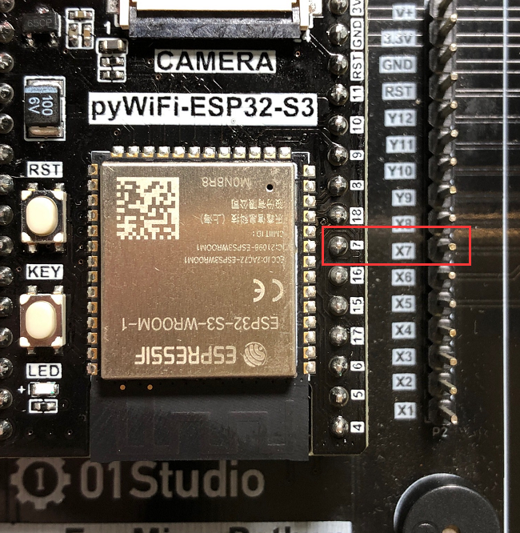
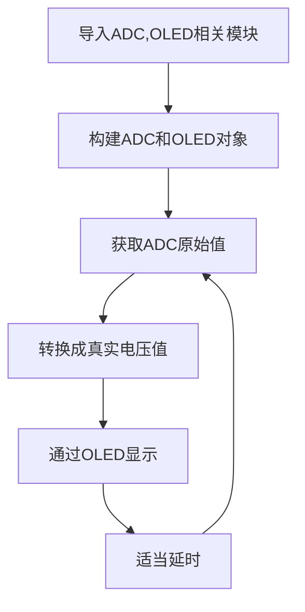
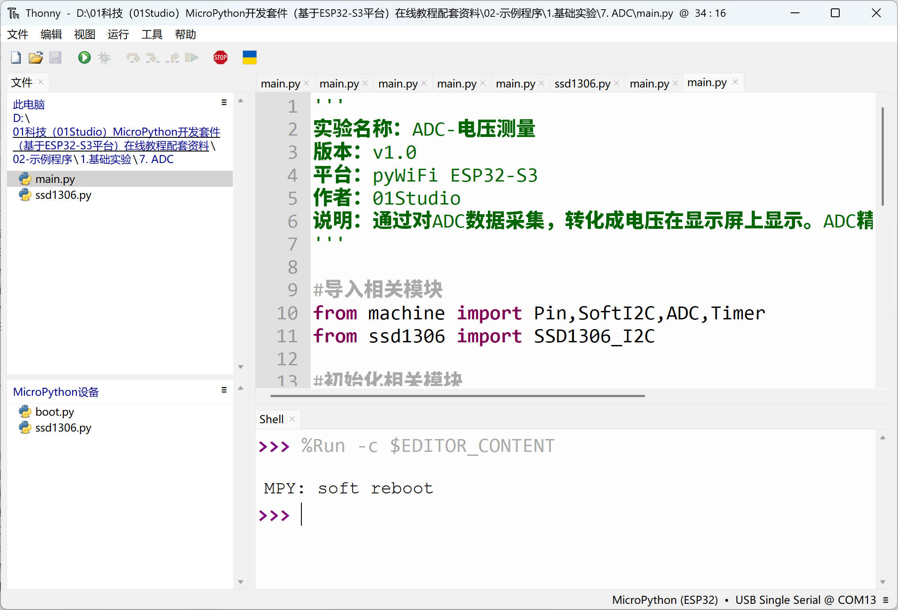
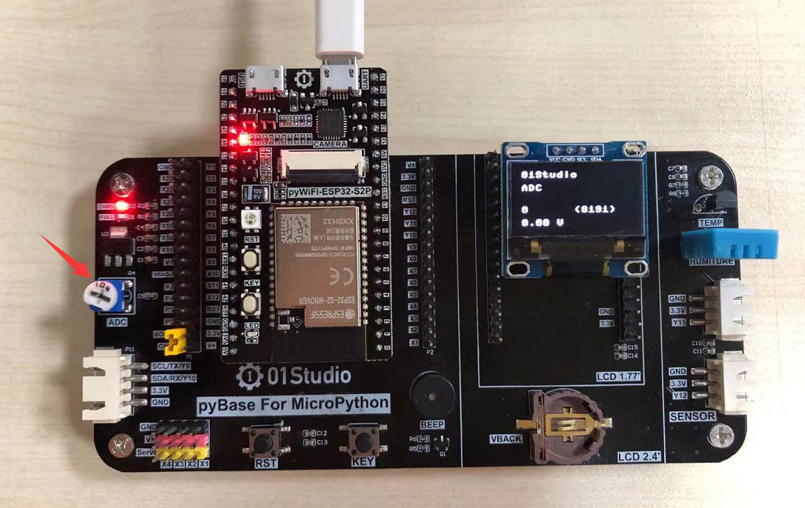
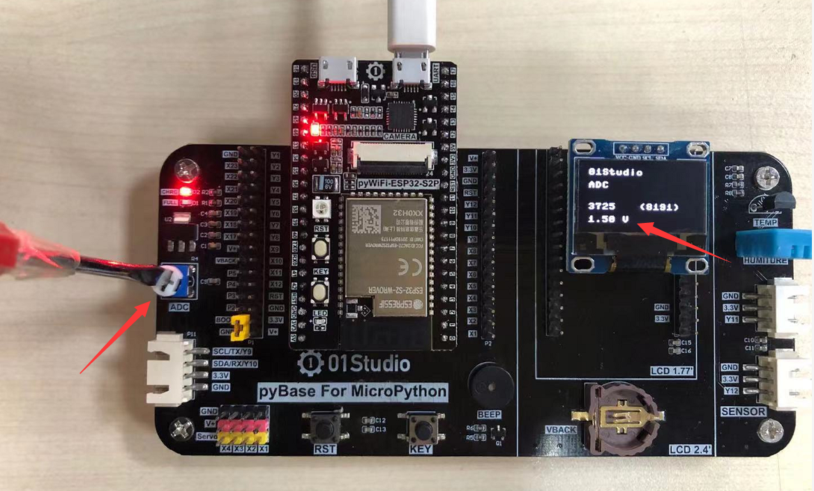

# ADC（电压测量）

## 前言
ADC(analog to digital conversion) 模拟数字转换。意思就是将模拟信号转化成数字信号，由于单片机只能识别二级制数字，所以外界模拟信号常常会通过ADC转换成其可以识别的数字信息。常见的应用就是将变化的电压转成数字信号实现对电压值测量。

## 实验平台

pyWiFi ESP32-S3 和 pyBase开发底板。


## 实验目的
通过编程调用MicroPython的内置ADC函数，实现测量0-3.3V电压，并显示到屏幕上。

## 实验讲解

pyBase开发底板的X7引脚连接到了电位器，通过电位器的调节可以使得X7引脚上的电压变化范围实现从0-3.3V。




从上图可以看到，电位器引脚对应pyBase的X7,实际是跟pyWiFi-ESP32-S3的‘7’引脚ADC输入引脚相连。

ESP32-S3有2路12位精度的ADC，支持多个通道（引脚）输入, ADC默认只能测量0-1V的量程，但ESP32-S3内部集成了衰减器，最大支持11dB衰减，通过配置衰减器最多能测量3V左右的电压。我们来看看ADC模块的构造函数和使用方法。

## ADC对象

### 构造函数
```python
adc = machine.ADC(Pin(id))
```
构建ADC对象，ADC引脚对应如下：

- `Pin(id)` ：支持ADC的Pin对象，如：Pin(7)。


### 使用方法
```python
adc.read()
```
获取ADC值，测量精度是12位，返回0-4095（对应电压0-1V）。

<br></br>

```python
adc.atten(attenuation)
```
配置衰减器。配置衰减器能增加电压测量范围，以牺牲精度为代价的。
- `attenuation` ：衰减设置。
    - `ADC.ATTN_0DB` ：0dB衰减，最大测量电压1.00V。（默认配置）
    - `ADC.ATTN_2_5DB` ： 2.5dB 衰减, 最大输入电压约为 1.34v；
    - `ADC.ATTN_6DB` ：6dB 衰减, 最大输入电压约为 2.00v；
    - `ADC.ATTN_11DB` ：11dB 衰减, 最大输入电压约为3.3v

你没看错，就这么简单，两句函数就可以获得ADC数值。我们将在本实验使用11DB衰减以获得量程0-3.3V。让我们来理顺一下编程逻辑。先导入相关模块，然后初始化模块。在循环中不断读取ADC的值，转化成电压值后，每隔300毫秒读取一次，具体如下：

更多用法请阅读官方文档：<br></br>
https://docs.01studio.cc/library/machine.ADC.html#machine-adc

<br></br>

熟悉ADC使用方法后，我们通过代码实现周期性测量引脚电压，代码编程流程图如下：




## 参考代码

```python
'''
实验名称：ADC-电压测量
版本：v1.0
平台：pyWiFi ESP32-S3
作者：01Studio
说明：通过对ADC数据采集，转化成电压在显示屏上显示。ADC精度12位（0~4095），测量电压0-3.3V。
'''

#导入相关模块
from machine import Pin,SoftI2C,ADC,Timer
from ssd1306 import SSD1306_I2C

#初始化相关模块
i2c = SoftI2C(sda=Pin(42), scl=Pin(40))  #I2C初始化
oled = SSD1306_I2C(128, 64, i2c, addr=0x3c)

adc = ADC(Pin(7)) #引脚7跟pyBase的电位器相连接
adc.atten(ADC.ATTN_11DB) #开启衰减器，测量量程增大到3.3V

def ADC_Test(tim):

    oled.fill(0)  # 清屏显示黑色背景
    oled.text('01Studio', 0, 0)  # 首行显示01Studio
    oled.text('ADC', 0, 15)      # 次行显示实验名称

    #获取ADC数值
    oled.text(str(adc.read()),0,40)
    oled.text('(4095)',60,40)

    #计算电压值，获得的数据0-4095相当于0-3.3V，（'%.2f'%）表示保留2位小数
    oled.text(str('%.2f'%(adc.read()/4095*3.3)),0,55)
    oled.text('V',40,55)

    oled.show()

#开启定时器
tim = Timer(1)
tim.init(period=300, mode=Timer.PERIODIC, callback=ADC_Test) #周期300ms
```

## 实验结果

在Thonny IDE运行代码：



电位器顺时钟拧到尽头是0V



通过调节电位器，可以发现电压在不断变化。如下图：



:::danger 警告
ADC测量输入电压请勿大于3.3V，有可能烧坏主控芯片。
:::
