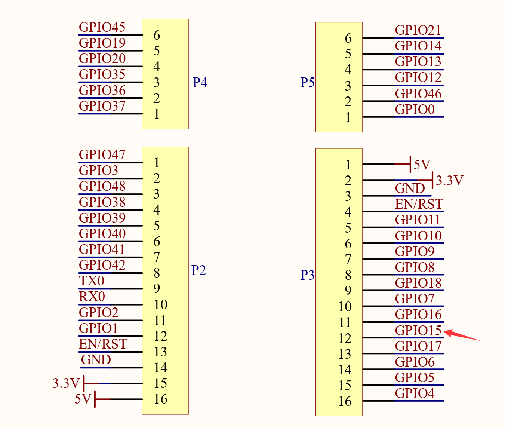
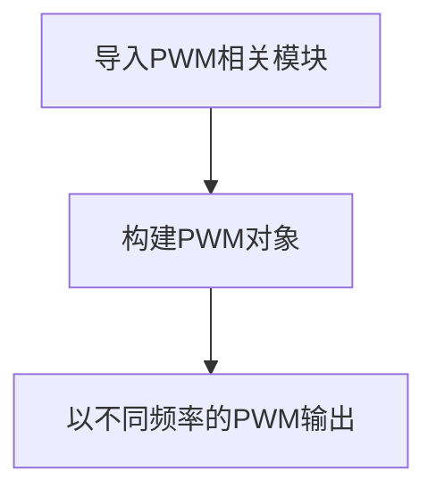
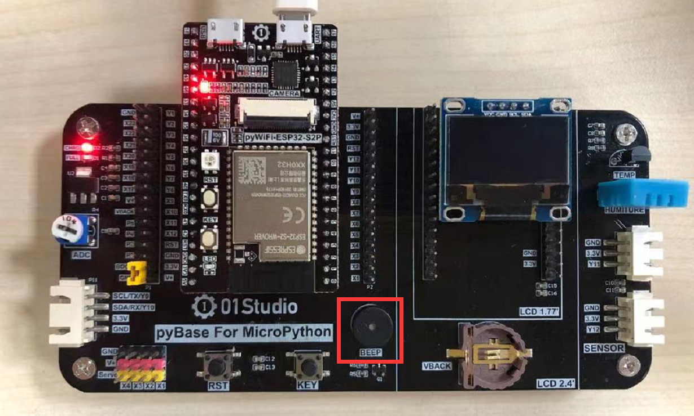

# PWM（无源蜂鸣器）

## 前言
PWM（脉冲宽度调制）就是一个特定信号输出，主要用于输出不同频率、占空比（一个周期内高电平出现时间占总时间比例）的方波。以实现固定频率或平均电压输出。


## 实验平台

pyWiFi ESP32-S3 和 pyBase开发底板。


## 实验目的
通过不同频率的PWM信号输出，驱动无源蜂鸣器发出不同频率的声音。

## 实验讲解

蜂鸣器分有源蜂鸣器和无源蜂鸣器，有源蜂鸣器的使用方式非常简单，只需要接上电源，蜂鸣器就发声，断开电源就停止发声。而本实验用到的无源蜂鸣器，是需要给定指定的频率，才能发声的，而且可以通过改变频率来改变蜂鸣器的发声音色，以此来判定pyWiFi-ESP32-S3的PWM输出频率是在变化的。

pyBase开发底板上的无源蜂鸣器连接到pyBase引脚X5。如下图所示：


从pyWiFi-ESP32-S3原理图可以看到由底板蜂鸣器X5连接到ESP32-S3的引脚4。


PWM 可以通过ESP32-S3所有GPIO引脚输出. 所有通道都有1个特定的频率，从0到40M之间（单位是Hz）。占空比的值为0至1023之间。在本实验中我们用到引脚15。

## PWM对象

### 构造函数
```python
pwm = machine.PWM(machine.Pin(id), freq, duty)
```
构建PWM对象，PWM对象位于machine模块下。

- `machine.Pin(id)` ：引脚编号，如Pin(12);
- `freq` ：PWM频率，单位：Hz, 范围：1-40MHz;
- `duty` ：PWM占空比，范围：0-1023;

### 使用方法
```python
pwm.freq([value])
```
设置频率。不传参数返回当前频率。

<br></br>

```python
pwm.duty([value])
```
设置占空比。不传参数返回当前占空比。

<br></br>

```python
pwn.deinit()
```
注销PWM。

<br></br>


更多用法请阅读官方文档：<br></br>
https://docs.01studio.cc/library/machine.PWM.html

<br></br>

无源蜂鸣器我们可以用特定频率的方波来驱动，方波的原理很简单，就是一定频率的高低电平转换，可以简单理解成占空比为50%的PWM输出。


结合上述讲解，总结出代码编写流程图如下：



## 参考代码

```python
'''
实验名称：PWM
版本：v1.0
平台：pyWiFi ESP32-S3
作者：01Studio
说明：通过不同频率的PWM信号输出，驱动无源蜂鸣器发出不同频率的声音。
'''

from machine import Pin, PWM
import time

Beep = PWM(Pin(15), duty=512) # 在同一语句下创建和配置PWM,占空比50%

#蜂鸣器发出频率200Hz响声
Beep.freq(200)
time.sleep(1)

#蜂鸣器发出频率400Hz响声
Beep.freq(400)
time.sleep(1)

#蜂鸣器发出频率600Hz响声
Beep.freq(600)
time.sleep(1)

#蜂鸣器发出频率800Hz响声
Beep.freq(800)
time.sleep(1)

#蜂鸣器发出频率1000Hz响声
Beep.freq(1000)
time.sleep(1)

#停止
Beep.deinit()
```

## 实验结果

运行代码，可以听到蜂鸣器依次发出不同频率的响声。



有条件的朋友可以使用示波器测量pyWiFi-ESP32-S3的引脚4或pyBase的X5接口，观察信号波形的变化：


到了这一节，我们发现实验中对象函数使用方法非常简单，这是好事，让我们可以将更多精力放在应用上，做出更多好玩的创意。而不需要过多的关注复杂的底层代码开发。而随着要实现功能的复杂化让编程的代码数量变多，逻辑也将略显复杂。
