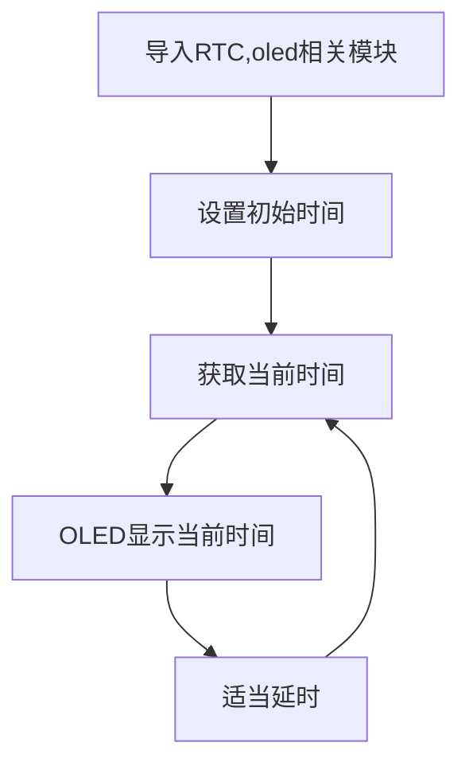
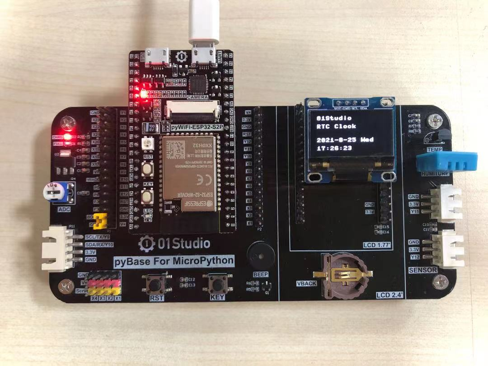

# RTC实时时钟

## 前言
时钟可以说我们日常最常用的东西了，手表、电脑、手机等等无时无刻不显示当前的时间。可以说每一个电子爱好者心中都希望拥有属于自己制作的一个电子时钟，接下来我们就用MicroPython开发板来制作一个属于自己的电子时钟。


## 实验平台

pyWiFi ESP32-S3 和 pyBase开发底板。


## 实验目的
学习RTC编程和制作电子时钟，使用OLED显示。

## 实验讲解

实验的原理是读取RTC数据。毫无疑问，强大的MicroPython已经集成了内置时钟函数模块。位于machine的RTC模块中，具体介绍如下：

## RTC对象

### 构造函数
```python
rtc = machine.RTC()
```
构建RTC对象，RTC对象位于machine模块下。

### 使用方法
```python
rtc.datetime((2025, 1, 1, 2, 0, 0, 0, 0))
```
设置RTC日期和时间。(2025, 1, 1, 2, 0, 0, 0, 0)按顺序分别表示（年，月，日，星期，时，分，秒，微妙），其中星期使用0-6表示星期一到星期日。

<br></br>

```python
rtc.datetime()
```
获取当前RTC时间。返回元组：（年，月，日，星期，时，分，秒，微妙），其中星期使用0-6表示星期一到星期日。

更多用法请阅读官方文档：<br></br>
https://docs.01studio.cc/library/machine.RTC.html#machine-rtc

<br></br>

从上表可以看到RTC（）的使用方法，我们需要做的就是先设定时间，然后再获取当前芯片里的时间，通过OLED显示屏显示，如此循环。在循环里，如果一直获取日期时间数据会造成资源浪费，所以可以每隔第一段时间获取一次数据，又由于肉眼需要看到至少每秒刷新一次即可，这里每隔300ms获取一次数据，所以具体流程如下：

熟悉RTC使用方法后，我们通过代码实现首次上电如果检测到未设置时间可以先设置时间，然后周期打印获取的时间信息，代码编程流程图如下：




## 参考代码

```python
'''
实验名称：RTC实时时钟
版本：v1.0
平台：pyWiFi ESP32-S3
作者：01Studio
说明：使用Thonny连接开发板会自动更新RTC时间
'''

# 导入相关模块
from machine import Pin, SoftI2C, RTC,Timer
from ssd1306 import SSD1306_I2C

# 定义星期和时间（时分秒）显示字符列表0-6
week = ['Mon', 'Tues', 'Wed', 'Thur', 'Fri', 'Sat', 'Sun']
time_list = ['', '', '']

# 初始化所有相关对象
i2c = SoftI2C(sda=Pin(42), scl=Pin(40)) #OLED屏I2C初始化
oled = SSD1306_I2C(128, 64, i2c, addr=0x3c)
rtc = RTC()

# 首次上电配置时间，按顺序分别是：年，月，日，星期，时，分，秒，次秒级；这里做了
# 一个简单的判断，检查到当前年份不对就修改当前时间，开发者可以根据自己实际情况来
# 修改。
if rtc.datetime()[0] != 2025:
    rtc.datetime((2025, 1, 1, 2, 0, 0, 0, 0))

def RTC_Run(tim):

    datetime = rtc.datetime()  # 获取当前时间

    oled.fill(0)  # 清屏显示黑色背景
    oled.text('01Studio', 0, 0)    # 首行显示01Studio
    oled.text('RTC Clock', 0, 15)  # 次行显示实验名称

    # 显示日期，字符串可以直接用“+”来连接
    oled.text(str(datetime[0]) + '-' + str(datetime[1]) + '-' + str(datetime[2]) + ' ' + week[datetime[3]], 0, 40)

    # 显示时间需要判断时、分、秒的值否小于10，如果小于10，则在显示前面补“0”以达
    # 到较佳的显示效果
    for i in range(4, 7):
        if datetime[i] < 10:
            time_list[i - 4] = "0"
        else:
            time_list[i - 4] = ""

    # 显示时间
    oled.text(time_list[0] + str(datetime[4]) + ':' + time_list[1] + str(datetime[5]) + ':' + time_list[2] + str(datetime[6]), 0, 55)
    oled.show()

#开启RTOS定时器
tim = Timer(0)
tim.init(period=300, mode=Timer.PERIODIC, callback=RTC_Run) #周期300ms
```

## 实验结果

在Thonny IDE运行代码：


可以看到终端打印当前RTC时间信息。



细心的用户或许已经发现运行程序后RTC时间自动更新，那是因为thonny每次连接MicroPython开发板会自动更新开发板的RTC时间。RTC时间是断电丢失的，要想RTC时间连续运行需要保持对开发板供电，用户可以使用RTC功能打造自己的电子时钟。


:::tip 提示
由于ESP32-S3没有后备电池引脚，所以不支持掉电保存。因此pybase上面的纽扣电池是不起作用的。

:::