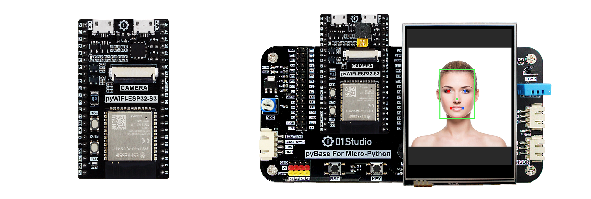

# 目录

### **pyWiFi ESP32-S3开发套件介绍**

- [产品参数](./intro/product.md)

### [**开发板资料下载**](./download.md)

### [**Python3基础知识**](./python_learn.md)

### **开发环境搭建**

- [Thonny IDE开发软件安装](./getting_start/thonny_ide.md)
- [串口驱动安装](./getting_start/driver.md)
- [REPL串口交互](./getting_start/repl.md)
- [文件系统](./getting_start/file_system.md)
- [例程测试](./getting_start/demo.md)
- [代码离线运行](./getting_start/run_offline.md)
- [固件更新](./getting_start/firmware_update.md)

### **基础实验**

- [点亮第1个LED](./basic_examples/led.md) 
- [按键](./basic_examples/key.md) 
- [外部中断](./basic_examples/exti.md) 
- [定时器](./basic_examples/timer.md) 
- [I2C总线（OLED显示屏）](./basic_examples/oled.md) 
- [RTC实时时钟](./basic_examples/rtc.md) 
- [ADC（电压测量）](./basic_examples/adc.md) 
- [PWM（蜂鸣器）](./basic_examples/pwm_beep.md) 
- [UART（串口通讯）](./basic_examples/uart.md) 
- [LCD显示屏](./basic_examples/lcd.md)
- [电阻触摸屏](./basic_examples/touch.md)  
- [触摸屏按钮](./basic_examples/touch_button.md)  
- [thread（线程）](./basic_examples/thread.md) 
- [看门狗](./basic_examples/watchdog.md) 
- [文件读写](./basic_examples/file.md) 

### **WiFi应用**

- [连接无线路由器](./wifi/connect_wifi.md) 
- [Socket通讯](./wifi/socket.md) 
- [MQTT通讯](./wifi/mqtt.md) 

### **蓝牙应用**

- [蓝牙广播](./bluetooth/broadcast.md) 
- [蓝牙从机（数据收发）](./bluetooth/peripheral.md) 

### **传感器**

- [温度传感器（DS18B20）](./sensor/ds18b20.md) 
- [温湿度传感器（DHT11）](./sensor/dht11.md) 
- [人体感应传感器](./sensor/human_induction.md) 
- [光敏传感器](./sensor/photosensitive.md) 
- [土壤湿度传感器](./sensor/soil_wet.md) 
- [水（液）位传感器](./sensor/liquid_level.md) 
- [超声波测距（HC-SR04）](./sensor/hcsr04.md) 
- [大气压强传感器（BMP280）](./sensor/bmp280.md) 
- [红外测温（MLX90614）](./sensor/mlx90614.md) 

### **拓展模块**

- [继电器](./module/relay.md) 
- [舵机](./module/servo.md) 
- [Neopixel彩灯](./module/neopixel.md) 
- `OV2640摄像头`
    - [拍照](./module/ov2640/ov2640.md) 
    - [图传](./module/ov2640/stream.md) 
- `USB摄像头`
    - [拍照](./module/usb_cam/usb_cam.md) 
    - [图传](./module/usb_cam/stream.md) 

### **AI视觉识别**

- [简介](./ai_vision/intro.md) 
- [二维码识别](./ai_vision/qr_code.md) 
- [颜色识别](./ai_vision/color.md) 
- [画面变动检测](./ai_vision/motion.md) 
- [猫脸检测](./ai_vision/cat_face.md) 
- [人脸检测](./ai_vision/face.md) 
- [人脸识别](./ai_vision/face_recog.md) 

### [**更新说明**](./update.md)

