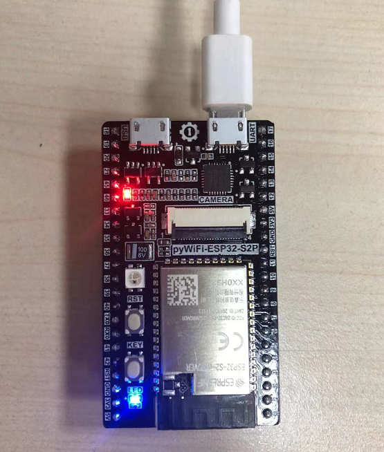
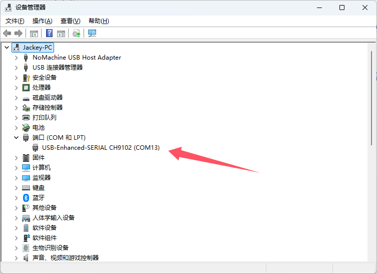
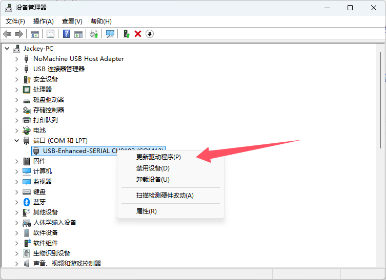
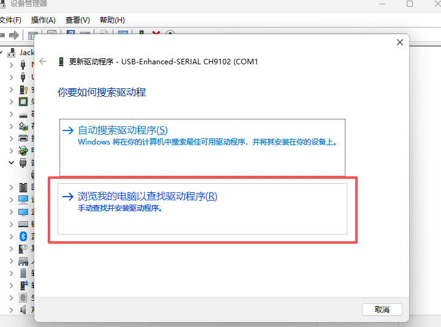
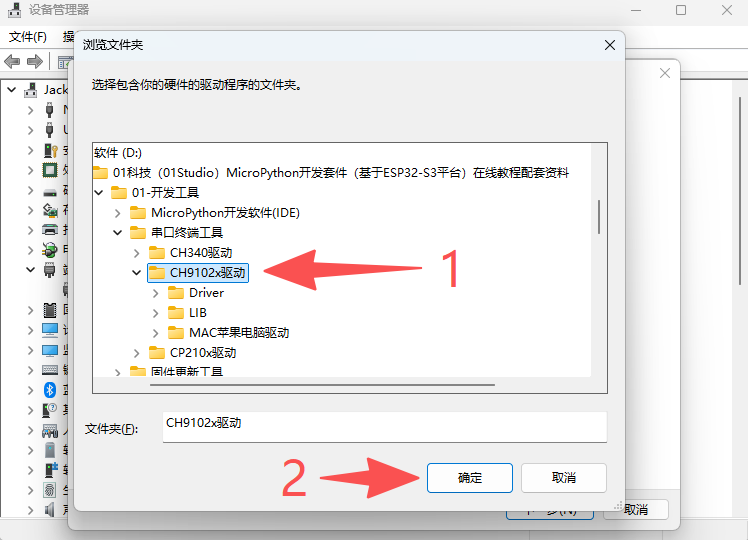
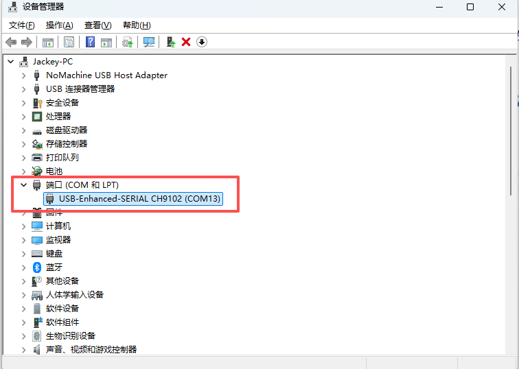

# 驱动安装

我们将pyWiFi-ESP32-S3开发板通过MicroUSB数据线连接到电脑，**注意是接右边一个黑色小芯片上方的USB口。**

推荐使用Win10以上版本系统，一般情况下能自动安装驱动。鼠标右键点击 **“我的电脑—属性—设备管理器”** ： 出现串口号说明安装成功，如下图所示。

如果没有自动安装（通常是出现感叹号），可以点击右键 **更新驱动**：

浏览计算机安装，选择路径是 **开发板资料包--开发工具--串口终端工具--CH9102x驱动**文件夹。

安装完成后，我们看到，原来的叹号消失，出现了一个COM13串口号。这个串口号不同的电脑会显示不同。

