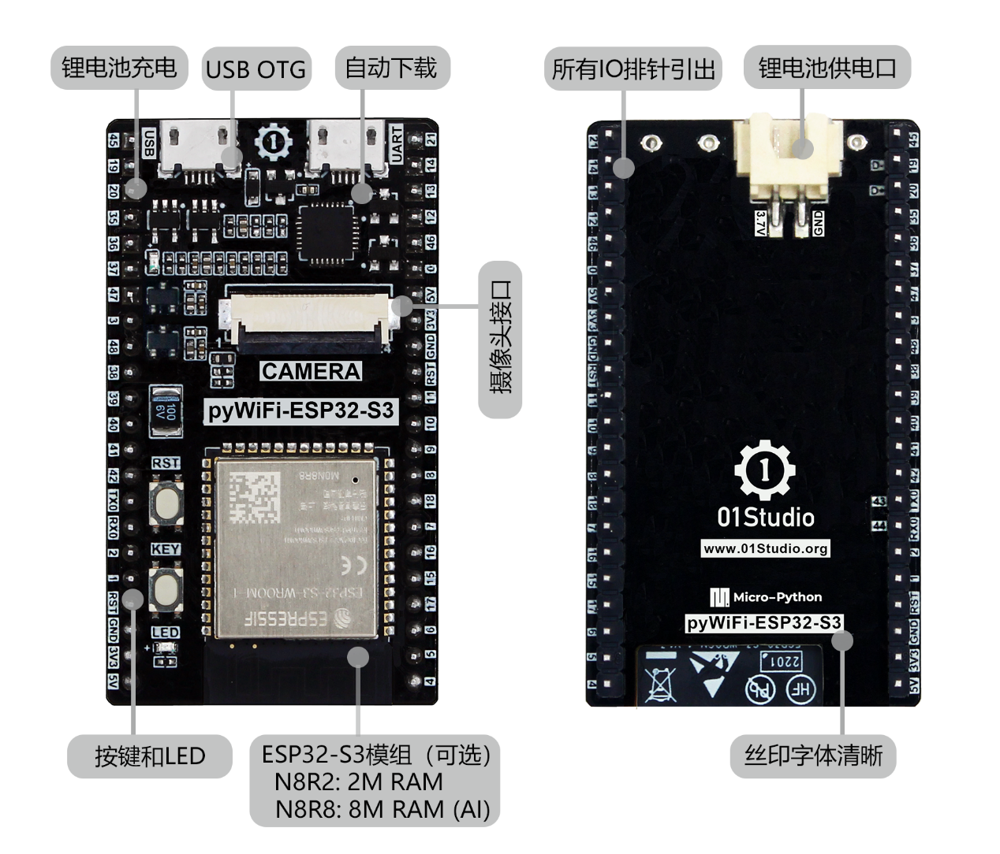
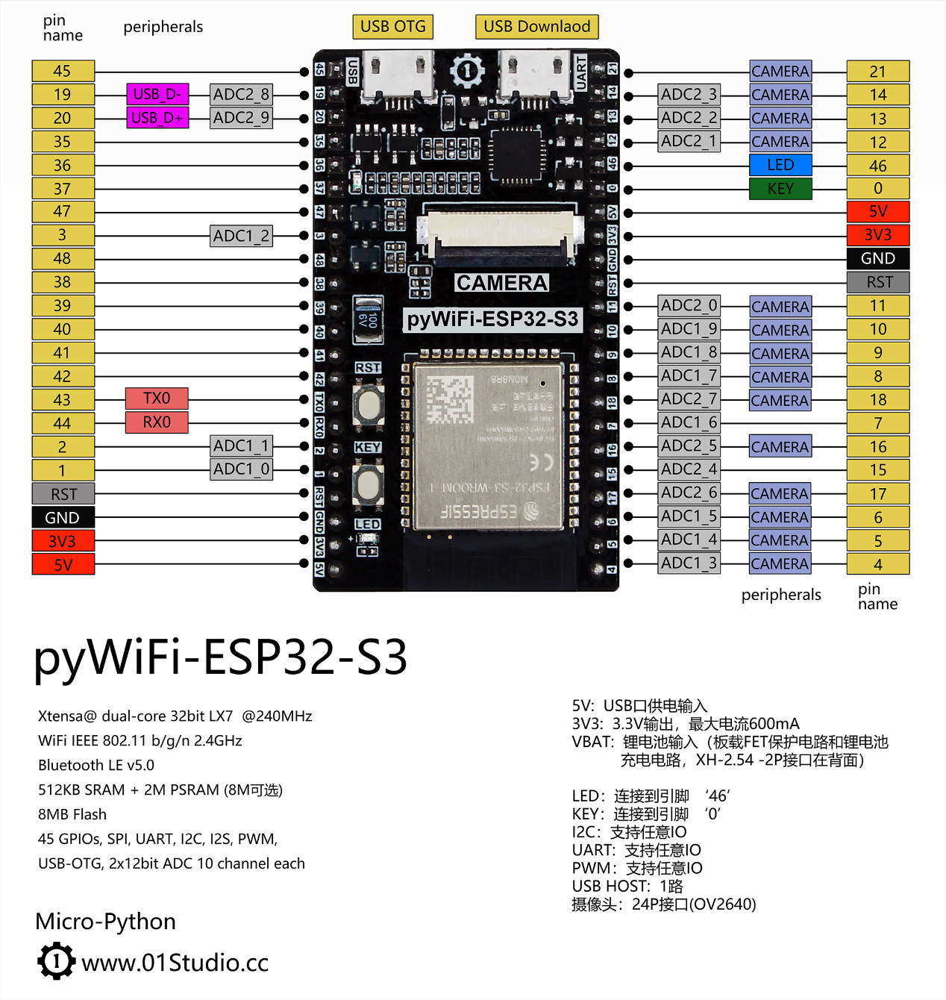
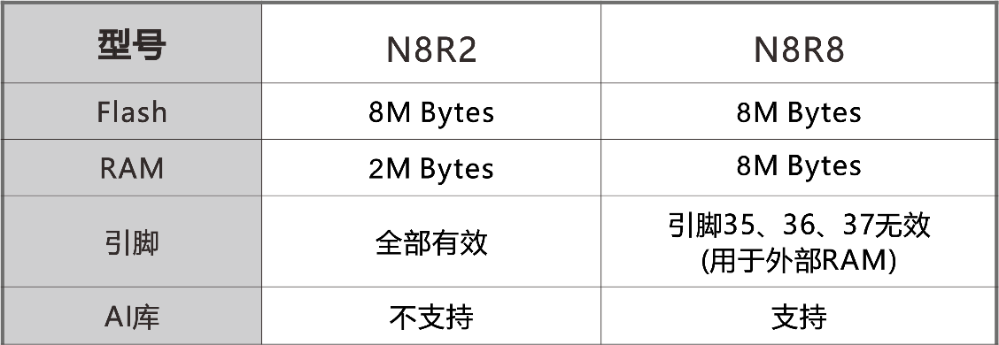
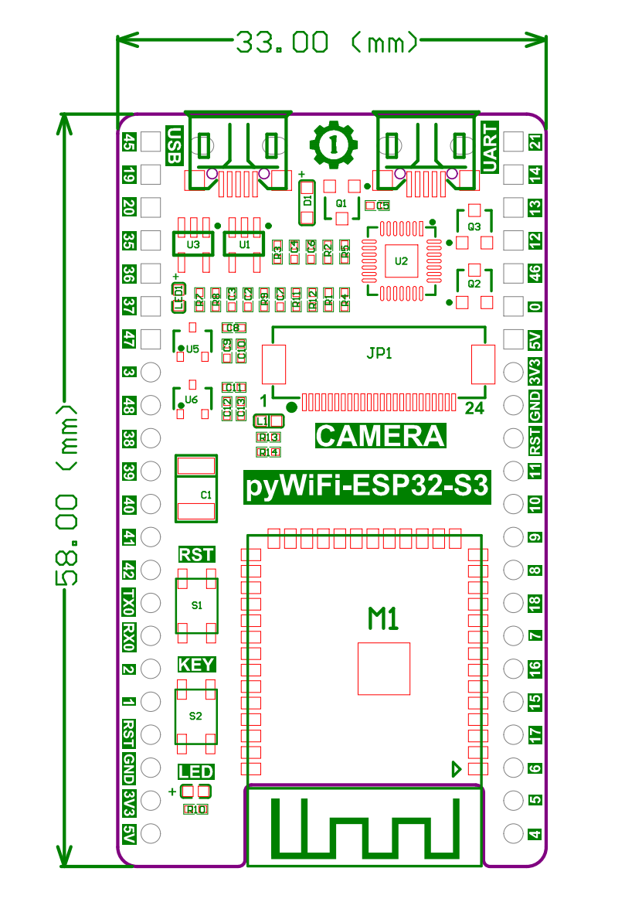
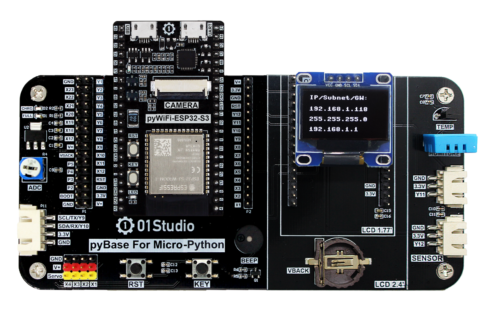

# 产品参数

## pyWiFi ESP32-S3

[**点击购买>>**](https://item.taobao.com/item.htm?id=673926620482)

pyWiFi-ESP32-S3是由01Studio设计研发，基于乐鑫ESP32-S3（内置WiFi和蓝牙功能）高性能处理器，拥有出色的射频性能，外观小巧精美，适用于各类电子产品DIY，商业项目开发和使用。

主要特点如下：

- 自动下载电路
- 锂电池接口和充电电路
- 24P摄像头接口
- USB OTG接口
- 全IO引出

## 硬件资源

## 引脚图

pyWiFi-ESP32-S3当前提供2个硬件版本，分别是N8R2和N8R8，如果需要使用AI库则需要使用N8R8（8M内存版本）。

## 详细参数

|  产品参数 |
|  :---:  | ---  |
| 主控 | **ESP32-S3** 32-bit dual cores @ up to 240MHz |
| 内存 | 2M / 8M Bytes PSRAM 可选 |
| FLASH  | 8M Bytes | 
| WiFi  | 2.4GHz WiFi 802.11 b/g/n |
| Bluetooth  | Bluetooth 5, BLE + Mesh |
| LED  |  ● 可编程LED（蓝色）   ● 充电指示灯（红色，充满熄灭） |
| 按键  |  ● 功能键（BOOT）   ● 复位键 |
| GPIO  | 32 x GPIO  (包含ADC/PWM/UART/I2C/SPI等功能) |
| 摄像头接口  | 24P-0.5mm FPC座 （提供ov2640摄像头案例） |
| USB  | ● USB2.0: MicroUSB接口，可接USB摄像头；    ● USB转TTL: MicroUSB接口,下载固件/编程/调试/供电 多合一。 |
| 锂电池接口  | XH-2.54 2P接口在背面 / 3.7V锂电池 |

|  外观规格 |
|  :---:  | ---  |
| 尺寸  | 42 x 33mm  (长宽为PCB尺寸) |

## 尺寸图

## pyBase底板

[**点击购买>>**](https://item.taobao.com/item.htm?id=624200370196)

pyBase是01Studio针对多款micropython核心板量身定制的底板，可以使用它可以做更多的MicroPython实验，pyBase同时设计了外设接口，扩展性非常强。以下是详细的功能说明：

### 详细参数

|  产品参数 |
|  :---:  | ---  |
| 双排母接口 | 兼容多款核心板 |
| 2.54mm排针 | 引出pyBoard全部引脚 |
| 按键  |  ● 可编程按键   ● 复位键 (RST) |
| 电位器  | ADC输入 | 
| 无源蜂鸣器  | PWM输出 | 
| Servo接口  | 舵机接口X1-X4 (连接舵机需要外接隔离电路) |
| OLED接口  | 0.96寸OLED显示屏 |
| LCD接口  | 支持01Studio 1.54/1.77/2.4/3.2等多款LCD显示屏 |
| 温度传感器  | DS18B20 |
| 温湿度传感器  | DHT11 |
| Sensor接口1  | 3P防呆接口，用于外接传感器 |
| Sensor接口2  | 3P防呆接口，用于外接传感器 |
| 通讯接口  | 4P防呆接口，用于外接UART/I2C设备 |

|  外观规格 |
|  :---:  | ---  |
| 尺寸  | 138 x 67mm  (长宽为PCB尺寸) |

### 尺寸图

### 组合使用图

- 搭配0.96寸oled显示屏 

- 搭配3.2寸LCD显示屏(电阻触摸)

