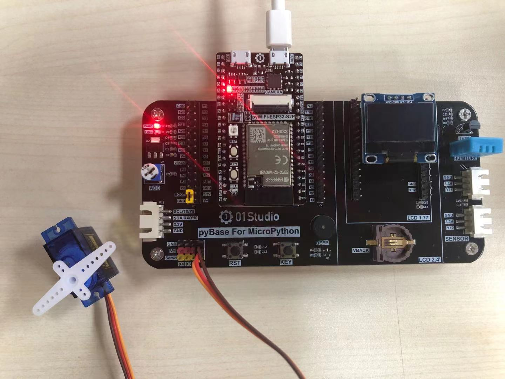
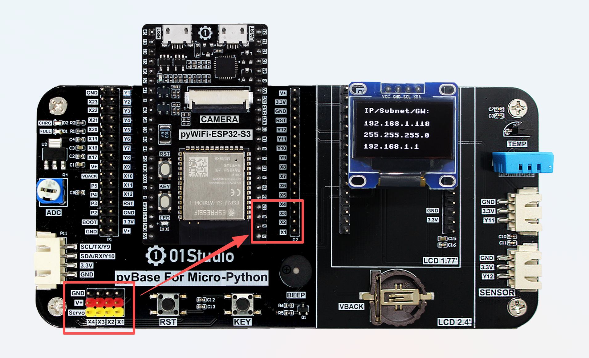
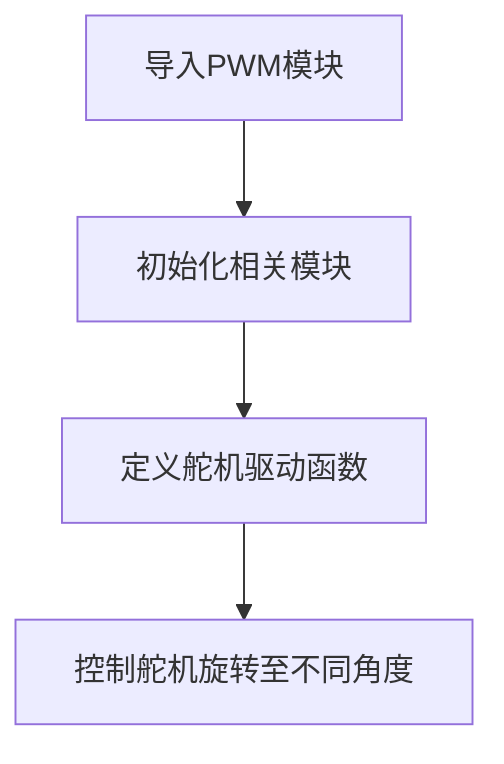
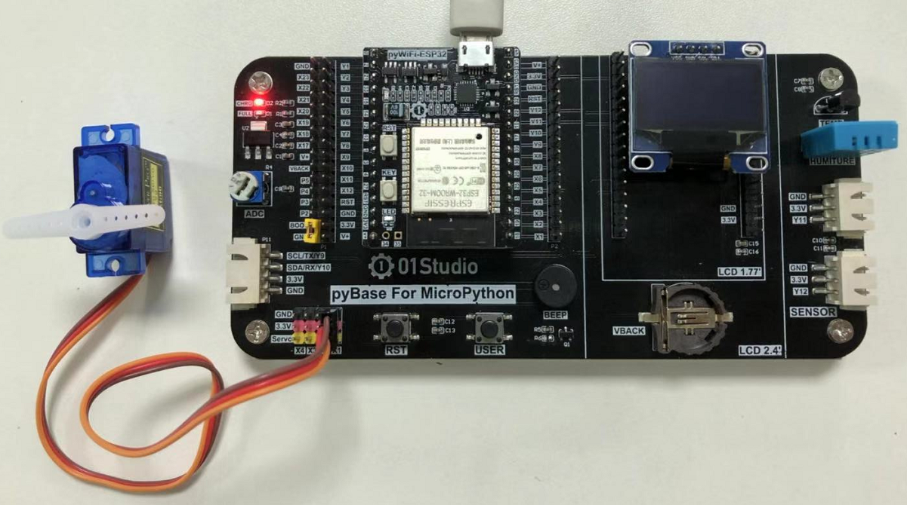
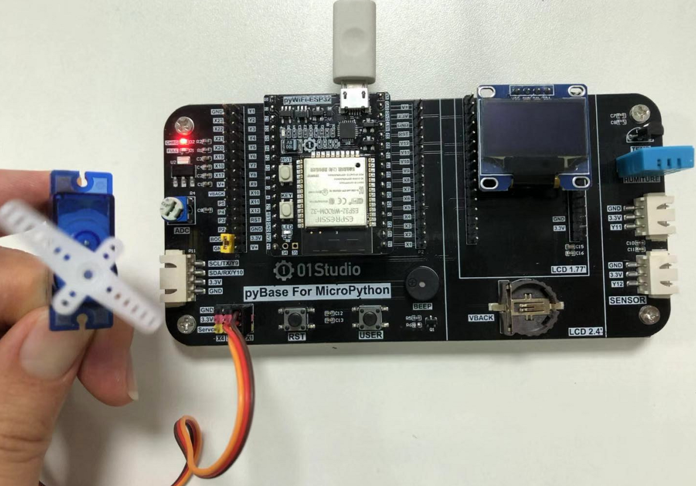

# 舵机

## 前言
舵机又叫伺服电机，是一个可以旋转特定角度的电机，可转动角度通常是90°、180°和360°（360°可以连续旋转）。我们看到的机器人身上就有非常多的舵机，它们抬手或者摇头的动作往往是通过舵机完成，因此机器人身上的舵机越多，意味着动作越灵活。

## 实验平台

pyWiFi-ESP32-S3开发套件和舵机。[**点击购买>>**](https://item.taobao.com/item.htm?id=623613580232)



:::danger 警告
请确认舵机内置隔离电路，或使用小功率舵机，避免反向电动势击穿主控损坏。
:::

## 实验目的
通过编程实现对SG90舵机的控制。

## 实验讲解

伺服电机对象通过3线（一般舵机的线序为信号，电源，地）控制，本节实验用到的是性价比较高的SG90舵机。通常情况下：黑色表示GND，红色表示VCC，橙色表示信号线。


pyBase上有4个位置可以插这些电机，分别是X1-X4引脚。对应pyWiFi-ESP32-S3的4、5、6、17脚。



180°舵机的控制一般需要一个20ms左右的时基脉冲，该脉冲的高电平部分一般为0.5ms-2.5ms范围内的角度控制脉冲部分，总间隔为2ms。以180度角度伺服为例，在MicroPython编程对应的控制关系是从-90°至90°，示例图如下：


而对于360°连续旋转舵机，上面的脉冲表则对应从正向最大速度旋转到反向最大速度旋转的过程。

如果过你学习过前面基于STM32平台的舵机实验，那就知道在STM32平台集成了舵机模块，使用起来非常方便。当前的ESP32-S3平台并没有集成Servo模块，但从上面可以看到上面是通过PWM来控制的，我们可以直接写PWM函数驱动即可。代码编程流程图如下：



## 参考代码

```python
'''
实验名称：舵机控制
版本：v1.0
平台：pyWiFi ESP32-S3
作者：01Studio 【www.01Studio.cc】
说明：通过编程控制舵机旋转到不同角度
'''

from machine import Pin, PWM
import time

S1 = PWM(Pin(4), freq=50, duty=0) # Servo1的引脚是0

'''
说明：舵机控制函数
功能：180度舵机：angle:-90至90 表示相应的角度
     360连续旋转度舵机：angle:-90至90 旋转方向和速度值。
'''
def Servo(servo,angle):
    S1.duty(int(((angle+90)*2/180+0.5)/20*1023))

#-90度
Servo(S1,-90)
time.sleep(1)

#-90度
Servo(S1,-45)
time.sleep(1)

#-90度
Servo(S1,0)
time.sleep(1)

#-90度
Servo(S1,45)
time.sleep(1)

#-90度
Servo(S1,90)
time.sleep(1)
```

## 实验结果

将180°舵机插到pyBase的X1的三线接口，运行程序，可以看到舵机依次旋转至不同角度。



## 360度连续旋转舵机

我们刚刚实现了180°舵机的角度控制，现在来做一下360°连续旋转舵机的实验，360°连续旋转舵机可以实现直流减速电机功能，用在小车或者航模上。

实验的代码不变，参数【-90至90】代表旋转方向和速度值大小。插上360°连续旋转舵机。可以看到舵机的旋转速度和方向逐渐变变化。



通过本节我们学会了使用不同类型的舵机，通过多路电机的组合使用，可以实现模型、航模、小车、机器人的实验。
