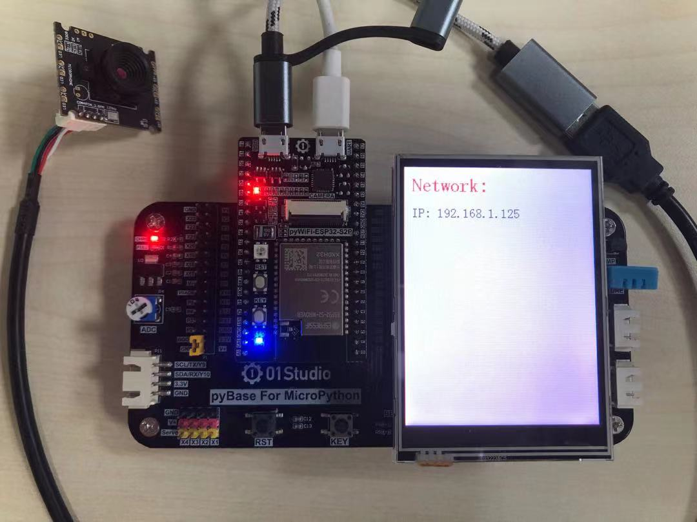
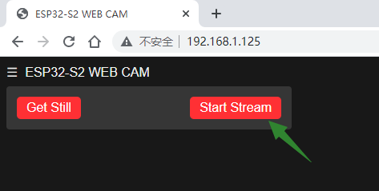
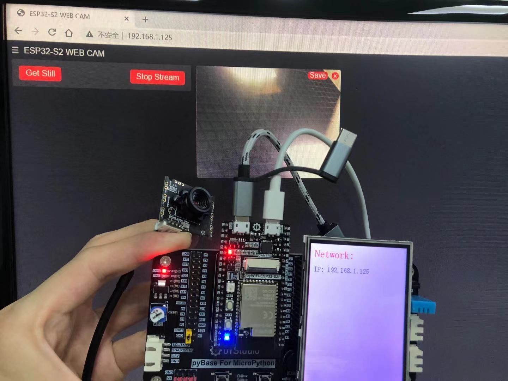
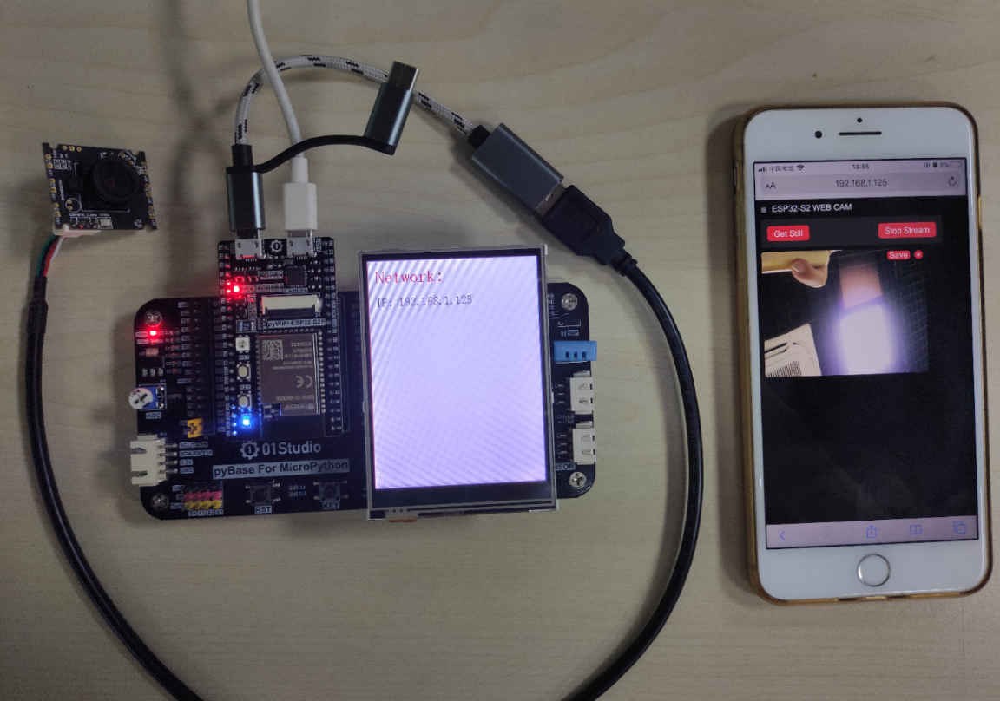

# 网络图传

上一节我们已经学习了USB摄像头的使用，本节不再重复图传只需要在摄像头连接WiFi后执行相关库函数即可。目前图传分辨率最大支持：QVGA-320*240。

## 参考代码

```python
'''
实验名称：USB摄像头无线图传
版本：v1.0
平台：pyWiFi ESP32-S3 + USB摄像头
作者：01Studio
说明：编程实现录拍摄图片并保存。
'''

from machine import Pin
import network,esp_usb,time
from tftlcd import LCD32

KEY=Pin(0,Pin.IN,Pin.PULL_UP) #构建KEY对象

#摄像头初始化,默认帧大小 QVGA 320X240
cam = esp_usb.CAM(framesize = esp_usb.CAM.VGA)

#定义常用颜色
BLACK = (0,0,0)
WHITE = (255,255,255)
RED = (255,0,0)

########################
# 构建3.2寸LCD对象并初始化
########################
d = LCD32(portrait=1) #默认方向竖屏

#填充白色
d.fill(WHITE)

#WIFI连接函数
def WIFI_Connect():

    WIFI_LED=Pin(46, Pin.OUT) #初始化WIFI指示灯

    wlan = network.WLAN(network.STA_IF) #STA模式
    wlan.active(True)                   #激活接口
    start_time=time.time()              #记录时间做超时判断

    if not wlan.isconnected():
        print('connecting to network...')
        wlan.connect('01Studio', '88888888') #输入WIFI账号密码

        while not wlan.isconnected():

            #LED闪烁提示
            WIFI_LED.value(1)
            time.sleep_ms(300)
            WIFI_LED.value(0)
            time.sleep_ms(300)

            #超时判断,15秒没连接成功判定为超时
            if time.time()-start_time > 15 :
                print('WIFI Connected Timeout!')
                break

    if wlan.isconnected():
        #LED点亮
        WIFI_LED.value(1)

        #串口打印信息
        print('network information:', wlan.ifconfig())
        
        #LCD显示IP信息
        d.printStr('Network:', 10, 10, RED, size=2)
        d.printStr('IP: ' + wlan.ifconfig()[0], 10, 50, BLACK, size=1)
        d.printStr('Subnet: ' + wlan.ifconfig()[1], 10, 90, BLACK, size=1)
        d.printStr('Gateway: ' + wlan.ifconfig()[2], 10, 130, BLACK, size=1)
        
        return True #连接成功

#执行WIFI连接函数
if WIFI_Connect():

    cam.stream() #无线图传
```

## 实验结果

将上面代码中的：

```python
wlan.connect('01Studio', '88888888') #输入WIFI账号密码
```

改成自己的无线路由器账号密码，只支持2.4G信号。不支持5G或者2.4G&5G混合信号。**保证电脑或手机和pyWiFi ESP32-S3开发板在同一个网段下（通常是指连接在同一个路由器），同时最好关闭电脑防火墙。**

运行代码，等待3~5秒摄像头初始化，然后连接wifi成功后可以在LCD或REPL看到IP信息。



在同一局域网络下的电脑浏览器输入IP地址：这里是 192.168.1.125，进入后如下图，点击“Start Stream”:



可以看到图传内容：



同样可以在手机浏览器输入IP地址进行图传。



点击浏览器的‘Save’按钮可以保存图片到本地：


