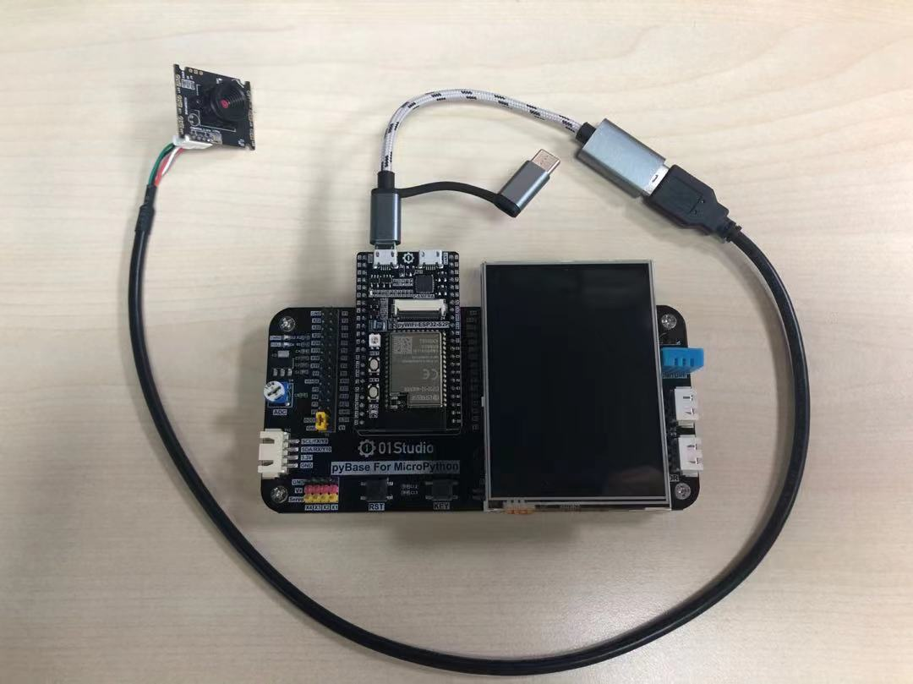
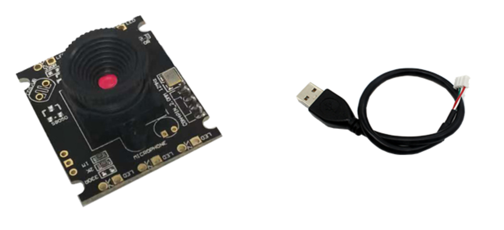
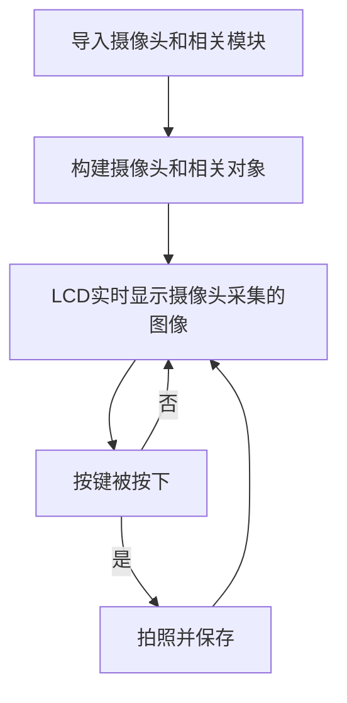
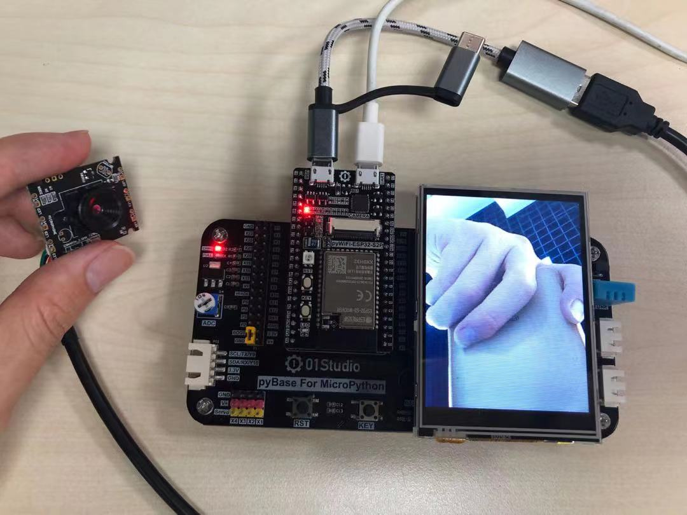
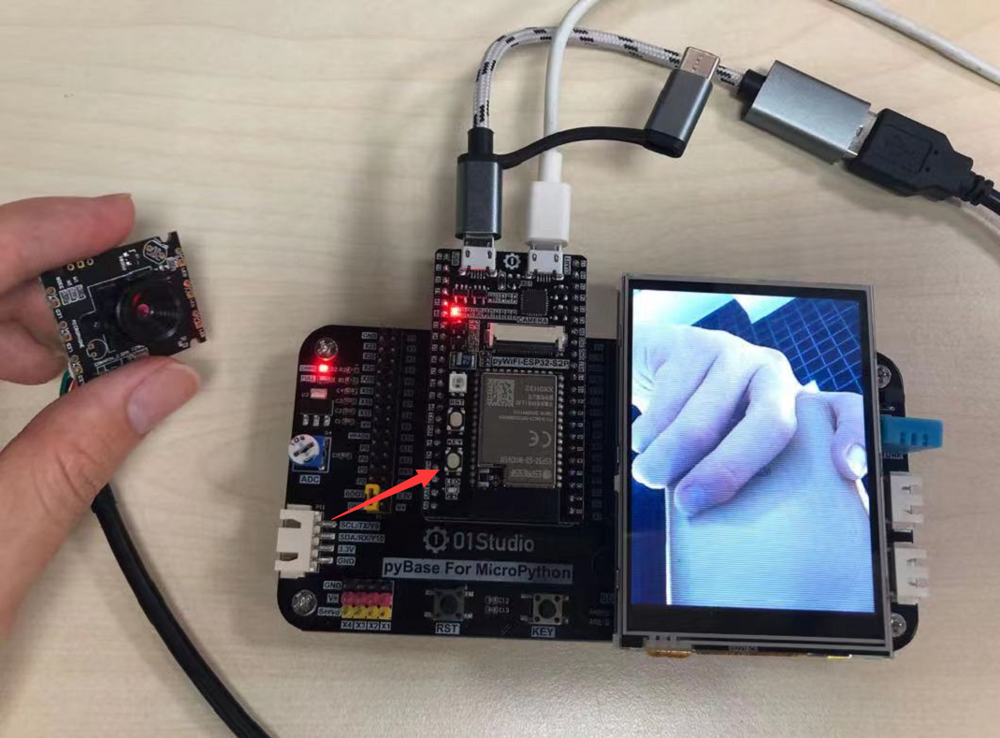

# 拍照

## 前言
ESP32-S3带1个标准的USB Host，可以外接USB设备，今天我们来学习一下USB摄像头的使用。

## 实验平台
pyWiFi-ESP32-S3开发套件、3.2寸显示屏、配套的USB摄像头。



## 实验目的
编写实现USB摄像头拍摄图片。

## 实验讲解

本例程实验的USB摄像头为01Studio ESP32-S3专用USB摄像头，ESP32-S3的USB Host受限于硬件和软件支持，目前只能使用专门的USB摄像头：

- USB摄像头 [**点击购买>>**](https://item.taobao.com/item.htm?id=655247799296)
- OTG转接线 [**点击购买>>**](https://item.taobao.com/item.htm?id=654856546989)

参数如下：



|  模块参数 |
|  :---:  | ---  |
| 调焦方式  | 手动调焦 |
| 接口定义  | USB2.0 |
| 像素  | 最高640*480（30万） |
| 模块尺寸  | 3 * 2mm |

01Studio已经将该usb摄像头相关功能封装成MicroPython库，用户直接使用即可，对象说明如下：

## CAM对象

### 构造函数
```python
esp_usb.CAM(framesize = esp_usb.CAM.QVGA)
```
构建USB摄像头对象。

- `framesize` 拍摄的帧尺寸：
    - `esp_usb.CAM.QQVGA` : 160*120
    - `esp_usb.CAM.QVGA` : 320*240 （默认）
    - `esp_usb.CAM.VGA` : 640*480


### 使用方法

```python
CAM.snapshot(filename)
```
拍摄照片并保存。最大支持 **sensor.VGA – 640*480**
- `filename`: 路径+名称，如 '/flash/test.jpg'

<br></br>

```python
CAM.display()
```
LCD实时显示摄像头图像；

<br></br>

```python
CAM.display_stop()
```
关闭摄像头LCD实时显示。

<br></br>

```python
CAM.stream()
```
摄像头网络图传。开发板联网后在同一局域网下的PC或手机浏览器输入开发板的IP地址即可

<br></br>

```python
CAM.deinit()
```
注销摄像头对象。

<br></br>

更多用法请阅读官方文档：<br></br>
https://docs.01studio.cc/library/esp_usb.html#cam

从上表可以看到，除了拍摄外，还支持图像在LCD实时显示。我们可以编写实现开发板上电后LCD实时显示摄像头采集图像，通过按键来拍照并保存到文件系统。编程思路如下：




## 参考代码

```python
'''
实验名称：USB摄像头拍照并保存
版本：v1.0
平台：pyWiFi ESP32-S3 + USB摄像头
作者：01Studio
说明：编程实现录拍摄图片并保存。
'''

from machine import Pin
import esp_usb,time
from tftlcd import LCD32

#初始化LCD，图像采集大于320x240只支持方向2和4，横屏。
d = LCD32(portrait=2)

KEY=Pin(0,Pin.IN,Pin.PULL_UP) #构建KEY对象

#摄像头初始化,默认帧大小 QVGA 320X240
cam = esp_usb.CAM(framesize = esp_usb.CAM.QVGA)
cam.display() #LCD显示

num=0 #用于命名图片
cam_flag = 0 #拍照标志位

##############################
#      USR按键  拍照并保存
##############################
def fun(KEY):
    global cam_flag
    cam_flag = 1

#中断初始化
KEY.irq(fun,Pin.IRQ_FALLING) #定义中断，下降沿触发

while True:

    #收到拍照命令
    if cam_flag == 1:

        #拍照并保存图片
        cam.snapshot("/"+str(num)+".jpg")

        num=num+1  #照片名称
        cam_flag=0 #清空标志位
```

## 实验结果

运行代码，可以看到LCD实时显示USB摄像头采集数据。



按下KEY键，即可拍照并保存到开发板的文件系统。



复位开发板，可以看到刚刚拍摄的照片。文件为JPG格式。点击右键—下载即可下载图片到本地查看。


