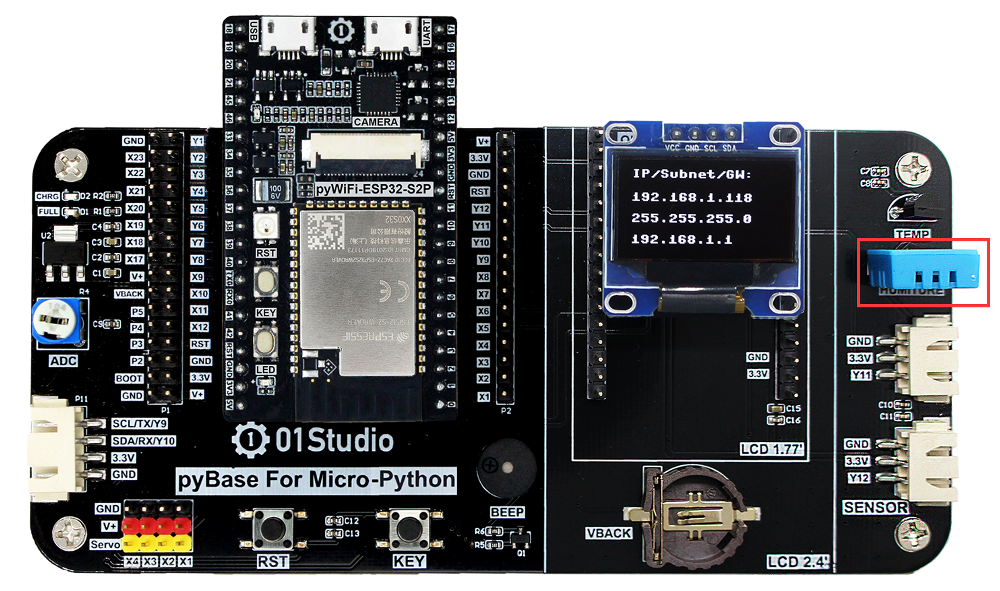
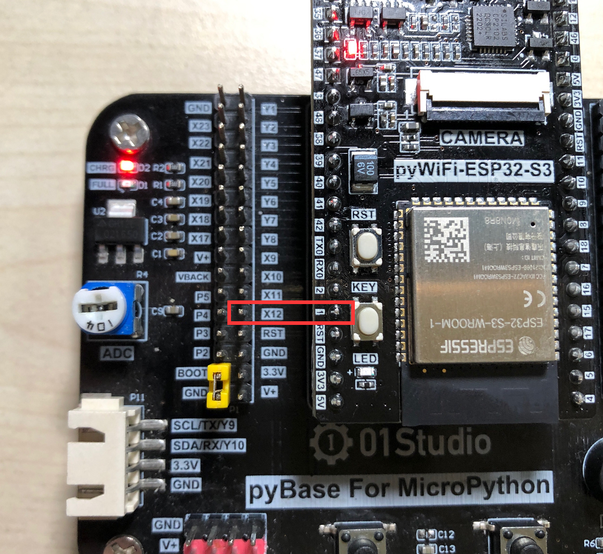
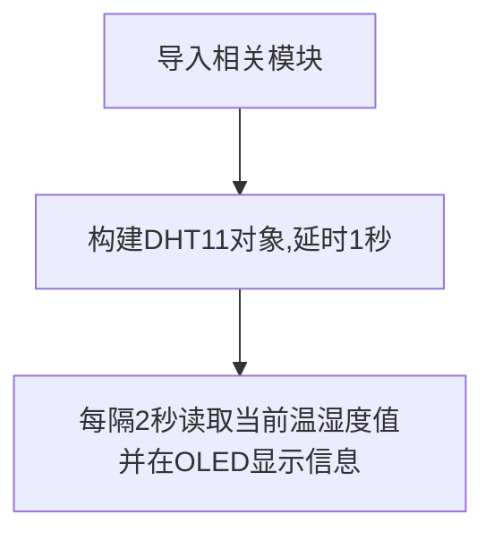
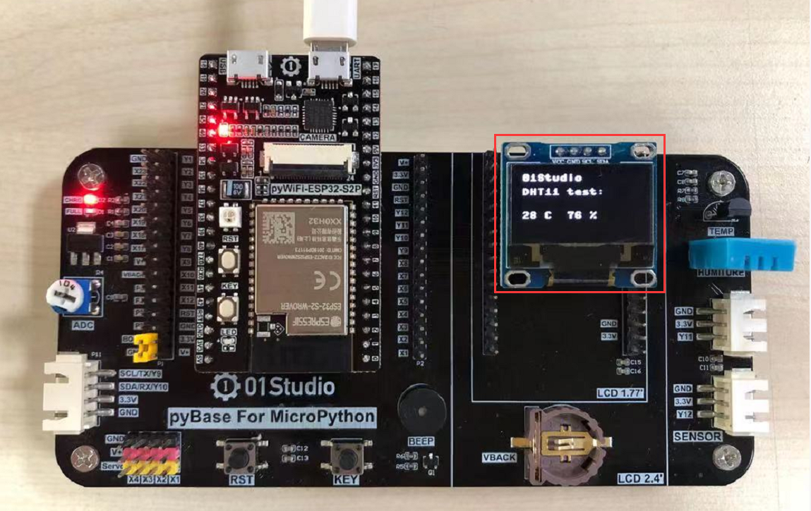

# 温湿度传感器（DHT11）

## 前言
温湿度也是我们日常非常常见的指标，我们使用的是DHT11数字温湿度传感器。这是一款含有已校准数字信号输出的温湿度复合传感器，它应用专用的数字模块采集技术和温湿度传感技术，确保产品具有极高的可靠性和卓越的长期稳定性。

DHT11具有小体积、极低的功耗，信号传输距离可达20米以上，使其成为给类应用甚至最为苛刻的应用场合的最佳选择。产品为4针单排引脚封装，连接方便。


**DHT11温湿度传感器**

## 实验平台

pyWiFi-ESP32-S3 和 pyBase开发底板, DHT11温湿度传感器位于右上方。




## 实验目的
通过MicroPython编程采集DHT11传感器温湿度数据, 并在OLED显示。

## 实验讲解

DHT11虽然有4个引脚，但其中第3个引脚是悬空的，也就是说DHT11也是单总线的传感器，只占用1个IO口。：


我们来看看DHT11在开发板上的接线图：


可以看到DHT11连接到pyBase的‘X12’引脚，也就是连接到pyWiFi-ESP32-S3的引脚42，如下图所示：



因此可以针对引脚42编程来驱动DHT11传感器，模块文件是dht.py，如果你学习过前面基于STM32平台应该不陌生。而对于pyWiFi-ESP32-S3,这个模块已经集成到了初始化固件中，也就是说我们可以直接在main.py导入模块并调用即可。函数模块说明如下：

## dht对象

### 构造函数
```python
d = dht.DHT11(machine.Pin(id))
```
构建DHT11传感器对象

- `id` ：芯片引脚编号。如：1、2。


### 使用方法
```python
d.measure()
```
测量温湿度。

<br></br>

```python
d.temperature()
```
获取温度值。

<br></br>

```python
d.humidity()
```
获取湿度值。

<br></br>


建议上电先延时1~2秒，让DHT11稳定后再开始读取。代码编写流程如下：




## 参考代码

```python
'''
实验名称：温湿度传感器DHT11
版本：v1.0
平台：pyWiFi ESP32-S3
作者：01Studio
说明：通过编程采集温湿度数据，并在OLED上显示。。
'''

#引入相关模块
from machine import Pin,SoftI2C,Timer
from ssd1306 import SSD1306_I2C
import dht,time

#初始化相关模块
i2c = SoftI2C(sda=Pin(42), scl=Pin(40))
oled = SSD1306_I2C(128, 64, i2c, addr=0x3c)

#创建DTH11对象
d = dht.DHT11(Pin(1)) #传感器连接引脚
time.sleep(1)   #首次启动停顿1秒让传感器稳定

def dht_get(tim):

    d.measure()  #温湿度采集

   #OLED显示温湿度
    oled.fill(0) #清屏背景黑色
    oled.text('01Studio', 0, 0)
    oled.text('DHT11 test:',0,15)
    oled.text(str(d.temperature() )+' C',0,40)   #温度显示
    oled.text(str(d.humidity())+' %',48,40)  #湿度显示
    oled.show()

#开启RTOS定时器，编号为1
tim = Timer(1)
tim.init(period=2000, mode=Timer.PERIODIC,callback=dht_get) #周期为2000ms
```

## 实验结果

将ssd1306.py文件上传到开发板文件系统，运行代码，可以看到结果如下图所示：



通过本节学习我们学会了使用MicroPython来驱动DTH11温湿度传感器，DHT11性价比比较高，是很适合学习使用的，但精度和响应速度有点低，需要更高要求应用的用户可以使用DHT22或者其他更高级的传感器。