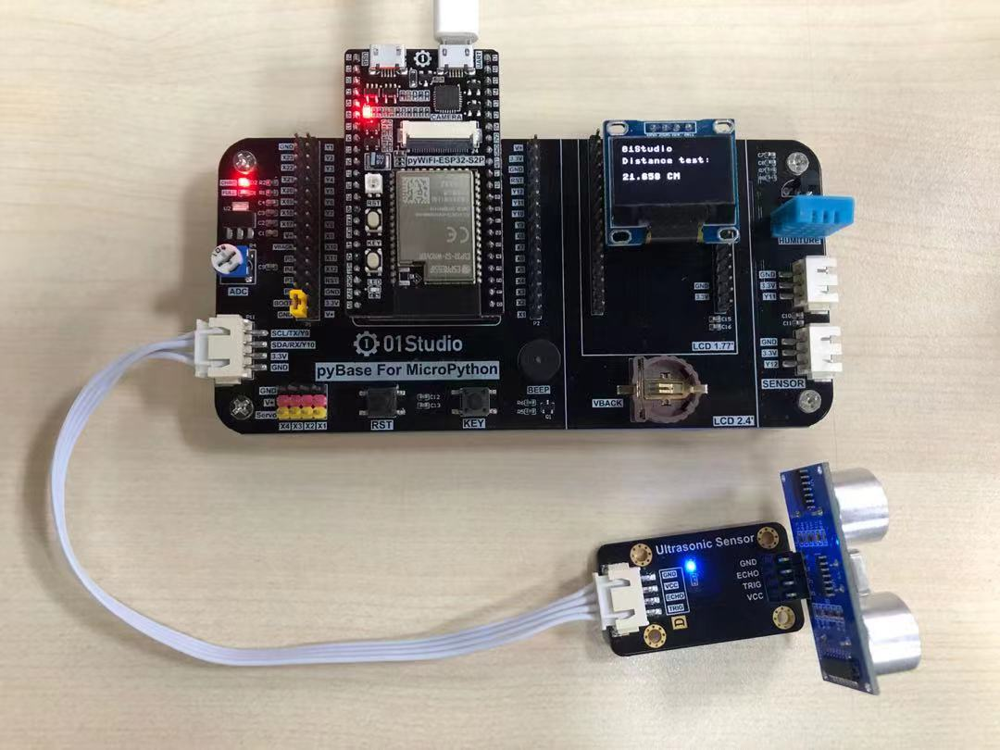
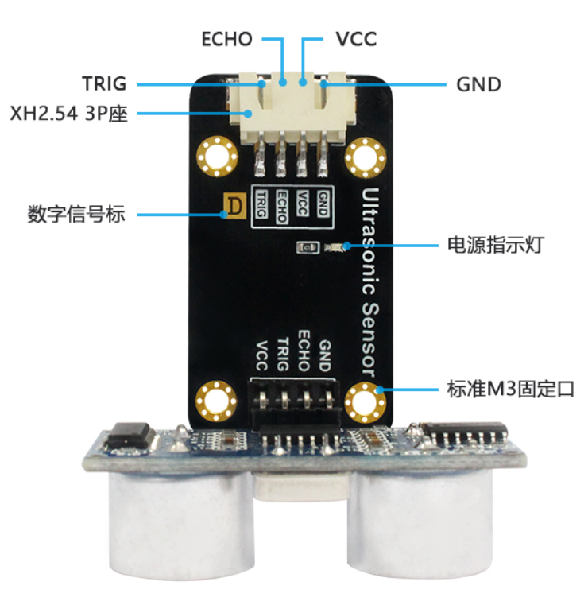
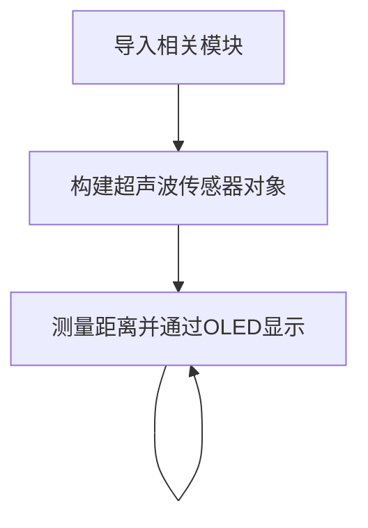
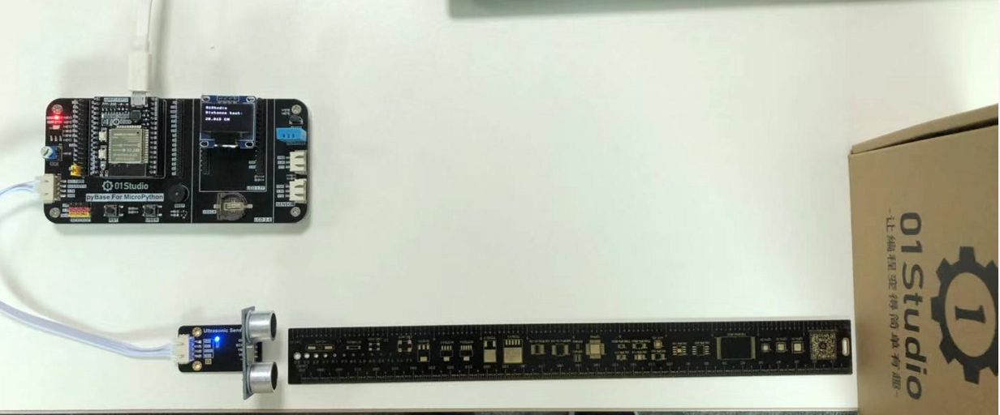
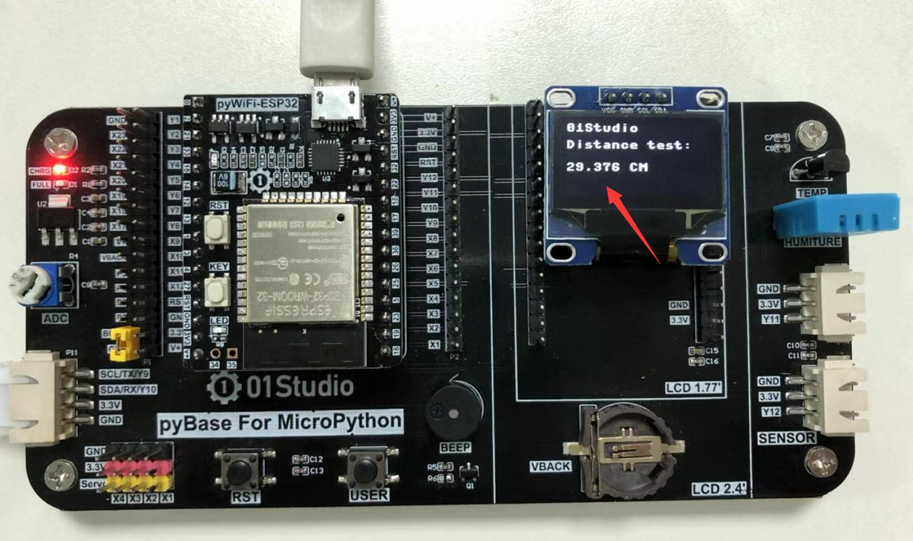

# 超声波测距（HC-SR04）

## 前言
超声波传感器是一款测量距离的传感器。其原理是利用声波在遇到障碍物反射接收结合声波在空气中传播的速度计算的得出。在测量、避障小车，无人驾驶等领域都有相关应用。

## 实验平台
pyWiFi-ESP32-S3开发套件和超声波传感器模块，传感器模块连接到I2C/UART扩展接口。

 

## 实验目的
通过MicroPython编程实现超声波传感器测距,并在OLED屏显示。

## 实验讲解

我们先来看看超声波传感器模块的介绍：[**点击购买>>**](https://item.taobao.com/item.htm?id=624198434340)

 

|  模块参数 |
|  :---:  | ---  |
| 供电电压  | 3.3V |
| 测量距离  | 2cm~450cm |
| 测量精度  | 0.5cm | 
| 引脚说明  | `VCC`: 接3.3V <br></br> `GND`: 接地 <br></br>  `Trig`: 发射引脚  <br></br> `Echo`: 接收引脚 |

<br></br>

超声波传感器模块使用两个IO口分别控制超声波发送和接收，工作原理如下：

1. 给超声波模块接入电源和地；
2. 给脉冲触发引脚（trig）输入一个长为20us的高电平方波；
3. 输入方波后，模块会自动发射8个40KHz的声波，与此同时回波引脚（echo）端的电平会由0变为1；（此时应该启动定时器计时）
4. 当超声波返回被模块接收到时，回波引 脚端的电平会由1变为0；（此时应该停止定时器计数），定时器记下的这个时间即为超声波由发射到返回的总时长；
5. 根据声音在空气中的速度为340米/秒，即可计算出所测的距离。

下面是超声波传感器HCSR04的时序触发图：

 

MicroPython导入对象库有2种方式，一种是集成在固件的库，直接调用即可。另外一种是通过py库文件方式调用，后者只需要将py库文件发送到开发板文件系统即可。本实验用的超声波对象就是使用py库方式，位于HCSR04.py文件下。对象说明如下：

## HCSR04对象

### 构造函数
```python
sonar = HCSR04(trig,echo)
```
构建超声波模块对象，主要是初始化连接超声波传感器的2个引脚。

- `trig` 超声波发射端引脚；
- `echo` 超声波接收端引脚；

例：
```python
#初始化超声波模块接口
trig = Pin(17,Pin.OUT)
echo = Pin(18,Pin.IN)
sonar = HCSR04(trig,echo)
```

### 使用方法
```python
sonar.getDistance()
```
返回测量距离值，单位cm，数据类型为`float`。

<br></br>

我们构建对象后就可以一直循环获取超声波距离信息了，代码编写流程如下：



## 参考代码

```python
'''
实验名称：超声波传感器
版本：v1.0
平台：pyWiFi ESP32-S3
作者：01Studio 【www.01Studio.cc】
说明：通过超声波传感器测距，并在OLED上显示。
'''

from HCSR04 import HCSR04     #子文件夹下的调用方式
from machine import Pin,SoftI2C,Timer
from ssd1306 import SSD1306_I2C

#初始化OLED
i2c = SoftI2C(sda=Pin(42), scl=Pin(40))
oled = SSD1306_I2C(128, 64, i2c, addr=0x3c)

#初始化接口 trig=8,echo=9
trig = Pin(8,Pin.OUT)
echo = Pin(9,Pin.IN)
HC=HCSR04(trig,echo)

#中断回调函数
def fun(tim):

    oled.fill(0)  # 清屏,背景黑色
    oled.text('01Studio', 0, 0)
    oled.text('Distance test:', 0, 15)

    Distance = HC.getDistance() #测量距离

    # OLED显示距离
    oled.text(str(Distance) + ' CM', 0, 35)

    oled.show()

    #串口打印
    print(str(Distance)+' CM')

#开启RTOS定时器
tim = Timer(1)
tim.init(period=1000, mode=Timer.PERIODIC, callback=fun) #周期1s
```

## 实验结果

由于本例程代码依赖其它py库，所以需要将HCSR04.py文件上传到开发板文件系统：

 

使用Thonny IDE运行主程序代码，在超声波传感器30cm外放置障碍物，可以看到OLED显示屏实时显示距离数据约为30cm。

 

 