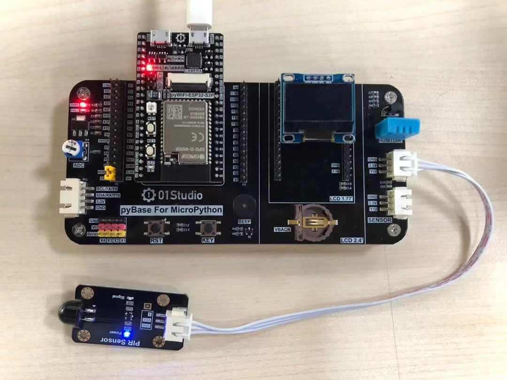
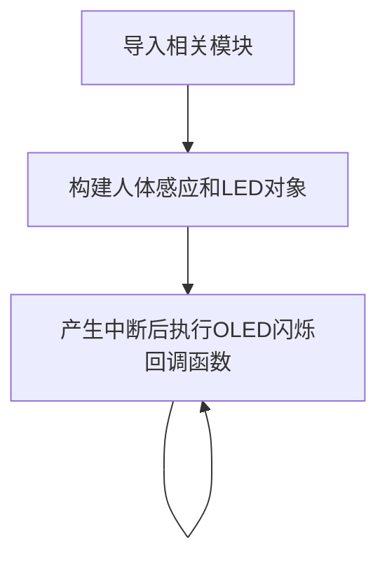
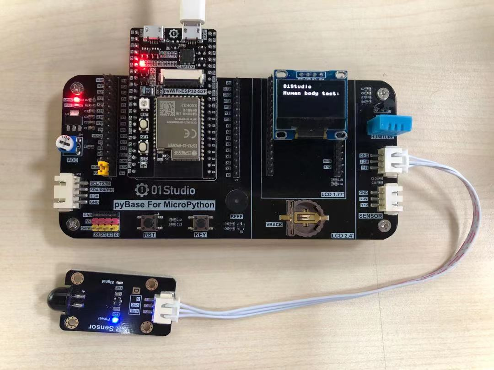
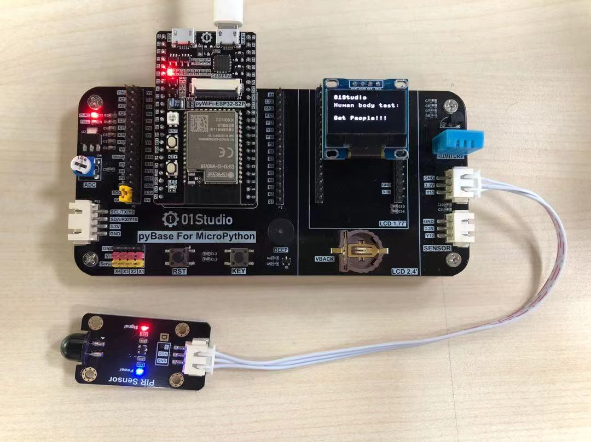

# 人体感应传感器

## 前言
人体感应传感器，在室内安防应用非常普遍，其原理是由探测元件将探测到人体的红外辐射转变成微弱的电压信号，经过放大后输出。为了提高探测器的探测灵敏度以增大探测距离，一般在探测器的前方装设一个塑料的菲涅尔透镜，它和放大电路相配合，可将信号放大 70dB 以上，这样就可以测出 5~10 米范围内人的行动。

## 实验平台
pyWiFi-ESP32-S3开发套件和人体感应传感器模块。
 

## 实验目的
通过外部中断编程来检测人体感应模块，当有人出现时候OLED通过“Get People!！！”闪烁提示。

## 实验讲解

先来看看人体感应传感器模块，主要有供电引脚和信号输出引脚（供电电压一般为3.3V，具体以厂家参数为准）。[**点击购买>>**](https://item.taobao.com/item.htm?id=623858849974)

 

|  产品参数 |
|  :---:  |  --- |
| 供电电压  | 3.3V |
| 工作电流  | <20mA |
| 输出信号  | XH2.54防呆接口（3Pin）【GND、VCC、Single】|
| 输出信号  | 数字信号：<br></br> 检测到人体：高电平3.3V,持续3-8秒; <br></br>未检测到人体：低电平0V。|
| 感应角度  | 100° |
| 感应距离  | 8米 |
| 模块尺寸  | 4.5*2.5cm |

这款模块通电后，当检测到有人时候，传感器信号输出引脚输出高电平并持续3-5秒。

 

此可见，可以使用外部中断结合上升沿的出发方式来编程实现相关功能。传感器的输出引脚连接Sensor1接口，即连接到pyBase的“Y11”引脚。也就是pyWiFi-ESP32-S3的‘10’引脚。编程方法可以是当“10”引脚产生中断时候，说明传感器检测到人体红外线，此时可以在OLED上显示相关信息。

外部中断参考 [**外部中断**](../basic_examples/exti.md) 章节内容，这里不再重复。

代码编写流程如下：



## 参考代码

```python
'''
实验名称：人体感应传感器
版本：v1.0
平台：pyWiFi ESP32-S3
作者：01Studio（www.01studio.cc）
说明：人体红外感应传感器应用
'''

import time
from machine import SoftI2C,Pin   #从machine模块导入I2C、Pin子模块
from ssd1306 import SSD1306_I2C   #从ssd1306模块中导入SSD1306_I2C子模块

#pyBoard I2C初始化
i2c = SoftI2C(sda=Pin(42), scl=Pin(40))
#OLED显示屏初始化：128*64分辨率,OLED的I2C地址是0x3c
oled = SSD1306_I2C(128, 64, i2c, addr=0x3c)

Human=Pin(10,Pin.IN,Pin.PULL_UP) #构建人体红外对象

#OLED初始信息显示
oled.fill(0)  # 清屏背景黑色
oled.text("01Studio", 0, 0)  # 写入第1行内容
oled.text("Human body test:", 0, 15)  # 写入第2行内容
oled.show()  # OLED执行显示

def fun(Human): #Get People闪烁5次效果！

    for i in range(5):
        oled.fill(0)  # 清屏背景黑色
        oled.text("01Studio", 0, 0)  # 写入第1行内容
        oled.text("Human body test:", 0, 15)  # 写入第2行内容
        oled.text("Get People!!!", 0, 40)  # 写入第3行内容
        oled.show()  # OLED执行显示
        time.sleep_ms(500)

        oled.fill(0)  # 清屏背景黑色
        oled.text("01Studio", 0, 0)  # 写入第1行内容
        oled.text("Human body test:", 0, 15)  # 写入第2行内容
        oled.text("            ", 0, 40)  # 写入第3行内容
        oled.show()  # OLED执行显示
        time.sleep_ms(500)

Human.irq(fun,Pin.IRQ_RISING) #定义中断，上升沿触发
```

## 实验结果

使用Thonny IDE运行代码:

- 没人时：

 

- 有人时，OLED提示信息"Get People!!!" ：

 

