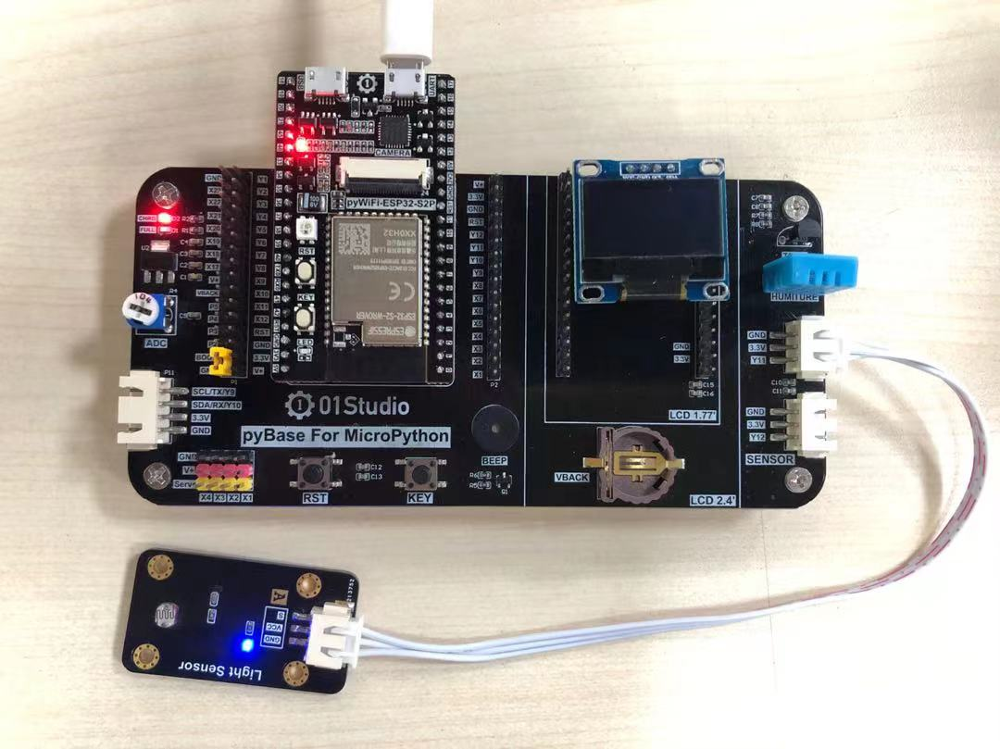
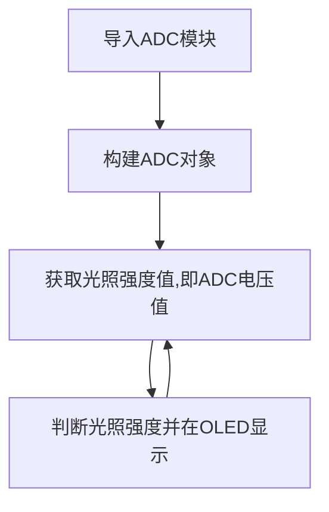
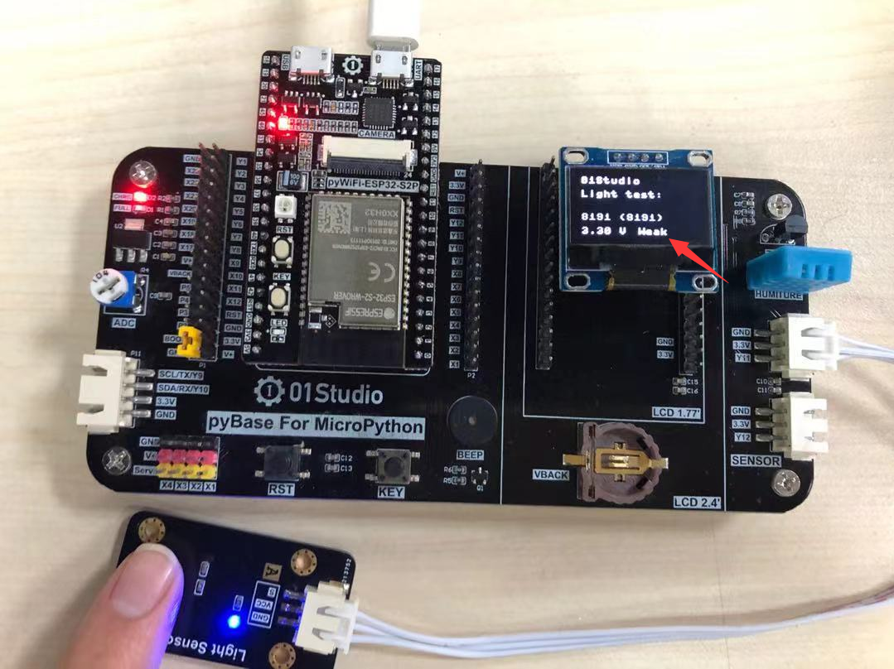
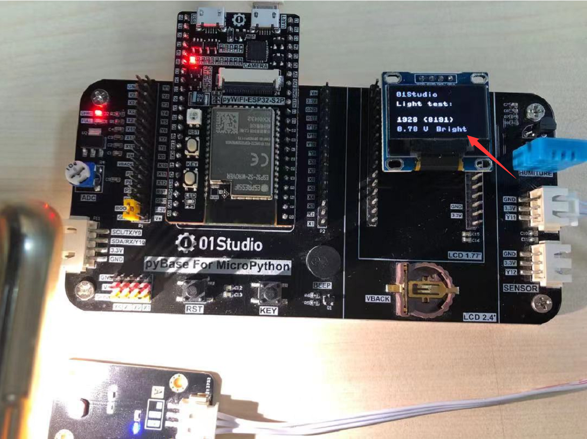

# 光敏传感器

## 前言
光敏传感器实际是一个款可以检测光照强度的传感器，可以应用于我们日常生活中植物光照强度、室内光线检测、以及某些场合的亮度检测。传感器的原理就是将外界模拟变化的信号转变成数字信号（电压值）让单片机出来，处理方式就是常用的ADC（模拟数字转换）。

## 实验平台

pyWiFi-ESP32-S3开发套件开发套件和光敏传感器模块。

 


## 实验目的
采集当前环境的光照强度并在OLED显示，显示方式为：Bright-强，Normal-中等，Weak-弱。

## 实验讲解

我们先来看看光敏传感器模块的介绍： [**点击购买>>**](https://item.taobao.com/item.htm?id=623551464458)

 

|  产品参数 |
|  :---:  |  --- |
| 供电电压  | 3.3V |
| 工作电流  | <20mA |
| 接口定义  | XH2.54防呆接口（3Pin）【GND、VCC、Single】 |
| 输出信号  | 模拟信号：0-3.3V （VCC=3.3V时） |
| 模块尺寸  | 4.5*2.5cm |

当使用3.3V供电时候，光敏传感器输出的是模拟信号：0-3.3V，这代表了外界的光照强度。接近0V时光线最强，接近3.3V时，光线最弱。因此我们可以使用ADC功能来编程实现检测，具体可参考 [**ADC(电压测量)**](../basic_examples/adc.md) 章节内容，这里不再重复。

:::tip 提示
ESP32-S3 ADC默认量程为1V，芯片内部配备了衰减器，通过配置可以提高量程获得更大的测量电压。详见：**https://docs.micropython.org/en/latest/esp32/quickref.html#ADC**
:::

ADC默认是12bit精度，即最大值为2^12-1=4095。然后我们将检测到的数值0-4095分成三段，分别代表光线强：【0- 1365】，中等：【1365- 2730】，弱：【2730-4095】。当然开发者可以根据自己实际情况来调整数值。


代码编写流程如下：



## 参考代码

```python
'''
实验名称：光敏传感器
版本：v1.0
平台：pyWiFi ESP32-S3
作者：01Studio
说明：通过光敏传感器对外界环境光照强度测量并显示。
'''

#导入相关模块

from machine import Pin,SoftI2C,ADC,Timer
from ssd1306 import SSD1306_I2C

#初始化相关模块
i2c = SoftI2C(sda=Pin(42), scl=Pin(40))
oled = SSD1306_I2C(128, 64, i2c, addr=0x3c)

#初始化ADC,Pin=10，11DB衰减，测量电压0-3.3V
Light = ADC(Pin(10))
Light.atten(ADC.ATTN_11DB)

#中断回调函数
def fun(tim):

    oled.fill(0)  # 清屏显示黑色背景
    oled.text('01Studio', 0, 0)  # 首行显示01Studio
    oled.text('Light test:', 0, 15)      # 次行显示实验名称

    value=Light.read() #获取ADC数值

    #显示数值
    oled.text(str(value)+' (4095)',0,40)
    #计算电压值，获得的数据0-4095相当于0-3.3V，（'%.2f'%）表示保留2位小数
    oled.text(str('%.2f'%(value/4095*3.3))+' V',0,55)

    #判断光照强度，分3档显示。
    if 0 < value <=1365:
        oled.text('Bright', 60, 55)

    if 1365 < value <= 2730:
        oled.text('Normal', 60, 55)

    if 2730 < value <= 4095:
        oled.text('Weak  ', 60, 55)

    oled.show()

#开启RTOS定时器
tim = Timer(1)
tim.init(period=1000, mode=Timer.PERIODIC, callback=fun) #周期1s
```

## 实验结果

使用Thonny IDE运行代码，用手遮挡住光敏传感器，可以见到OLED显示光线强势是弱Weak：

 

打开手机手电筒，照在光敏传感器上，可以见到光线强度是强Bright：

 
