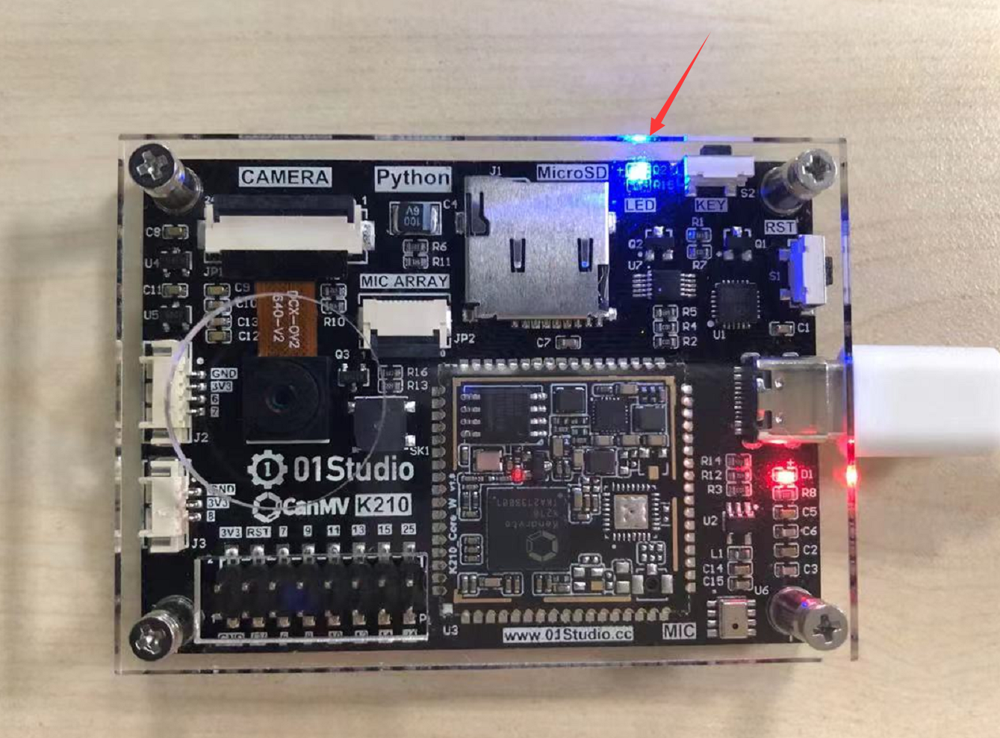

# 点亮第1个LED

## 前言
相信大部分人开始学习嵌入式单片机编程都会从点亮LED开始，基于K210平台的MicroPython的学习也不例外，通过点亮第一个LED能让你对编译环境和程序架构有一定的认识，为以后的学习和更大型的程序打下基础，增加信心。

## 实验目的
学习LED的点亮，点亮LED（蓝灯）。

## 实验讲解

CanMV K210有一个跟GPIO连接可控制的LED灯。



其连接到CanMV K210的外部IO引脚如下（可以看开发板原理图），LED蓝灯对应的外部IO为IO35，从电路可以看到当IO35为低电平时，蓝灯被点亮。


K210 支持外部IO和内部IO任意映射，其片上外设（比如GPIO、I2C等）对应的引脚是可以任意设置的，而传统大部分MCU片上外设和引脚对应关系已经固定了， 只有部分引脚可以复用， 相比之下 K210 自由度更大。

因此我们在编程使用GPIO的时候需要注册一下硬件IO和K210内部IO的对应关系。注册方式使用fpioa_manager：简称fm，该模块用于注册芯片内部功能和引脚，帮助用户管理内部功能和引脚。


## fm对象

使用fm对象绑定GPIO：

### 构造函数
```python
from fpioa_manager import fm
```

fm位于fpioa_manager下，直接import使用。

### 使用方法
```python
fm.register(pin,func,force=False)
```
注册IO：
- `pin` ：芯片外部IO。
- `func` ：芯片功能。
- `force`: 强制分配。
    - `True` : 强制注册，清除之前注册记录；
    - `False` : 不允许引脚多次注册。

例：**fm.register(12, fm.fpioa.GPIO0,force=True) ** 表示将外部IO12注册到内部GPIO0


更多用法请阅读官方文档：<br></br>
https://www.kendryte.com/canmv/main/canmv/library/canmv/built-in/fpioa_manager.html#fm

## GPIO对象

注册成功后我们就可以通过GPIO对象模块来控制外部IO，从而控制LED。GPIO对象说明如下：

### 构造函数
```python
GPIO(ID, MODE, PULL, VALUE)
```
GPIO对象。

- `ID` ：内部GPIO编号。
- `MODE`: GPIO模式：
    - `GPIO.IN` : 输入模式；
    - `GPIO.OUT` : 输出模式。
- `PULL`: GPIO模式：
    - `GPIO.PULL_UP` : 上拉；
    - `GPIO.PULL_DOWN` : 下拉。
    - `GPIO.PULL_NONE` : 无。
- `VALUE`: GPIO初始电平：
    - `1` : 高电平；
    - `0` : 低电平。


### 使用方法
```python
GPIO.value([value])
```
设置GPIO输出电平。
- `value`: 
    - `1` : 高电平；
    - `0` : 低电平。

**当IO被配置为输入模式且时候参数为空时，表示获取当前IO输入电平值。**

更多用法请阅读官方文档：<br></br>
https://www.kendryte.com/canmv/main/canmv/library/canmv/maix/maix.GPIO.html

<br></br>

上面对MicroPython的GPIO对象做了详细的说明，GPIO模块在maix大模块下，而fm模块是在fpioa_manager大模块下面的其中一个小模块，在python编程里有两种方式引用相关模块:

- 方式1是：import maix，然后通过maix.GPIO来操作；

- 方式2是：from maix import GPIO，意思是直接从maix中引入GPIO模块，然后直接通过GPIO来操作。显然方式2会显得更直观和方便，本实验也是使用方式2来编程。代码编写流程如下：


## 参考代码

```python
'''
实验名称：点亮LED蓝灯
版本：v1.0
日期：2022.9
作者：01Studio
实验目的：学习led点亮。
'''
from maix import GPIO
from fpioa_manager import fm

#将蓝灯引脚IO35配置到GPIO0，K210引脚支持任意配置
fm.register(35, fm.fpioa.GPIO0)

LED_B = GPIO(GPIO.GPIO0, GPIO.OUT) #构建LED对象
LED_B.value(0) #点亮LED

#用于阻塞IO保持点亮
while True: 
    pass

```

## 实验结果

在CanMV IDE中运行上述代码，可以看到LED_B蓝灯被点亮。


从第一个实验我们可以看到，使用MicroPython来开发关键是要学会构造函数和其使用方法，便可完成对相关对象的操作，在强大的模块函数支持下，实验只用了简单的两行代码便实现了点亮LED灯。