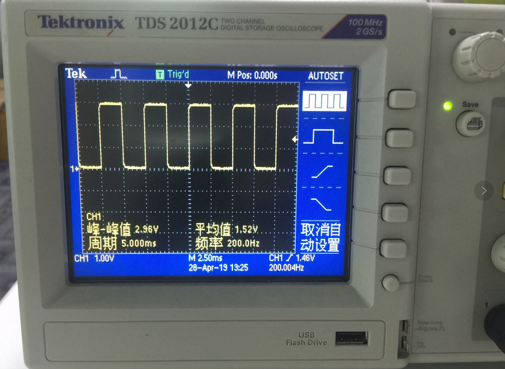

# PWM（蜂鸣器）

## 前言
PWM（脉冲宽度调制）就是一个特定信号输出，主要用于输出不同频率、占空比（一个周期内高电平出现时间占总时间比例）的方波。以实现固定频率或平均电压输出。


## 实验目的
通过不同频率的PWM信号输出，驱动无源蜂鸣器发出不同频率的声音。

## 实验讲解

蜂鸣器分有源蜂鸣器和无源蜂鸣器，有源蜂鸣器的使用方式非常简单，只需要接上电源，蜂鸣器就发声，断开电源就停止发声。而本实验用到的无源蜂鸣器，是需要给定指定的频率，才能发声的，好处可以通过改变频率来改变蜂鸣器的发声音色，以此来判定CanMV K210的PWM输出频率是在变化的。

从CanMV K210原理图可以看到蜂鸣器控制端跟K210的外部IO9连接。


## PWM对象

### 构造函数
```python
machine.PWM(tim, freq, duty, pin, enable=True)
```
PWM对象位于machine模块下。

- `tim` ：K210的PWM依赖于定时器来产生波形;

- `freq` ：PWM频率，单位：Hz;

- `duty` ：PWM占空比，范围：0-100;

- `pin` ：PWM输出引脚;

- `enable`: 是否在构建对象后立即产生波形：
    - `True` : 立即产生；
    - `False`: 不立即产生，需要调用enable()来开启；

### 使用方法
```python
PWM.freq(freq)
```
设置频率。不传参数返回当前频率。

<br></br>

```python
PWM.duty(duty)
```
设置占空比。范围0-100。

<br></br>

```python
PWM.enable()
```
使能PWM输出。

<br></br>

```python
PWM.disable()
```
暂停PWM输出。

<br></br>

```python
PWM.deinit()
```
注销PWM。

更多用法请阅读官方文档：<br></br>
https://www.kendryte.com/canmv/main/canmv/library/micropython/spec/machine.PWM.html

<br></br>

无源蜂鸣器我们可以用特定频率的方波来驱动，方波的原理很简单，就是一定频率的高低电平转换，可以简单理解成占空比为50%的PWM输出。


结合上述讲解，总结出代码编写流程图如下：


## 参考代码

### CanMV K210平台

```python
'''
实验名称： PWM
版本： v1.0
日期： 2022.9
作者： 01Studio
说明：通过不同频率的 PWM 信号输出，驱动无源蜂鸣器发出不同频率的声音。
'''
from machine import Timer,PWM
import time

#PWM通过定时器配置，接到IO9引脚
tim = Timer(Timer.TIMER0, Timer.CHANNEL0, mode=Timer.MODE_PWM)
beep = PWM(tim, freq=1, duty=50, pin=9)

#循环发出不同频率响声。
while True:
    beep.freq(200)
    time.sleep(1)

    beep.freq(400)
    time.sleep(1)

    beep.freq(600)
    time.sleep(1)

    beep.freq(800)
    time.sleep(1)

    beep.freq(1000)
    time.sleep(1)
```
### CanMV K210 mini平台

```python
'''
实验名称： PWM
版本： v1.0
作者： 01Studio
说明：通过不同频率的 PWM 信号输出，驱动无源蜂鸣器发出不同频率的声音。
实验平台：01Studio CanMV K210 mini (需要通过3P接口外接无源蜂鸣器)
'''
from machine import Timer,PWM
import time

#PWM通过定时器配置，接到IO9引脚
tim = Timer(Timer.TIMER0, Timer.CHANNEL0, mode=Timer.MODE_PWM)
beep = PWM(tim, freq=1, duty=50, pin=8)

#循环发出不同频率响声。
while True:
    beep.freq(200)
    time.sleep(1)

    beep.freq(400)
    time.sleep(1)

    beep.freq(600)
    time.sleep(1)

    beep.freq(800)
    time.sleep(1)

    beep.freq(1000)
    time.sleep(1)
```

## 实验结果

运行代码，可以听到蜂鸣器依次发出不同频率的响声。


如果你使用CanMV K210 mini平台，可以通过配套的3p线外接无源蜂鸣器完成此实验。


有条件的朋友可以使用示波器测量CanMV K210的IO9引脚（CanMV K210 mini的IO8引脚）。观察PWM波形变化。



到了这一节，我们发现实验中对象函数使用方法非常简单，这是好事，让我们可以将更多精力放在应用上，做出更多好玩的创意。而不需要过多的关注复杂的底层代码开发。而随着要实现功能的复杂化让编程的代码数量变多，逻辑也将略显复杂。
