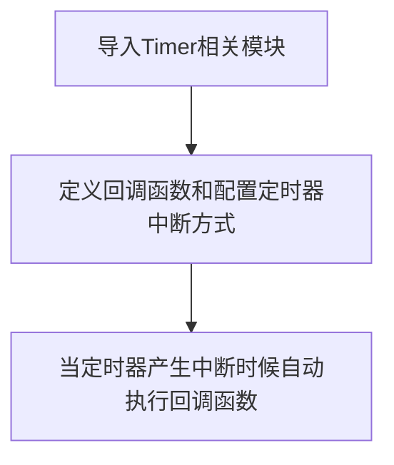

# 定时器

## 前言
定时器，顾名思义就是用来计时的，我们常常会设定计时或闹钟，然后时间到了就告诉我们要做什么了。单片机也是这样，通过定时器可以完成各种预设好的任务。

## 实验目的
通过定时器让LED蓝灯周期性每秒闪烁1次。

## 实验讲解

定时器是在machine的Timer模块。通过MicroPython可以轻松编程使用。我们也是只需要了解其构造对象函数和使用方法即可！

## Timer对象

### 构造函数
```python
machine.Timer(id, channel, mode=Timer.MODE_ONE_SHOT, period=1000, unit=Timer.UNIT_MS,  
              callback=None, arg=None, start=True, priority=1, div=0)
```
定时器对象Timer位于machine模块下。

- `id` ：定时器编号编号。
    - `Timer.TIMER0` : 定时器0；
    - `Timer.TIMER1` : 定时器1。
    - `Timer.TIMER2` : 定时器2。

- `channel`: 定时器通道：
    - `Timer.CHANNEL0` : 通道0；
    - `Timer.CHANNEL1` : 通道1；
    - `Timer.CHANNEL2` : 通道2；
    - `Timer.CHANNEL3` : 通道3；

- `mode`: 定时器模式：
    - `MODE_ONE_SHOT` : 一次；
    - `MODE_PERIODIC` : 周期性。

- `period`: 定时器模式为周期性时每个周期时间值：
    - `Timer.UNIT_S` : 秒；
    - `Timer.UNIT_MS` : 毫秒；
    - `Timer.UNIT_US` : 微秒；
    - `Timer.UNIT_NS` : 纳秒。

- `callback`: 定时器中断执行的回调函数；**注意：回调函数是在中断中调用的，所以在回调函数中请不要占用太长时间以及做动态内存分配开关中断等动作。**

- `arg`: 希望传给回调函数的参数，作为回调函数的第二个参数。

- `start`: 是否在构建对象后立即开始定时器：
    - `True` : 立即开始；
    - `False`: 不立即开始，需要调用start()来开启；

- `priority`: 硬件中断优先级，在K210中，取值范围是1-7，值越小优先级越高。

- `div`: 硬件分频器。

### 使用方法
```python
Timer.callback(fun)
```
指定回调函数。

<br></br>

```python
Timer.period([value])
```
设置定时器周期。

<br></br>

```python
Timer.start()
```
启动定时器。

<br></br>

```python
Timer.stop()
```
停止定时器。

<br></br>

```python
Timer.deinit()
```
注销定时器。

更多用法请阅读官方文档：<br></br>
https://www.kendryte.com/canmv/main/canmv/library/micropython/spec/machine.Timer.html

<br></br>

定时器到了预设指定时间后，也会产生中断，因此跟外部中断的编程方式类似，代码编程流程图如下：




## 参考代码

```python
'''
实验名称：定时器
版本： v1.0
日期： 2022.9
作者： 01Studio
说明：通过定时器让 LED 周期性每秒闪烁 1 次
'''
from maix import GPIO
from fpioa_manager import fm
from machine import Timer

#注册IO和构建LED对象
fm.register(35, fm.fpioa.GPIO0)
LED_B = GPIO(GPIO.GPIO0, GPIO.OUT)

#计数变量
Counter=0

#定时器回调函数
def fun(tim):
    global Counter
    Counter = Counter + 1
    print(Counter)
    LED_B.value(Counter%2)#LED循环亮灭。

#定时器0初始化，周期1秒
tim = Timer(Timer.TIMER0, Timer.CHANNEL0, mode=Timer.MODE_PERIODIC, period=1000, callback=fun)
```

## 实验结果

运行程序，可以看到LED蓝灯每隔1秒闪烁1次。


本节实验介绍了定时器的使用方式，有用户可能会认为使用延时延时也可以实现这个功能，但相比于延时函数，定时器的好处就是不占用过多的CPU资源。有兴趣的用户也可以多定义几个定时器对象tim2,tim3，通过不同的参数配置实现多任务的操作。
