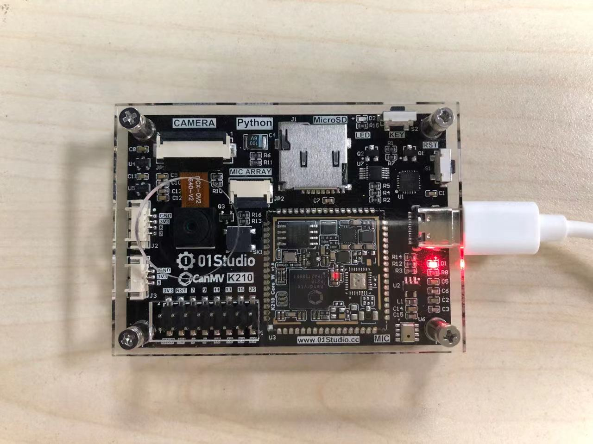
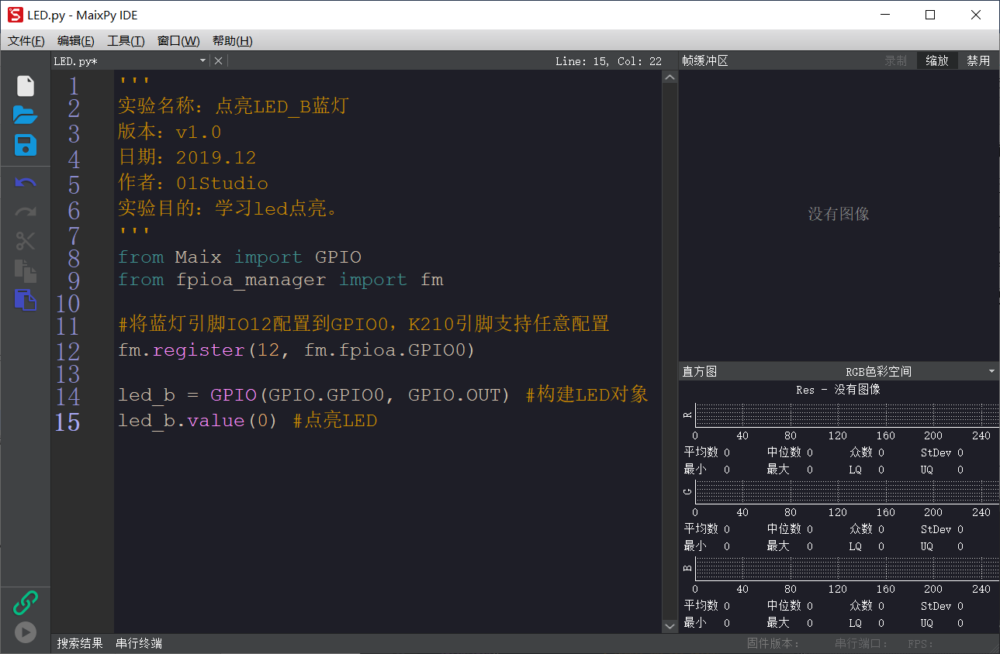
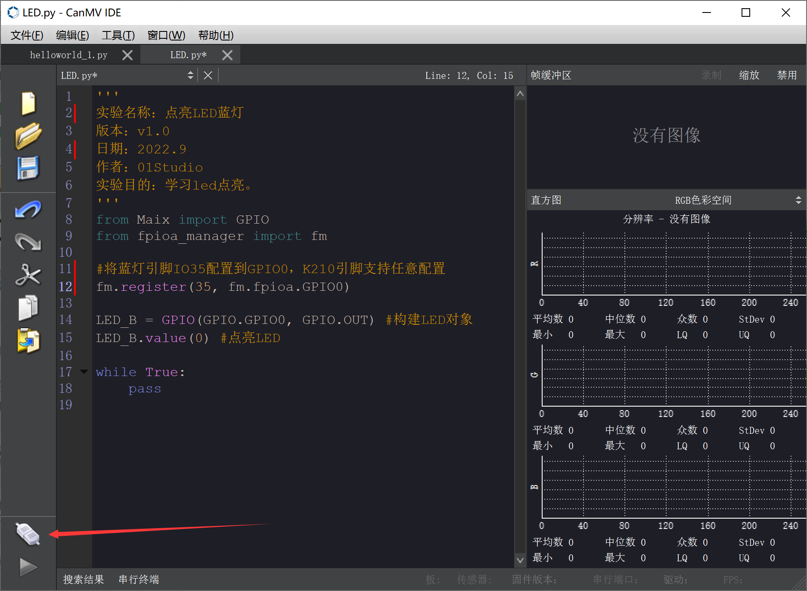
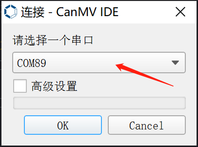
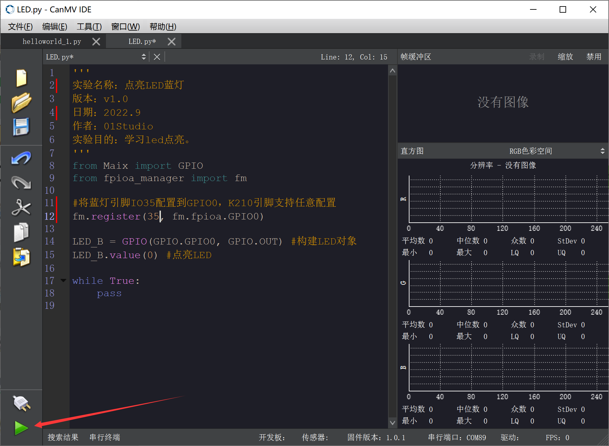
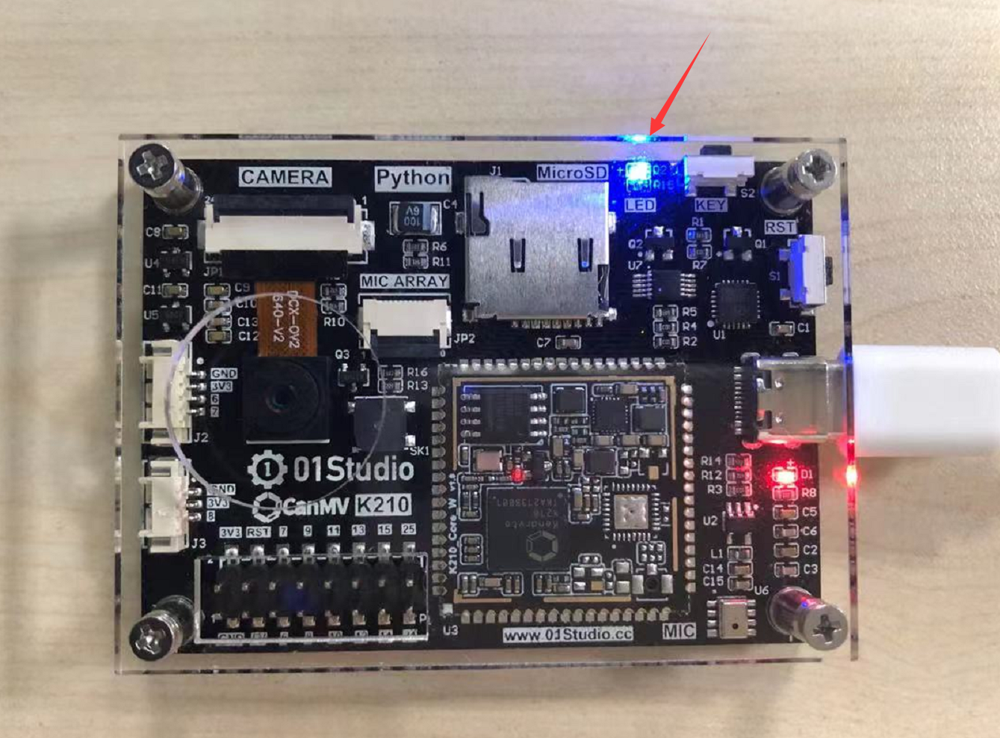

# 例程测试

我们使用CanMV IDE来进行我们的第一个实验，借此来熟悉开发环境。将CanMV K210开发板通过type-c线连接到电脑。



打开CanMV IDE，我们先打开配套资料包里面的例程代码（这里暂时不对代码进行讲解，后面章节会有详细内容）。

我们用最简单的LED程序来测试，在CanMV IDE中打开 **零一科技（01Studio）MicroPython开发套件（基于CanMV K210平台）配套资料\02-示例程序\1.基础实验\1.点亮第一个LED** 里面的LED.py例程（也可以直接拖动过去），如下图所示：

```python
'''
实验名称：点亮LED蓝灯
版本：v1.0
日期：2022.9
作者：01Studio
实验目的：学习led点亮。
'''
from maix import GPIO
from fpioa_manager import fm

#将蓝灯引脚IO35配置到GPIO0，K210引脚支持任意配置
fm.register(35, fm.fpioa.GPIO0)

LED_B = GPIO(GPIO.GPIO0, GPIO.OUT) #构建LED对象
LED_B.value(0) #点亮LED

while True:
    pass

```



接下来我们需要连接开发板，开发板是通过板子的USB转TTL串口芯片以串口方式跟IDE连接的。点击左下角连接按钮：



在弹出串口选择你开发板的串口号，然后点击OK。**串口号在设备管理器可以查看。**



连接成功后，运行按钮变成绿色。



当前的例程是点亮LED蓝灯，我们点击绿色按键“运行”按钮，当看到CanMV K210开发板上的蓝灯亮时，说明代码运行成功:


