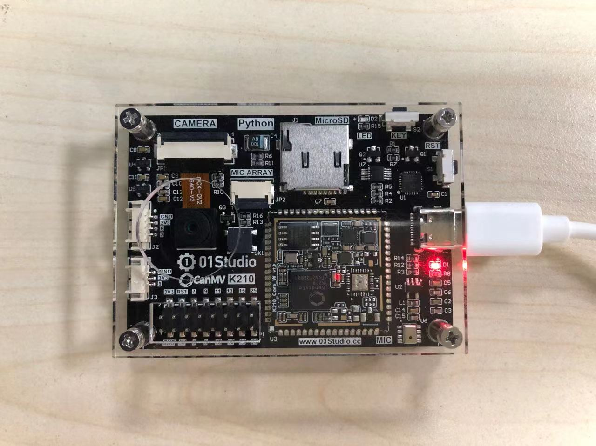
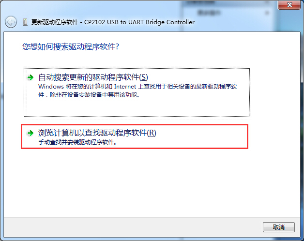

# 串口驱动安装

CanMV K210通过串口烧写程序和调试，因此主要是安装USB转串口驱动。我们将CanMV K210开发板通过type-c数据线连接到电脑：

如果你的操作系统是Win10,一般情况下能自动安装。鼠标右键点击 **“我的电脑—属性—设备管理器”** ： 出现串口号说明安装成功，如下图所示。

如果无法安装，请手动安装驱动，方法如下：

驱动无法自动安装时候，设备会出现黄色叹号，这时候点击设备右键，选择“更新驱动程序”，选择“浏览计算机查找驱动”：

驱动路径选择：零一科技（01Studio）MicroPython开发套件配套资料\01-开发工具\01-Windows\串口终端工具\CH9102x驱动，点击确认后即可自动安装：

安装成功后如下图：

