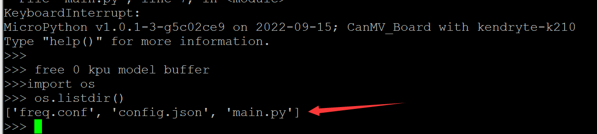
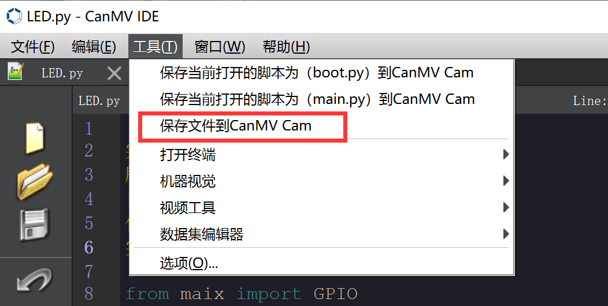
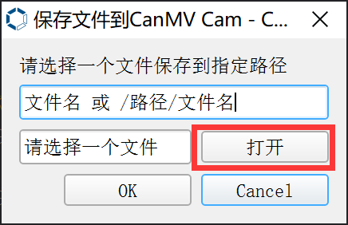
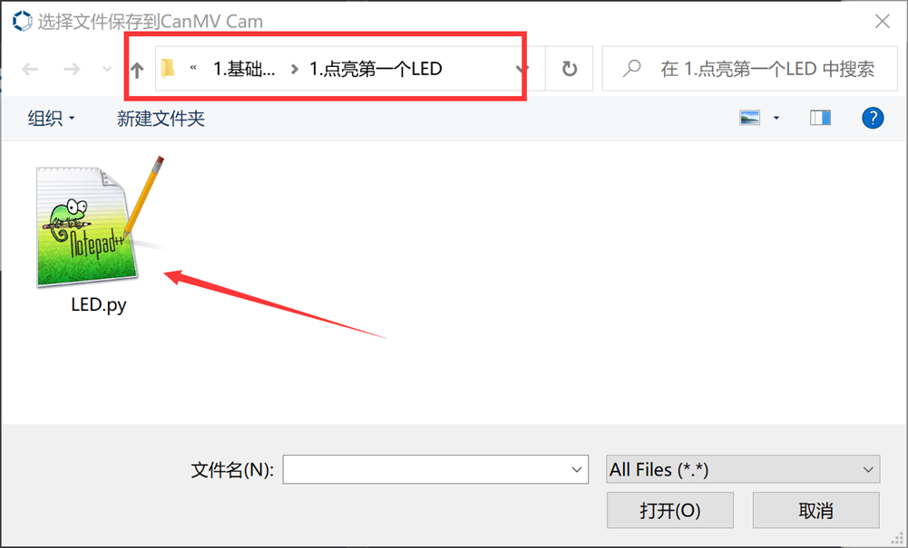
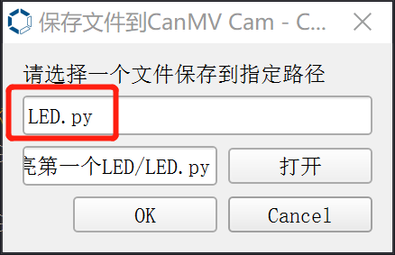
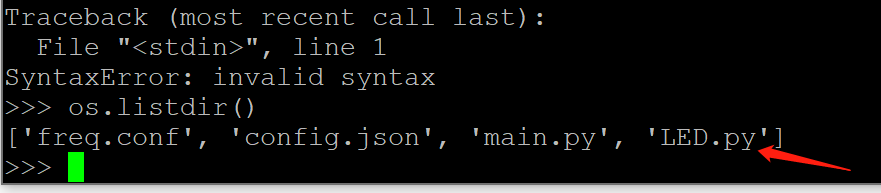

# 文件系统
CanMV K210里面内置了文件系统，可以简单理解成上电后运行的python文件，这个可以通过串口REPL结合命令来查看。
打开putty进入REPL，依次输入下面命令，每行输入后按回车键。
```python
import os
os.listdir()
```


可以看到一共有以下3个文件（不同版本固件可能不一样）：freq.conf、config.json、main.py。
- 【freq.conf】：CPU参数配置。
- 【config.json】:不同开发板的配置文件。
- 【main.py】：上电运行的第二个脚本文件，也是主函数文件。
 
:::tip 提示
提示：micropython默认上电先执行boot.py再执行main.py，一般将主函数代码放在main.py这样更符合MicroPython使用习惯！
:::

前面章节讲到的CanMV IDE中 <u>工具--将打开的脚本保存到开发板的main.py</u> 实际上就是将脚本文件保存到开发板文件系统。当然我们也可以使用IDE中传输文件功能来将有需要的文件发送到开发板，点击**“保存文件到CanMV”**。



在弹出的窗口点击“打开”来打开计算机本地文件。



我们可以选择基础实验中的LED.py文件，保存到开发板。



该文件传输功能支持放在根目录或在开发板新建一个文件夹，直接输入LED.py即表示将打开的文件以名称“LED.py”发送到开发板根目录。



点击OK写入成功后可以再次通过REPL查看文件，发现多了LED.py。



如果想删除某个文件，可以使用以下指令：
```python
os.remove('xxx.py')
```

当插入SD卡时候，系统会自动以SD作为存储的文件系统。优先执行SD卡上面的脚本文件。