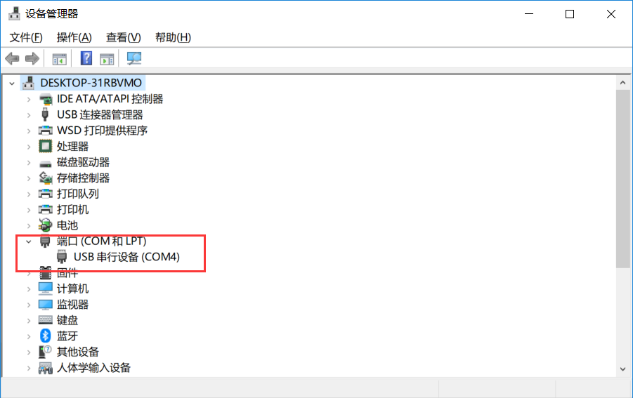
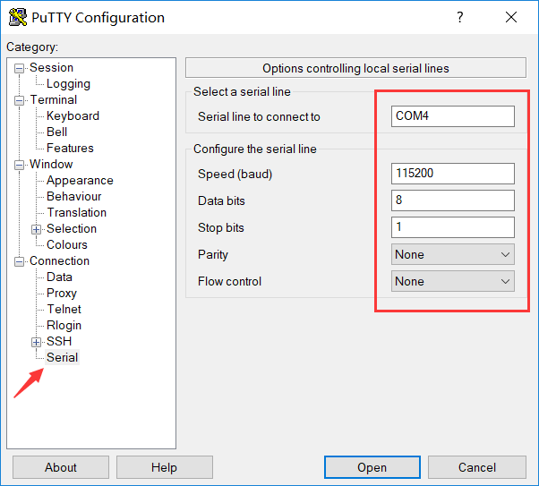
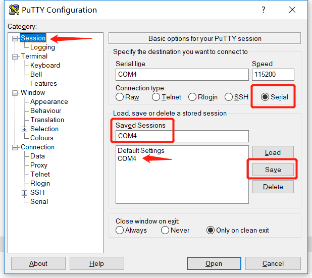
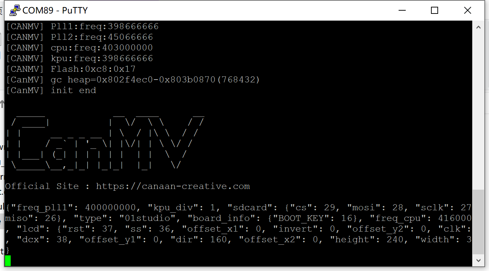

# REPL串口交互调试
:::tip 提示
REPL是MicroPython特有的功能，由于大部分IDE都集成了串口终端信息打印，所以这个功能一般情况下不需要用到。主要用于查看或删除文件的场景。
:::

上一节在IDE中的串口终端打印调试数据，并不能实现交互，CanMV K210 的MicroPython固件集成了交互解释器REPL 【读取(Read)-运算(Eval)-输出(Print)-循环(Loop) 】，开发者可以直接通过串口终端来调试CanMV K210开发板。我们使用的软件是一款免费的串口终端软件putty。

将开发板连接到电脑，从我的电脑—属性—设备管理器中找到当前的串口号，这里是COM4。



打开<u>**MicroPython开发套件配套资料\开发工具\串口终端工具\Putty.exe**</u>，选择左下角Serial，配置信息如下：



配置好后不是点open，而是点左边上方Session，选择Serial后可看到刚刚的配置信息。串口号通常不会变化，我们在Save Session下方输入COM4或者自己喜欢的名称，点右边Save，在空白框里面就出现COM4字样，以后可以直接使用。设置好后我们点击Open。



连接如果出现下面情况，说明开发板里面有代码在运行，阻塞了REPL，这时候只需要按下键盘的Ctrl + C键即可打断在运行的程序。



Ctrl + C打断后会出现下面可交互的对话框，是不是似曾相识，没错，跟我们之前在计算机命令行执行python指令后出现类似的。上面主要是当前设备固件的版本号。


现在对话框相当于连接上了开发板上，由于CanMV K210集成了MicroPython解析器。我们在这里可以进行调试和简单编程，接下来我们测试一下。在对话框输入下面代码，按回车，可以看到代码运行情况。

```python
print("Hello 01Studio!")
```


我们再输入1+1按回车，得到了计算结果2。


