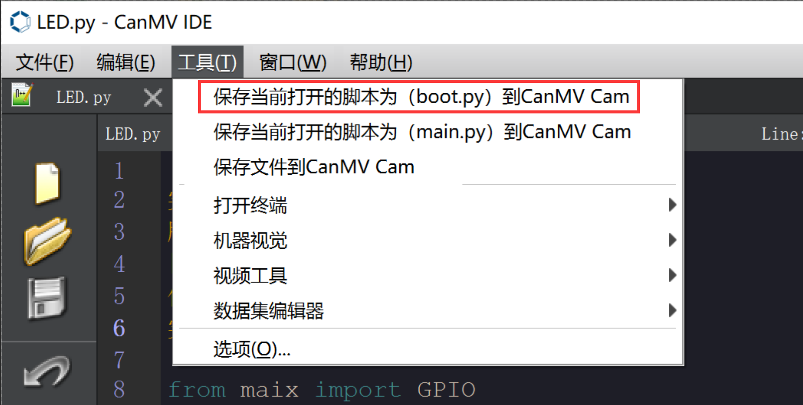

# 代码离线运行

直接在IDE里面运行功能代码是保存在开发板的RAM（内存）里面，方便调试，但断电后丢失，那么如何实现开发板上电运行我们的代码呢？方法如下：

Micropython机制是上电默认先运行名字为boot.py文件，然后在运行main.py文件，如果没有boot.py那么直接运行main.py。

- boot.py: **上电第1个运行的脚本，如果代码有while True阻塞，将不会运行下面的main.py。**

- main.py：**上电第2个运行的脚本。**

也就是我们只需要将代码以boot.py或main.py文件发送到开发板，那么开发板就可以实现上电运行相关程序。

可以将在当前IDE打开的例程代码以boot.py发送到开发板:

然后关闭IDE，按下开发板复位键，代码实现了离线运行。
