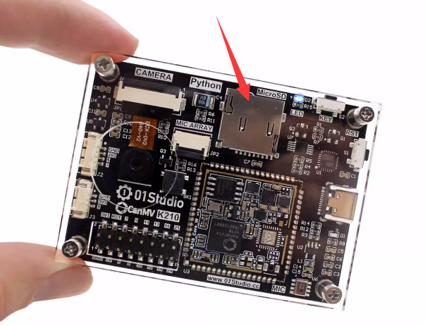
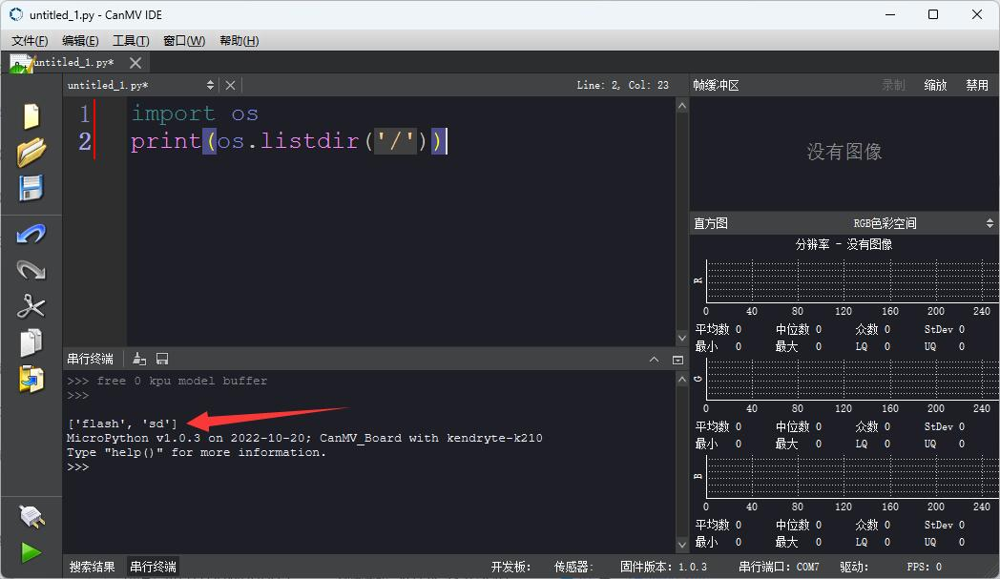
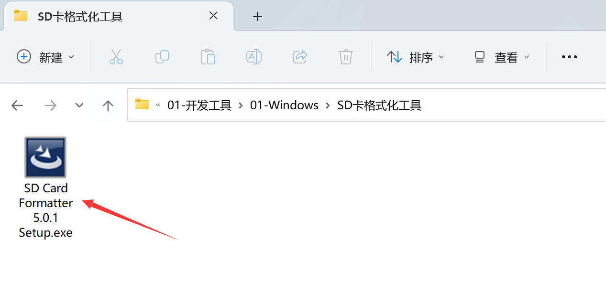
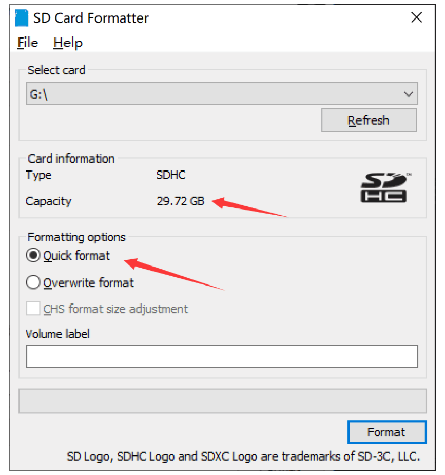

# SD卡使用

CanMV K210带有MicroSD卡槽，位于开发板上方，推荐使用闪迪等一线品牌的MicroSD卡，容量64G以内。

开发板上电检测到MicroSD卡插入后会自动以SD卡作为文件系统（屏蔽flash），因此使用如果将boot.py放到SD卡并插入开发板，那么开发板上电就运行SD卡里面的boot.py。py脚本几百KB以内的小文件可以通过Canmv ide传输，模型等大文件则可以使用读卡器拷贝。

:::danger 警告
请勿带电拔插MicroSD卡。
:::



## 检测SD卡是否挂载成功

将SD卡插入开发板，在CanMV IDE中输入下面两行代码：

```python
import os
print(os.listdir('/'))
```

运行代码，在串口终端观察输出结果，如包含sd说明sd卡挂载成功,如下图：



如果没挂载成功，可以使用读卡器参考下面教程将SD卡格式化一下试试，或者更换闪迪class10的SD卡。

## SD卡格式化
:::tip 提示
仅在SD卡无法正常使用时格式化。
:::

使用国际标准的格式化工具。位于资料包开发工具文件夹：



安装后打开，选择 SD 卡对应的驱动器， 选择“Quick format”（快速格式化），将“Volume label”（卷标）留空， 单击“Format”（格式化）开始格式化。如图所示。 然后在警告对话框中单击“Yes”（是） 即可快速格式化 SD 卡。


