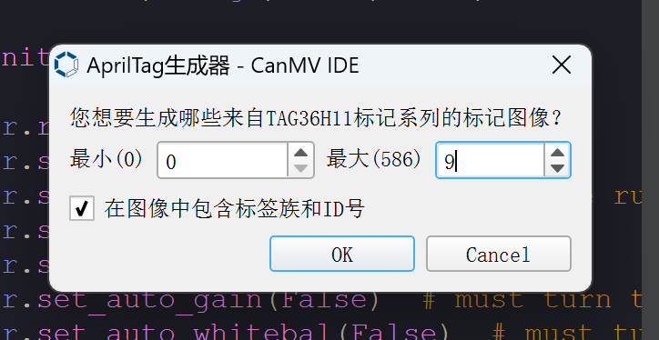
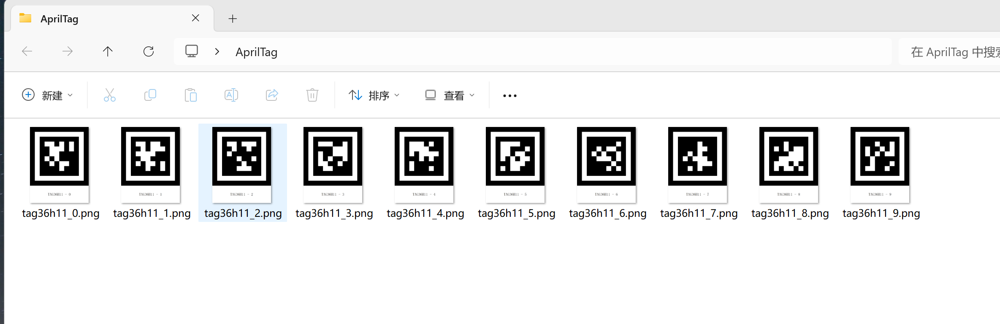
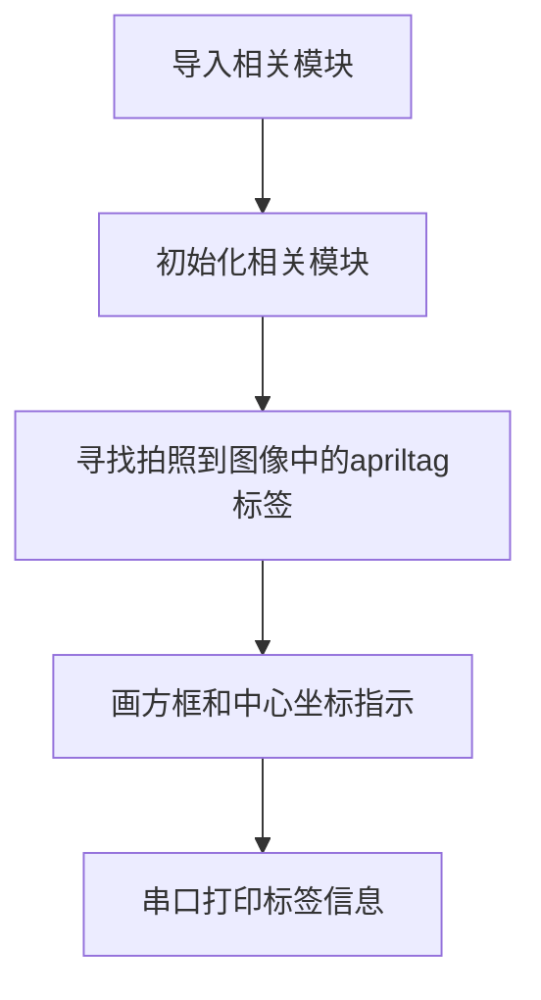
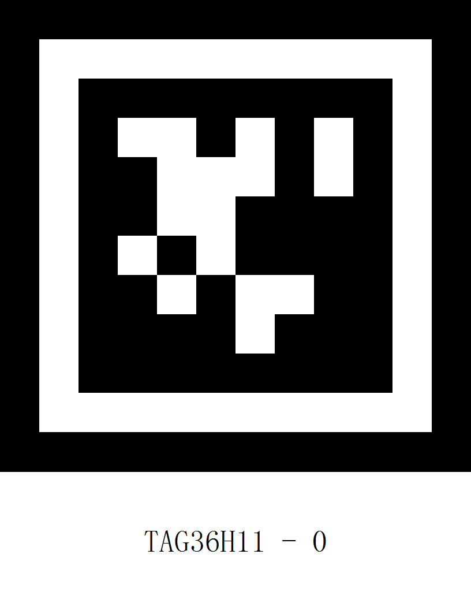
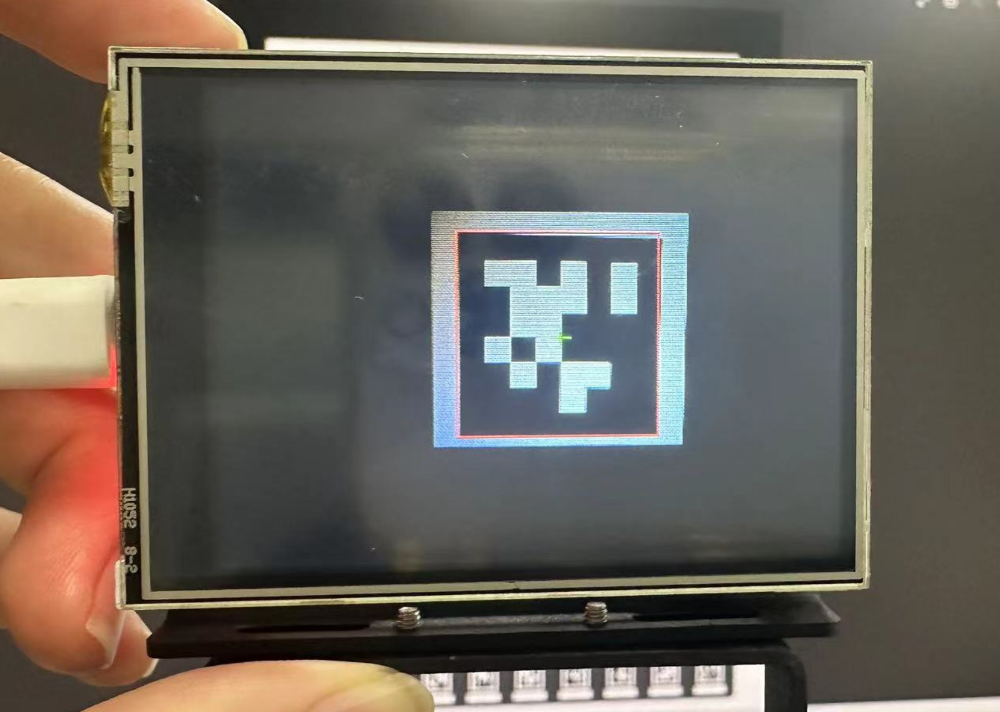
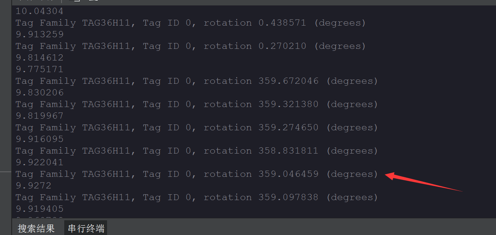

# AprilTag标签识别

## 前言
**AprilTag**是一种视觉基准系统，可用于多种任务，包括增强现实、机器人和相机校准。可以通过普通打印机创建目标，AprilTag 检测软件可以计算标签相对于相机的精确3D位置、方向和标识。

AprilTag官网介绍：https://april.eecs.umich.edu/software/apriltag.html

## 实验目的
编程实现AprilTag标记识别，并将识别到的信息通过串口终端打印出来。

## 实验讲解

### AprilTag种类

可以将AprilTag简单地理解为一个特定信息的**二维码**，有family和ID两个概念：

- `TAG16H5` → 0 to 29
- `TAG25H7` → 0 to 241
- `TAG25H9` → 0 to 34
- `TAG36H10` → 0 to 2319
- `TAG36H11` → 0 to 586 （CanMV K210推荐使用）
- `ARTOOLKIT` → 0 to 511

以【`TAG36H11` → 0 to 586】为例，family信息就是：TAG36H11 ， ID可以是“0 到 586” ，也就是一共有587种标记码。

**不同家族区别：**TAG16H5的有效区域是 4x4 的方块，那么它比TAG36H11看的更远（因为他有 6x6 个方块）。 但是内容少，所以TAG16H5的错误率比TAG36H11 高很多，因为TAG36H11的校验信息多。CanMV K210推荐使用TAG36H11家族的标记码。

### AprilTag生成

可以在CanMV IDE生成AprilTag。点击**工具--机器视觉--AprilTag生成器--TAG36H11家族：**


最小输入0 ，最大输入9 ，制作id从0-9共10张标签。



点击OK后选择要生成的位置文件夹即可：



## find_apriltags对象

识别apriltag使用find_apriltags对象函数，具体说明如下：

### 构造函数
```python
image.find_apriltags([roi[, families=image.TAG36H11[, fx[, fy[, cx[, cy]]]]]])
```
查找roi区域内的所有apriltags并返回一个image.apriltags的对象列表。

### 使用方法

以上函数返回image.apriltags 对象列表。

```python
tag.rect()
```
返回一个矩形元组（x,y,w,h）,二维码的边界。可以通过索引[0-3]来获得单个值。

<br></br>

```python
tag.cx()
```
返回中心x坐标。

<br></br>

```python
tag.cy()
```
返回中心y坐标
<br></br>

```python
tag.family()
```
家族信息。

<br></br>

```python
tag.id()
```
ID信息。

<br></br>

```python
tag.rotation()
```
方向。

<br></br>

代码编写流程如下图所示：



## 参考代码

```python

# AprilTags 示例
#
# 此示例显示了如何在CanMV上是被AprilTags

import sensor, image, time, math, lcd

lcd.init()

sensor.reset()
sensor.set_pixformat(sensor.RGB565)
sensor.set_framesize(sensor.QQVGA) # 如果分辨率更大，我们的内存会耗尽...
sensor.set_vflip(1) #摄像头后置模式

sensor.skip_frames(time = 2000)
sensor.set_auto_gain(False)  # 必须关闭此功能，以防止图像冲洗…
sensor.set_auto_whitebal(False)  # 必须关闭此功能，以防止图像冲洗…
clock = time.clock()

# 注意！与find_qrcodes不同，find_apriltags方法不需要对图像进行镜头校正

# apriltag代码最多支持可以同时处理6种tag家族。
# 返回的tag标记对象，将有其tag标记家族及其在tag标记家族内的id。

tag_families = 0
tag_families |= image.TAG16H5 # 注释掉，禁用这个家族
tag_families |= image.TAG25H7 # 注释掉，禁用这个家族
tag_families |= image.TAG25H9 # 注释掉，禁用这个家族
tag_families |= image.TAG36H10 # 注释掉，禁用这个家族
tag_families |= image.TAG36H11 # 注释掉以禁用这个家族(默认家族)
tag_families |= image.ARTOOLKIT # 注释掉，禁用这个家族

#标签系列有什么区别？ 那么，例如，TAG16H5家族实际上是一个4x4的方形标签。
#所以，这意味着可以看到比6x6的TAG36H11标签更长的距离。
#然而，较低的H值（H5对H11），意味着4x4标签的假阳性率远高于6x6标签。
#所以，除非你有理由使用其他标签系列，否则使用默认族TAG36H11。

def family_name(tag):
    if(tag.family() == image.TAG16H5):
        return "TAG16H5"
    if(tag.family() == image.TAG25H7):
        return "TAG25H7"
    if(tag.family() == image.TAG25H9):
        return "TAG25H9"
    if(tag.family() == image.TAG36H10):
        return "TAG36H10"
    if(tag.family() == image.TAG36H11):
        return "TAG36H11"
    if(tag.family() == image.ARTOOLKIT):
        return "ARTOOLKIT"

while(True):
    clock.tick()
    img = sensor.snapshot()
    for tag in img.find_apriltags(families=tag_families): # 如果没有给出家族，默认TAG36H11。
        img.draw_rectangle(tag.rect(), color = (255, 0, 0))
        img.draw_cross(tag.cx(), tag.cy(), color = (0, 255, 0))
        print_args = (family_name(tag), tag.id(), (180 * tag.rotation()) / math.pi) #打印标签信息
        print("Tag Family %s, Tag ID %d, rotation %f (degrees)" % print_args)
    lcd.display(img) #LCD显示
    print(clock.fps())
```

## 实验结果

为了更好地识别，图像上apriltag需比较平展，不能太小。使用显示屏的话不能太暗。**目前只支持QQVGA分辨率。**

这里打开family: TAG36H11 , id: 0的标签图片测试：



运行程序，将摄像头正对标签，可以看到识别出来：



IDE串口终端显示识别结果：

