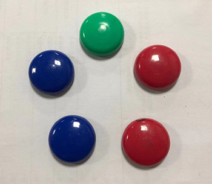
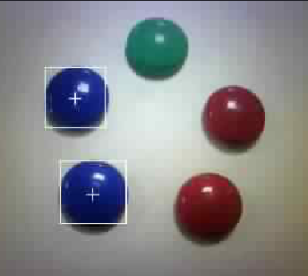

# 颜色识别

## 前言
我们活在一个色彩斑斓的世界里。本节我们来学习机器视觉中的颜色识别。我们会预先设定颜色阈值，如红、绿、蓝。这样K210摄像头采集图像后就能自动识别了。

## 实验目的
通过编程实现CanMV K210识别程序预先设定的颜色色块，分别是红、绿、蓝三种颜色。

## 实验讲解

CanMV集成了RGB565颜色块识别find_blobs函数，主要是基于LAB颜色模型（每个颜色都是用一组LAB阈值表示，有兴趣的用户可以自行查阅相关模型资料）。其位于image模块下，因此我们直接将拍摄到的图片进行处理即可，那么我们像以往一样像看一下本实验相关对象和函数说明，具体如下：


## find_blobs对象

### 构造函数
```python
image.find_blobs(thresholds[, invert=False[, roi[, x_stride=2[, y_stride=1[, area_threshold=10
                 [, pixels_threshold=10[, merge=False[, margin=0[, threshold_cb=None[, 
                 merge_cb=None]]]]]]]]]])
```
查找图像中指定的色块。返回image.blog对象列表；参数说明：
- `thresholds`: 必须是元组列表。 [(lo, hi), (lo, hi), ..., (lo, hi)] 定义你想追踪的颜色范围。 对于灰度图像，每个元组需要包含两个值 - 最小灰度值和最大灰度值。 仅考虑落在这些阈值之间的像素区域。 对于RGB565图像，每个元组需要有六个值(l_lo，l_hi，a_lo，a_hi，b_lo，b_hi) - 分别是LAB L，A和B通道的最小值和最大值。
- `area_threshold`: 若色块的边界框区域小于此参数值，则会被过滤掉；
- `pixels_threshold`: 若色块的像素数量小于此参数值，则会被过滤掉；
- `merge`: 若为True,则合并所有没有被过滤的色块；
- `margin`: 调整合并色块的边缘。

### 使用方法

以上函数返回image.blob对象。

```python
blob.rect()
```
返回一个矩形元组（x,y,w,h）,如色块边界。可以通过索引[0-3]来获得这些值。

<br></br>

```python
blob.cx()
```
返回色块(int)的中心x位置。可以通过索引[5]来获得这个值。

<br></br>

```python
blob.cy()
```
返回色块(int)的中心y位置。可以通过索引[6]来获得这个值。

<br></br>

更多用法请阅读官方文档：<br></br>
https://www.kendryte.com/canmv/main/canmv/library/canmv/image.html#find-blobs

<br></br>

了解了找色块函数应用方法后，我们可以理清一下编程思路，代码编写流程如下：

```mermaid
graph TD
    导入sensor等相关模块 --> 初始化和配置相关模块  --> 定义红,绿,蓝颜色阈值 --> 寻找图像跟定义颜色相同的色块 --> 画图指示 --> 寻找图像跟定义颜色相同的色块;
```

## 参考代码

```python
'''
实验名称：颜色识别
实验目的：单个颜色识别
作者： 01Studio
版本： v1.0
'''

import sensor,lcd,time

#摄像头初始化
sensor.reset()
sensor.set_pixformat(sensor.RGB565)
sensor.set_framesize(sensor.QVGA)
sensor.set_vflip(1) #摄像头后置模式

#lcd初始化
lcd.init()

clock=time.clock()

# 颜色识别阈值 (L Min, L Max, A Min, A Max, B Min, B Max) LAB模型
# 下面的阈值元组是用来识别 红、绿、蓝三种颜色，当然你也可以调整让识别变得更好。
thresholds = [(30, 100, 15, 127, 15, 127), # 红色阈值
              (30, 100, -64, -8, -32, 32), # 绿色阈值
              (0, 30, 0, 64, -128, -20)] # 蓝色阈值

while True:

    clock.tick()

    img=sensor.snapshot()

    blobs = img.find_blobs([thresholds[2]]) # 0,1,2分别表示红，绿，蓝色。
    if blobs:
        for b in blobs:
            tmp=img.draw_rectangle(b[0:4])
            tmp=img.draw_cross(b[5], b[6])

    lcd.display(img)     #LCD显示图片
    print(clock.fps())   #打印FPS
```

## 实验结果

在CanMV IDE中运行代码，代码默认检测的是蓝色，用户可以自行修改find_blobs()参数的阈值数组编号来切换识别颜色，如下：

**蓝色识别：**

原图：



实验结果：



本节学习了通过MicroPython编程在CanMV K210上实现单种颜色识别。本实验主要是基于LAB颜色模型来判断。有兴趣的小伙伴可以自行查阅LAB模块相 关资料，再结合打印threshold查看其元组数据来深入学习，还有就是可以找多种不规则形状的颜色物体对比学习。的