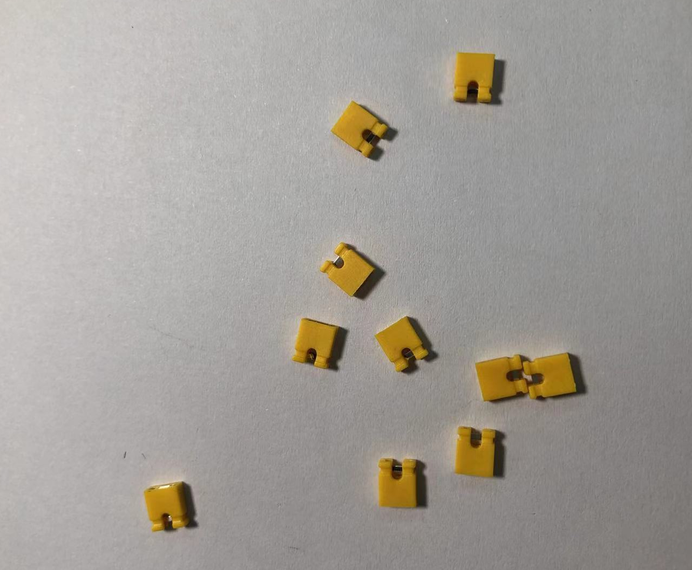
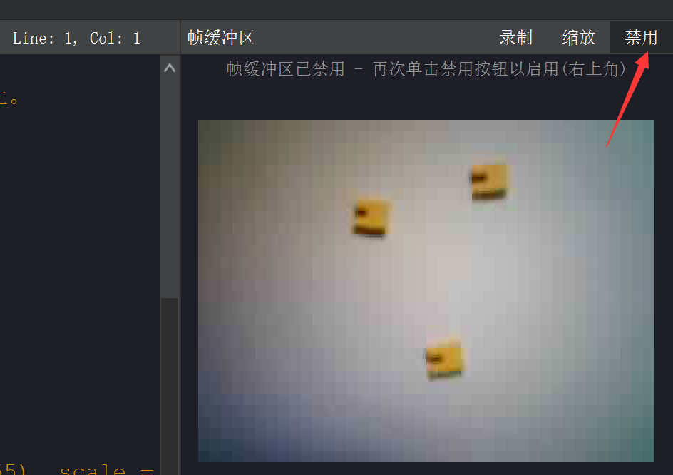
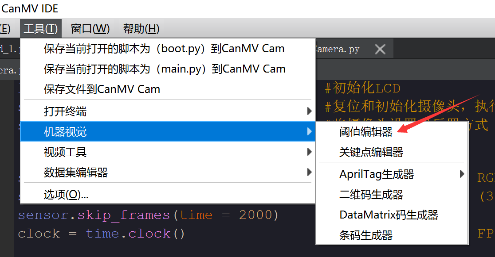
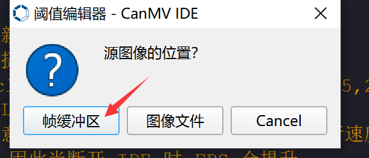
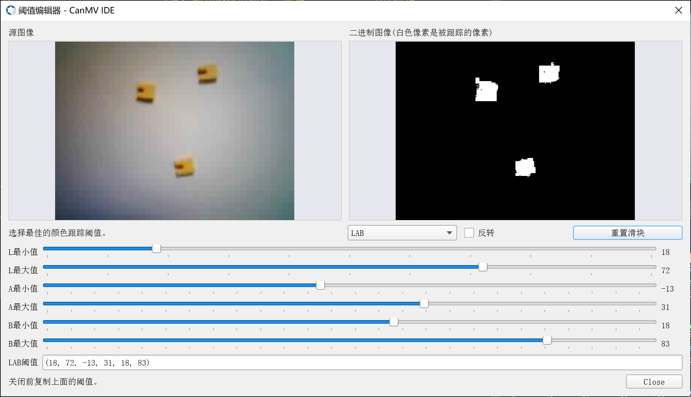
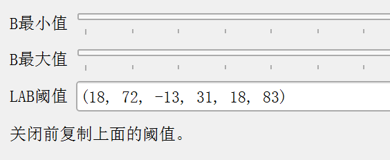
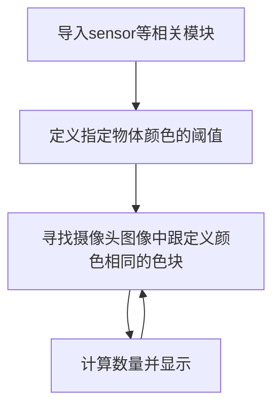
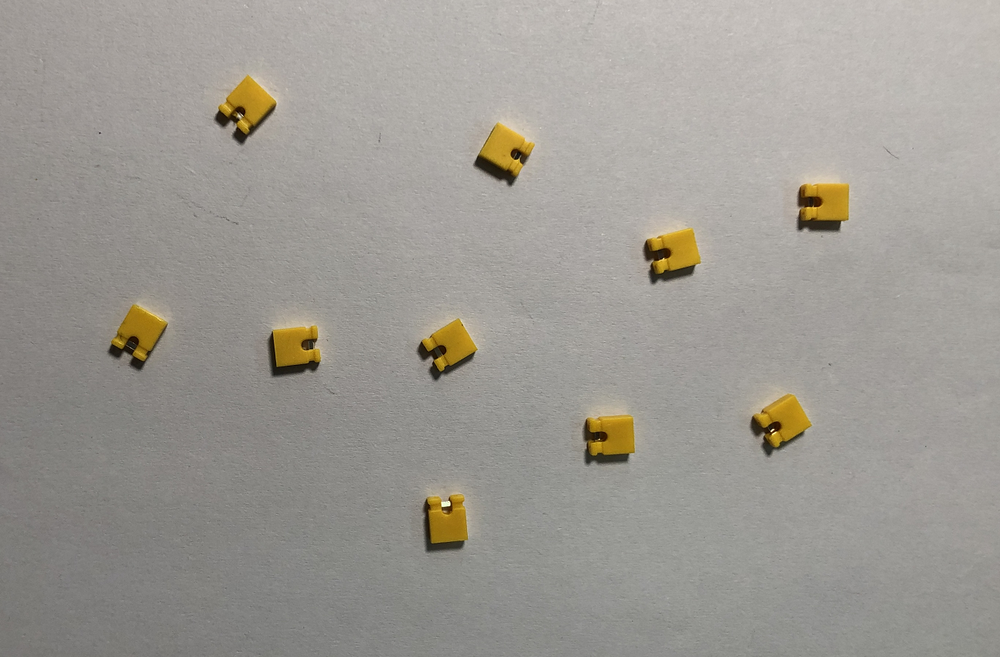
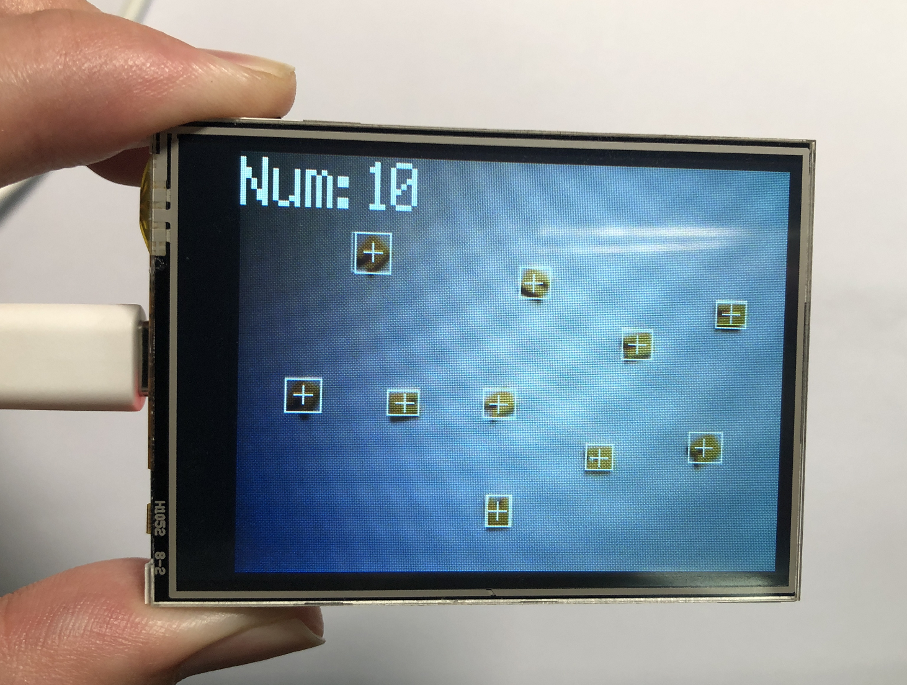

# 物体计数（相同颜色）

## 前言
通过上一节颜色识别我们看到可以识别出色块的数量，这节我们就基于上一节颜色识别来学习如何识别指定颜色的物体，计算其数量。

## 实验目的
通过编程实现CanMV K210识别程序预先设定的颜色，计算物体的数量。

## 实验讲解

find_blobs用法在上一节**颜色识别**已经讲解过，这里重复一下。主要是基于LAB颜色模型（每个颜色都是用一组LAB阈值表示，有兴趣的用户可以自行查阅相关模型资料）。其位于image模块下，因此我们直接将拍摄到的图片进行处理即可，那么我们像以往一样像看一下本实验相关对象和函数说明，具体如下：


## find_blobs对象

### 构造函数
```python
image.find_blobs(thresholds[, invert=False[, roi[, x_stride=2[, y_stride=1[, area_threshold=10
                 [, pixels_threshold=10[, merge=False[, margin=0[, threshold_cb=None[, 
                 merge_cb=None]]]]]]]]]])
```
查找图像中指定的色块。返回image.blog对象列表；参数说明：
- `thresholds`: 必须是元组列表。 [(lo, hi), (lo, hi), ..., (lo, hi)] 定义你想追踪的颜色范围。 对于灰度图像，每个元组需要包含两个值 - 最小灰度值和最大灰度值。 仅考虑落在这些阈值之间的像素区域。 对于RGB565图像，每个元组需要有六个值(l_lo，l_hi，a_lo，a_hi，b_lo，b_hi) - 分别是LAB L，A和B通道的最小值和最大值。
- `area_threshold`: 若色块的边界框区域小于此参数值，则会被过滤掉；
- `pixels_threshold`: 若色块的像素数量小于此参数值，则会被过滤掉；
- `merge`: 若为True,则合并所有没有被过滤的色块；
- `margin`: 调整合并色块的边缘。

### 使用方法

以上函数返回image.blob对象列表。

```python
blob.rect()
```
返回一个矩形元组（x,y,w,h）,如色块边界。可以通过索引[0-3]来获得这些值。

<br></br>

```python
blob.cx()
```
返回色块(int)的中心x位置。可以通过索引[5]来获得这个值。

<br></br>

```python
blob.cy()
```
返回色块(int)的中心y位置。可以通过索引[6]来获得这个值。

<br></br>

更多用法请阅读官方文档：<br></br>
https://developer.canaan-creative.com/canmv/main/canmv/library/canmv/image.html#find-blobs

<br></br>

## 获取颜色阈值

针对不同颜色的物体我们如何获取它的阈值呢？这里以黄色的跳线帽为例来讲解。



先使用 [摄像头](../machine_vision/camera.md)代码采集物体图像，在IDE右上角缓冲区点击“**禁用**”将要识别的物体确认下来：



点击 **工具—机器视觉—阈值编辑器** 。



在弹出的对话框选择“帧缓冲区”。



通过调整下方6个LAB值，使得物体颜色在右边为白色，其余背景为黑色。（需要花费一点时间，找到临界值效果更佳。）



记录颜色的LAB值，在后面代码中使用。



学会了找色块函数和颜色阈值获取方法后，我们可以理清一下编程思路，代码编写流程如下：



## 参考代码

```python
'''
实验名称：物体计数(相同颜色)
实验目的：识别图像中相同颜色的物体
作者： 01Studio
版本： v1.0
'''

import sensor,lcd,time

#摄像头初始化
sensor.reset()
sensor.set_pixformat(sensor.RGB565)
sensor.set_framesize(sensor.QVGA)
sensor.set_vflip(1) #摄像头后置模式

#lcd初始化
lcd.init()

clock=time.clock()

# 颜色识别阈值 (L Min, L Max, A Min, A Max, B Min, B Max) LAB模型
# 下面的阈值元组是用来识别 红、绿、蓝三种颜色，当然你也可以调整让识别变得更好。

thresholds = [(18, 72, -13, 31, 18, 83)]#黄色跳线帽阈值

while True:

    clock.tick()

    img=sensor.snapshot()

    blobs = img.find_blobs([thresholds[0]]) # 找黄色跳线帽色块

    if blobs:
        print(len(blobs))
        #计算色块数量并在LCD显示
        img.draw_string(0, 0, 'Num: '+str(len(blobs)), color = (255, 255,255), scale = 3,mono_space = False)

        for b in blobs:
            tmp=img.draw_rectangle(b[0:4])
            tmp=img.draw_cross(b[5], b[6])

    lcd.display(img)     #LCD显示图片
    print(clock.fps())   #打印FPS

```

## 实验结果

在IDE中运行代码，这里尝试识别10个跳线帽，可以看到准确度非常高：

待识别物体：



识别结果：



