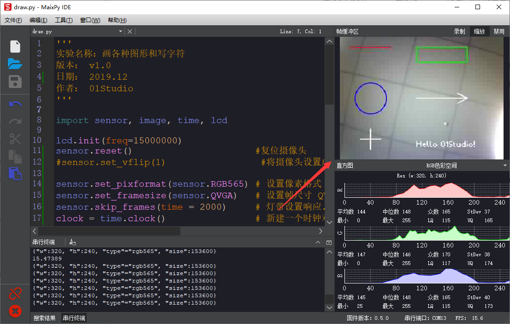

# 画图

## 前言
通过摄像头采集到照片后，我们会进行一些处理，而这时候往往需要一些图形来指示，比如在图片某个位置标记箭头、人脸识别后用矩形框提示等。本节就是学习在图形上画图的使用功能。

## 实验目的
在摄像头拍摄的图像上画各种图形。

## 实验讲解

上一节我们学习了摄像头sensor模块应用，通过摄像头实时采集到的是图片image, 没错，本节实验就是建立在非常重要的image模块上面。CanMV已经将图片处理（包含画图）封装成各类模块，我们只需要熟悉其构造函数和使用方法即可，具体如下：


## image对象

### 构造函数
```python
img=sensor.snapshot()
```
通过摄像头拍摄方式返回image对象。
<br></br>

```python
img=image.Image(path[, copy_to_fb=False])
```
通过读取图片方式创建image对象。
- `copy_to_fb`: 加载大图片。
    - `True` : 可以加载大图片。
    - `False` : 不可以加载大图片。

例：img = image.Image("01Studio.bmp", copy_to_fb=True),表示加载根目录下的01Studio.bmp图片。

### 使用方法

```python
image.draw_line(x0, y0, x1, y1[, color[, thickness=1]])
```
画线段。
- `x0, y0`: 起始坐标;
- `x1, y1`: 终点坐标;
- `color`: 颜色;
- `thickness`: 线条粗细;

<br></br>

```python
image.draw_rectangle(x, y, w, h[, color[, thickness=1[, fill=False]]])
```
画矩形。
- `x, y`: 起始坐标;
- `w`: 宽度;
- `h`: 高度;
- `color`: 颜色;
- `thickness`: 边框粗细;
- `fill`: 是否填充;、
    - `True` : 填充。
    - `False` : 不填充。

<br></br>

```python
image.draw_circle(x, y, radius[, color[, thickness=1[, fill=False]]])
```
画圆。
- `x, y`: 圆心;
- `radius`: 宽度;
- `h`: 高度;
- `color`: 颜色;
- `thickness`: 线条粗细;
- `fill`: 是否填充;、
    - `True` : 填充。
    - `False` : 不填充。

<br></br>

```python
image.draw_arrow(x0, y0, x1, y1[, color[, size,[thickness=1]]])
```
画箭头。
- `x0, y0`: 起始坐标;
- `x1, y1`: 终点坐标;
- `color`: 颜色;
- `size`: 箭头位置大小;
- `thickness`: 线条粗细;

<br></br>

```python
image.draw_cross(x, y[, color[, size=5[, thickness=1]]])
```
画十字交叉。
- `x, y`: 交叉中点坐标;
- `color`: 颜色;
- `size`: 大小;
- `thickness`: 线条粗细;

<br></br>

```python
image.draw_string(x, y, text[, color[, scale=1[,mono_space=True…]]]])
```
写字符。
- `x, y`: 起始左边;
- `text`: 字符内容;
- `color`: 颜色;
- `scale`: 字体大小;
- `mono_space`: 强制间隔;
    - `True` : 有间隔。
    - `False` : 无间隔。

<br></br>

更多用法请阅读官方文档：<br></br>
https://developer.canaan-creative.com/canmv/main/canmv/library/canmv/image.html

<br></br>

熟悉了image对象的画图功能后，我们尝试在摄像头采集到的画面依次画出线段、矩形、圆形、箭头、十字交叉和字符。具体编程思路如下：

```mermaid
graph TD
    导入sensor,lcd相关模块 --> 初始化和配置模块  --> 摄像头拍摄 --> 画各类图形--> 摄像头拍摄;
```

## 参考代码

```python
'''
实验名称：画各种图形和写字符
版本： v1.0
日期： 2022.9
作者： 01Studio
'''

import sensor, image, time, lcd

lcd.init(freq=15000000)
sensor.reset()                      #复位摄像头
sensor.set_vflip(1)                 #将摄像头设置成后置方式（所见即所得）

sensor.set_pixformat(sensor.RGB565) # 设置像素格式 RGB565 (or GRAYSCALE)
sensor.set_framesize(sensor.QVGA)   # 设置帧尺寸 QVGA (320x240)
sensor.skip_frames(time = 2000)     # 灯带设置响应.
clock = time.clock()                # 新建一个时钟对象计算FPS.

while(True):
    clock.tick()
    img = sensor.snapshot()

    # 画线段：从 x0, y0 到 x1, y1 坐标的线段，颜色红色，线宽度 2。
    img.draw_line(20, 20, 100, 20, color = (255, 0, 0), thickness = 2)

    #画矩形：绿色不填充。
    img.draw_rectangle(150, 20, 100, 30, color = (0, 255, 0), thickness = 2, fill = False)

    #画圆：蓝色不填充。
    img.draw_circle(60, 120, 30, color = (0, 0, 255), thickness = 2, fill = False)

    #画箭头：白色。
    img.draw_arrow(150, 120, 250, 120, color = (255, 255, 255), size = 20, thickness = 2)

    #画十字交叉。
    img.draw_cross(60, 200, color = (255, 255, 255), size = 20, thickness = 2)

    #写字符。
    img.draw_string(150, 200, "Hello 01Studio!", color = (255, 255, 255), scale = 2,mono_space = False)

    lcd.display(img)                # 在LCD显示
    print(clock.fps())              #终端打印FPS
```

## 实验结果

在CanMV IDE中打开画图例程文件draw.py，点击运行。可以看到在图像缓冲区中画上了各种图形。



在LCD上同样能看到实验结果。由于CanMV IDE缓冲区图片经过压缩，所以LCD上的效果会更好一点。


画图形是很基础的功能，在以后的实验中特别是指示识别内容时候会经常用到。