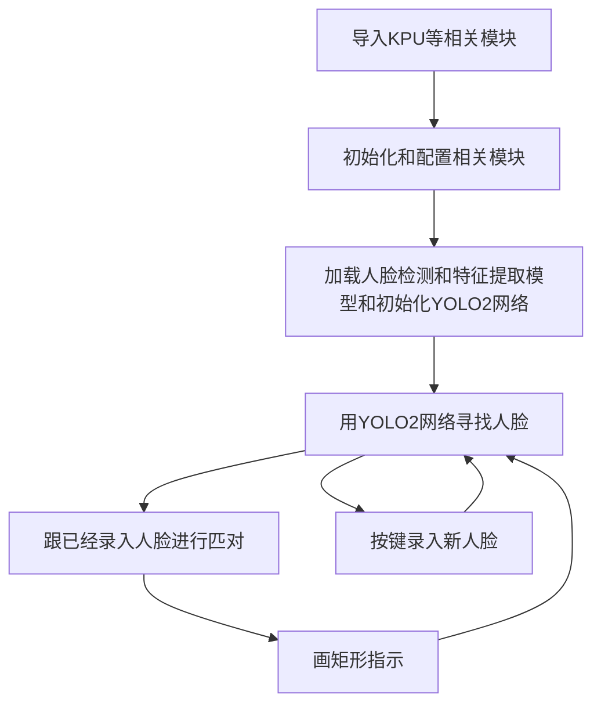
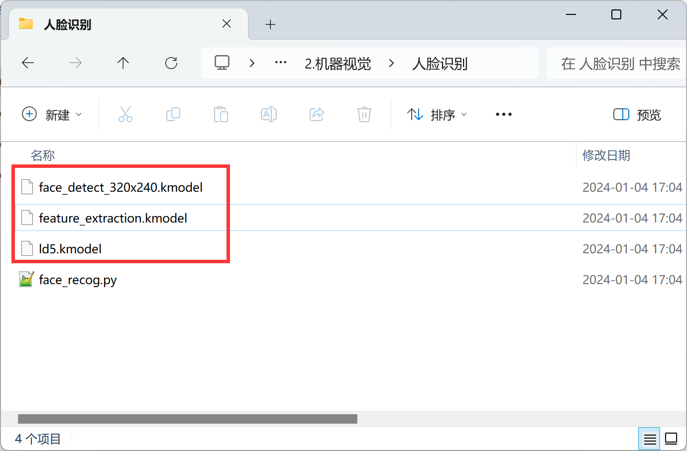
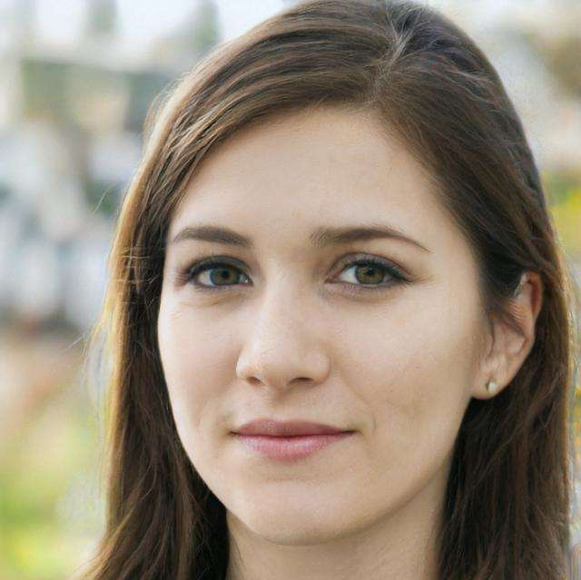
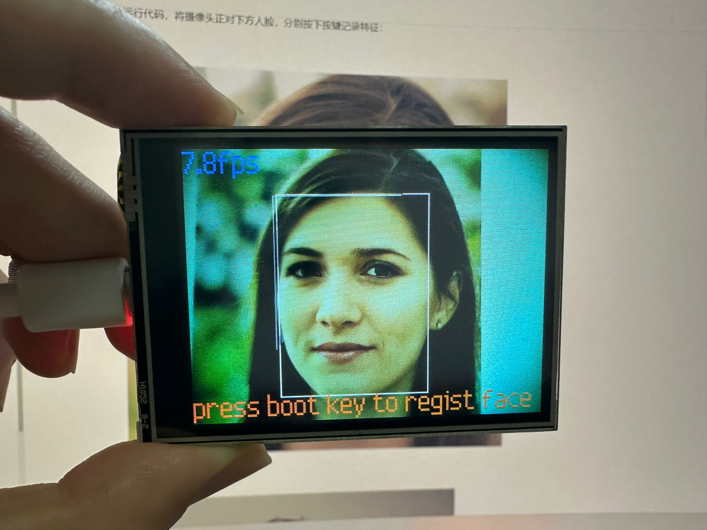
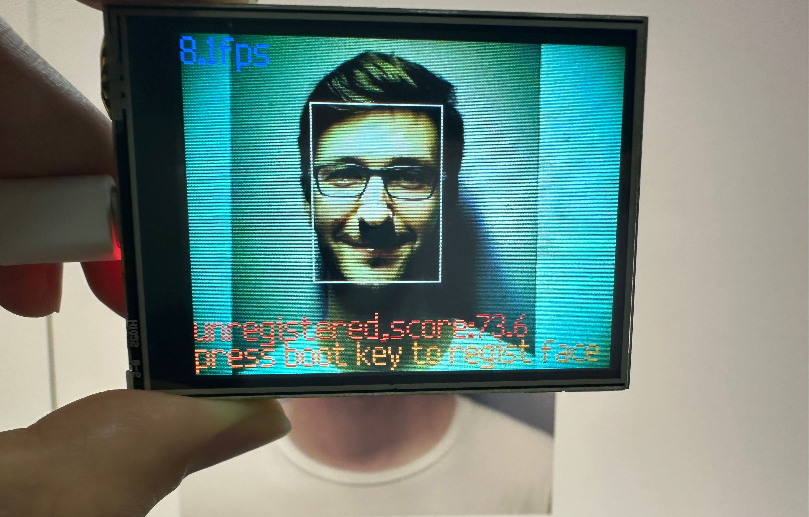
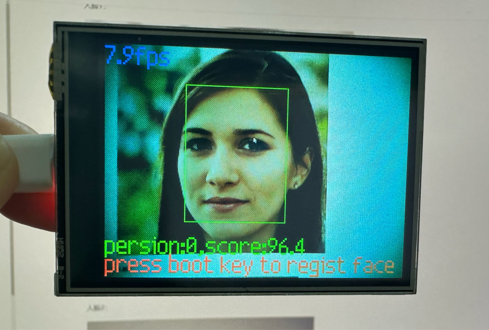

# 人脸识别

## 前言
前面学习过的人脸检测，只检测出人脸，而本实验要做的人脸识别，会学习人脸特征，然后比对，实现区分不同人脸。比如常用的人脸考勤机就是这样的原理。

## 实验目的
实现不同人脸识别。

## 实验讲解

本实验通过KPU模块直接加载YOLO2网络，再结合人脸检测和特征提取模型来实现人脸识别。KPU对象说明参考[KPU简介](./kpu)章节内容，这里不再重复。

检测到人脸后我们可以通过按键按下来实现提前当前人脸特征，实现录入人脸。具体编程思路如下：



## 参考代码

```python
#实验名称：人脸识别
#实验平台：01Studio CanMV K210
#说明：本例程对内存需求较大，如提示内存不足请烧录CanMV_K210_lite（精简版）固件。

#导入相关模块
import sensor, image, time, lcd
from maix import KPU
import gc
from maix import GPIO, utils
from fpioa_manager import fm
from board import board_info

#按键初始化
fm.register(board_info.BOOT_KEY, fm.fpioa.GPIOHS0)
key_gpio = GPIO(GPIO.GPIOHS0, GPIO.IN)

lcd.init()
#sensor.reset(dual_buff=True) # improve fps
sensor.reset()                      # Reset and initialize the sensor. It will
                                    # run automatically, call sensor.run(0) to stop

sensor.set_vflip(1)                 #将摄像头设置成后置方式（所见即所得）
sensor.set_hmirror(1)               #GC0328摄像头（如果使用ov2640摄像头，注释此行。）

sensor.set_pixformat(sensor.RGB565) # Set pixel format to RGB565 (or GRAYSCALE)
sensor.set_framesize(sensor.QVGA)   # Set frame size to QVGA (320x240)
sensor.skip_frames(time = 1000)     # Wait for settings take effect.
clock = time.clock()                # Create a clock object to track the FPS.

feature_img = image.Image(size=(64,64), copy_to_fb=False)
feature_img.pix_to_ai()

FACE_PIC_SIZE = 64
dst_point =[(int(38.2946 * FACE_PIC_SIZE / 112), int(51.6963 * FACE_PIC_SIZE / 112)),
            (int(73.5318 * FACE_PIC_SIZE / 112), int(51.5014 * FACE_PIC_SIZE / 112)),
            (int(56.0252 * FACE_PIC_SIZE / 112), int(71.7366 * FACE_PIC_SIZE / 112)),
            (int(41.5493 * FACE_PIC_SIZE / 112), int(92.3655 * FACE_PIC_SIZE / 112)),
            (int(70.7299 * FACE_PIC_SIZE / 112), int(92.2041 * FACE_PIC_SIZE / 112)) ]

anchor = (0.1075, 0.126875, 0.126875, 0.175, 0.1465625, 0.2246875, 0.1953125, 0.25375, 0.2440625,
      0.351875, 0.341875, 0.4721875, 0.5078125, 0.6696875, 0.8984375, 1.099687, 2.129062, 2.425937)

#构建KPU对象
kpu = KPU()
kpu.load_kmodel("/sd/face_detect_320x240.kmodel")#人脸检测模型
kpu.init_yolo2(anchor, anchor_num=9, img_w=320, img_h=240, net_w=320 , net_h=240 ,layer_w=10 ,
                layer_h=8, threshold=0.5, nms_value=0.2, classes=1)

#加载KPU模型，放在SD卡根目录
ld5_kpu = KPU()
print("ready load model")
ld5_kpu.load_kmodel("/sd/ld5.kmodel")

fea_kpu = KPU()
print("ready load model")
fea_kpu.load_kmodel("/sd/feature_extraction.kmodel")#特征提取模型

start_processing = False
BOUNCE_PROTECTION = 50

#按键按下执行函数
def set_key_state(*_):
    global start_processing
    start_processing = True
    time.sleep_ms(BOUNCE_PROTECTION)

key_gpio.irq(set_key_state, GPIO.IRQ_RISING, GPIO.WAKEUP_NOT_SUPPORT)

record_ftrs = []
THRESHOLD = 80.5

RATIO = 0
def extend_box(x, y, w, h, scale):
    x1_t = x - scale*w
    x2_t = x + w + scale*w
    y1_t = y - scale*h
    y2_t = y + h + scale*h
    x1 = int(x1_t) if x1_t>1 else 1
    x2 = int(x2_t) if x2_t<320 else 319
    y1 = int(y1_t) if y1_t>1 else 1
    y2 = int(y2_t) if y2_t<240 else 239
    cut_img_w = x2-x1+1
    cut_img_h = y2-y1+1
    return x1, y1, cut_img_w, cut_img_h

recog_flag = False

while 1:
    gc.collect()
    #print("mem free:",gc.mem_free())
    #print("heap free:",utils.heap_free())
    clock.tick()                    # Update the FPS clock.
    img = sensor.snapshot()
    kpu.run_with_output(img)
    dect = kpu.regionlayer_yolo2()
    fps = clock.fps()

    if len(dect) > 0: #检测到人脸

        for l in dect :
            x1, y1, cut_img_w, cut_img_h= extend_box(l[0], l[1], l[2], l[3], scale=RATIO)
            face_cut = img.cut(x1, y1, cut_img_w, cut_img_h)
            #a = img.draw_rectangle(l[0],l[1],l[2],l[3], color=(255, 255, 255))
            # img.draw_image(face_cut, 0,0)
            face_cut_128 = face_cut.resize(128, 128)
            face_cut_128.pix_to_ai()
            out = ld5_kpu.run_with_output(face_cut_128, getlist=True)
            face_key_point = []
            for j in range(5):
                x = int(KPU.sigmoid(out[2 * j])*cut_img_w + x1)
                y = int(KPU.sigmoid(out[2 * j + 1])*cut_img_h + y1)
                # a = img.draw_cross(x, y, size=5, color=(0, 0, 255))
                face_key_point.append((x,y))
            T = image.get_affine_transform(face_key_point, dst_point)
            a = image.warp_affine_ai(img, feature_img, T)
            # feature_img.ai_to_pix()
            # img.draw_image(feature_img, 0,0)
            feature = fea_kpu.run_with_output(feature_img, get_feature = True)
            del face_key_point
            scores = []
            for j in range(len(record_ftrs)):
                score = kpu.feature_compare(record_ftrs[j], feature)
                scores.append(score)
            if len(scores):
                max_score = max(scores)
                index = scores.index(max_score)
                if max_score > THRESHOLD:
                    a=img.draw_string(0, 195, "persion:%d,score:%2.1f" %(index, max_score), color=(0, 255, 0), scale=2)
                    recog_flag = True
                else:
                    a=img.draw_string(0, 195, "unregistered,score:%2.1f" %(max_score), color=(255, 0, 0), scale=2)
            del scores

            #按键按下则录入新人脸
            if start_processing:
                record_ftrs.append(feature)
                print("record_ftrs:%d" % len(record_ftrs))
                start_processing = False

            if recog_flag:
                a = img.draw_rectangle(l[0],l[1],l[2],l[3], color=(0, 255, 0))
                recog_flag = False
            else:
                a = img.draw_rectangle(l[0],l[1],l[2],l[3], color=(255, 255, 255))
            del (face_cut_128)
            del (face_cut)

    a = img.draw_string(0, 0, "%2.1ffps" %(fps), color=(0, 60, 255), scale=2.0)
    a = img.draw_string(0, 215, "press boot key to regist face", color=(255, 100, 0), scale=2.0)
    lcd.display(img)


kpu.deinit()
ld5_kpu.deinit()
fea_kpu.deinit()

```

## 实验结果

在资料包教程代码文件夹路径中找到本节代码目录，将里面的 `face_detect_320x240.kmodel` 、`ld5.kmodel` 、`feature_extraction.kmodel`文件通过读卡器拷贝到SD卡，然后将SD卡插入开发板，在IDE运行上述代码即可。



运行代码，将摄像头正对下方人脸，分别按下按键记录特征：

**原图：**

人脸1：



人脸2：


依次按下按键学习上面2个人脸，从0开始记录，也就是第一个人脸编号为0，如此类推：





学习完成后将摄像头正对着刚才学习的人脸，可以看到识别出来了对应的人脸编号和可信度值。

