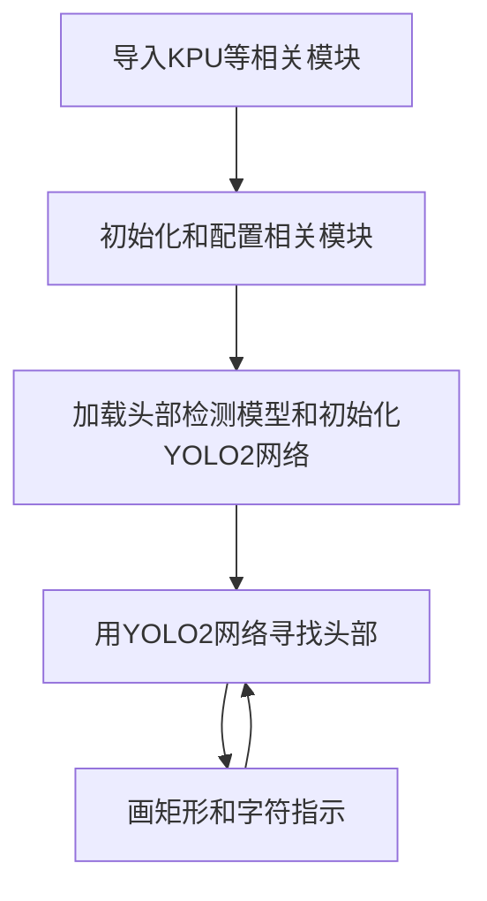
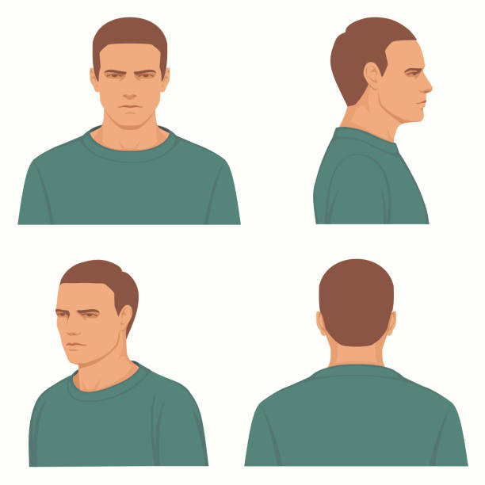
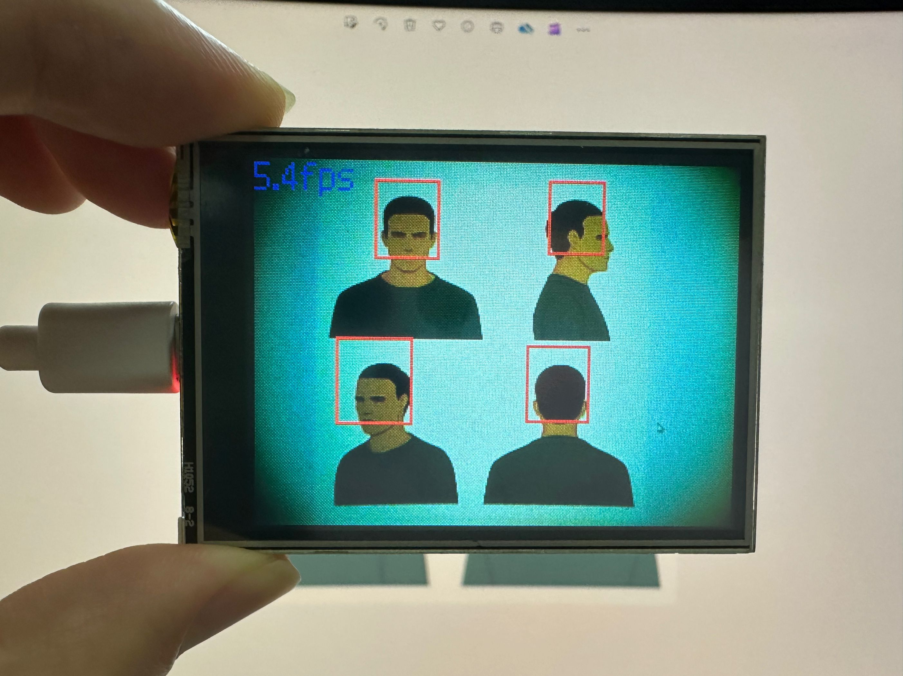

# 头部检测

## 前言
头部检测是判断摄像头画面中有无出现人体头部，本节我们来学习一下如何通过MicroPython编程快速实现头部检测。

## 实验目的
人体头部检测并通过画框提示。

## 实验讲解

本实验还是使用到YOLO2网络，结合人体检测模型来识别头部。KPU对象说明可参考[KPU简介](./kpu)章节内容。

具体编程思路如下：



## 参考代码

```python
#实验名称：头部检测
#实验平台：01Studio CanMV K210

#导入相关模块
import sensor, image, time, lcd
from maix import KPU
import gc

lcd.init()
sensor.reset()                      # Reset and initialize the sensor. It will
                                    # run automatically, call sensor.run(0) to stop

sensor.set_vflip(1)                 #将摄像头设置成后置方式（所见即所得）
sensor.set_hmirror(1)               #GC0328摄像头（如果使用ov2640摄像头，注释此行。）

sensor.set_pixformat(sensor.RGB565) # Set pixel format to RGB565 (or GRAYSCALE)
sensor.set_framesize(sensor.QVGA)   # Set frame size to QVGA (320x240)
sensor.skip_frames(time = 1000)     # Wait for settings take effect.
clock = time.clock()                # Create a clock object to track the FPS.

od_img = image.Image(size=(320,256))

#构建KPU对象
anchor_head_detect = (0.1074, 0.1458, 0.1367, 0.2137, 0.1758, 0.2824, 0.2441, 0.3333, 0.2188, 
                      0.4167, 0.2969, 0.5000, 0.4102, 0.6667, 0.6094, 0.9722, 1.2364, 1.6915)
head_kpu = KPU()
print("ready load model")

#加载KPU模型，放在SD卡根目录
head_kpu.load_kmodel("/sd/uint8_head_detect_v1_old.kmodel")

head_kpu.init_yolo2(anchor_head_detect, anchor_num=9, img_w=320, img_h=240, net_w=320 ,
                    net_h=256 ,layer_w=10 ,layer_h=8, threshold=0.7, nms_value=0.2, classes=1)


while True:
    gc.collect()
    clock.tick()                    # Update the FPS clock.
    img = sensor.snapshot()
    a = od_img.draw_image(img, 0,0)
    od_img.pix_to_ai()

    #将摄像头采集图片输送到KPU和yolo模型运算。
    head_kpu.run_with_output(od_img)
    head_boxes = head_kpu.regionlayer_yolo2()
    if len(head_boxes) > 0:#识别到人体头部
        print(head_boxes) #打印所有头部识别框信息

        for l in head_boxes : #画矩形
            a = img.draw_rectangle(l[0],l[1],l[2],l[3], color=(255, 0, 0),thickness=2)

    fps = clock.fps()#计算FPS
    a = img.draw_string(0, 0, "%2.1ffps" %(fps), color=(0, 60, 128), scale=2.0)

    lcd.display(img)

head_kpu.deinit()
```

## 实验结果

将资料包例程源码中的 `uint8_head_detect_v1_old.kmodel` 模型文件拷贝到SD卡中。

在CanMV IDE中运行上述代码，将摄像头对准下方图片，可以看到人体头部被正确的识别出来：

原图：



识别结果：


