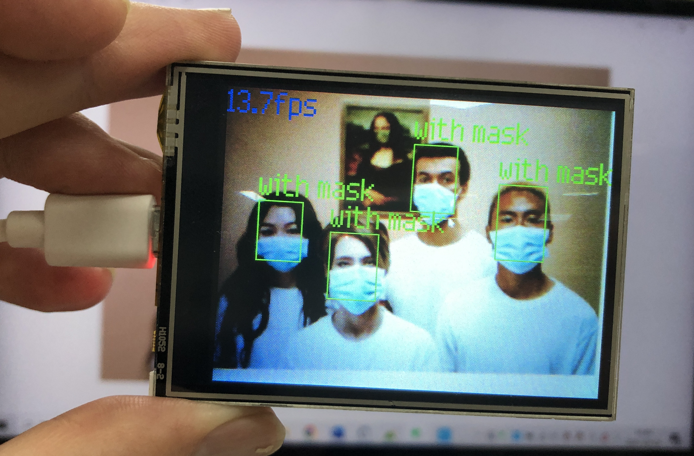

# 口罩识别

## 前言
口罩识别应用于识别某个人有无佩戴口罩。本节我们来学习一下如何通过MicroPython编程快速实现口罩识别。

## 实验目的
识别有无佩戴口罩。

## 实验讲解

本实验还是使用到YOLO2网络，，结合口罩识别模型来识别人手。KPU对象说明可参考[KPU简介](./kpu)章节内容。

具体编程思路如下：

```mermaid
graph TD
    导入KPU等相关模块 --> 初始化和配置相关模块  --> 加载口罩识别模型和初始化YOLO2网络 --> 用YOLO2网络寻找人脸口罩 --> 画矩形和字符指示 --> 用YOLO2网络寻找人脸口罩;
```

## 参考代码

```python
#实验名称：口罩检测
#翻译和注释：01Studio

#导入相关模块
import sensor, image, time, lcd
from maix import KPU
import gc

lcd.init()
sensor.reset()

sensor.set_pixformat(sensor.RGB565)
sensor.set_framesize(sensor.QVGA)
sensor.set_vflip(True) #摄像头后置

sensor.skip_frames(time = 1000)
clock = time.clock()

od_img = image.Image(size=(320,256), copy_to_fb=False)

#构建KPU对象
anchor = (0.156250, 0.222548, 0.361328, 0.489583, 0.781250, 0.983133, 1.621094, 1.964286, 3.574219, 3.94000)
kpu = KPU()
print("ready load model")

#加载KPU模型，放在SD卡根目录
kpu.load_kmodel("/sd/detect_5.kmodel")

#需要将kmdel通过固件下载工具下载到0x300000的位置（3M偏移）
#kpu.load_kmodel(0x300000, 555176)

kpu.init_yolo2(anchor, anchor_num=5, img_w=320, img_h=240, net_w=320 , net_h=256 ,layer_w=10 ,layer_h=8, threshold=0.7, nms_value=0.4, classes=2)

while True:
    #print("mem free:",gc.mem_free())
    clock.tick()                    # Update the FPS clock.
    img = sensor.snapshot()
    a = od_img.draw_image(img, 0,0)
    od_img.pix_to_ai()

    #将摄像头采集图片输送到KPU和yolo模型运算。
    kpu.run_with_output(od_img)
    dect = kpu.regionlayer_yolo2()
    fps = clock.fps()

    if len(dect) > 0: #识别到人脸
        print("dect:",dect)
        for l in dect :
            if l[4] : #有带口罩
                a = img.draw_rectangle(l[0],l[1],l[2],l[3], color=(0, 255, 0))
                a = img.draw_string(l[0],l[1]-24, "with mask", color=(0, 255, 0), scale=2)
            else:    #没有戴口罩
                a = img.draw_rectangle(l[0],l[1],l[2],l[3], color=(255, 0, 0))
                a = img.draw_string(l[0],l[1]-24, "without mask", color=(255, 0, 0), scale=2)

    a = img.draw_string(0, 0, "%2.1ffps" %(fps), color=(0, 60, 128), scale=2.0)
    lcd.display(img)
    gc.collect()

kpu.deinit()
```

## 实验结果

将示例程序中的hand_detect.kmodel模型文件拷贝到SD卡中。

在CanMV IDE中运行上述代码，将摄像头对准戴口罩人员，可以看到被正确的识别出来，支持多个口罩识别。

原图：


识别结果：




**对于未佩戴口罩识别结果如下：**

未佩戴口罩原图：


识别结果：

