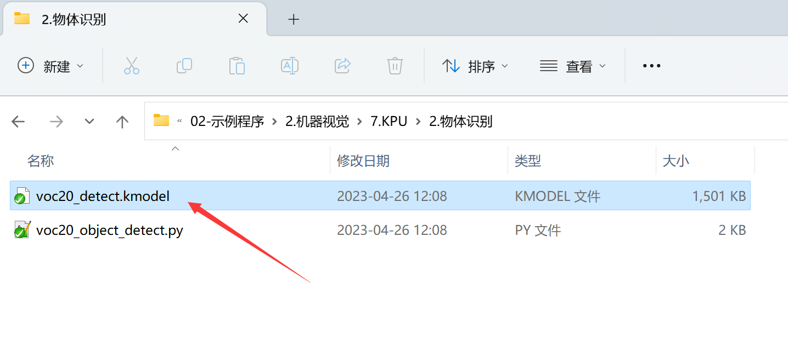
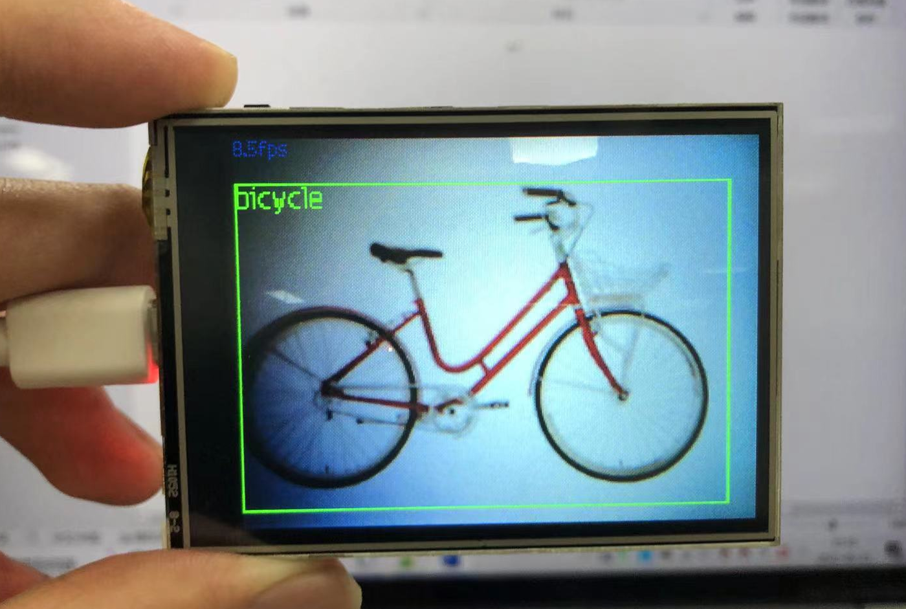

# 物体识别

## 前言
物体识别，是机器视觉里面非常典型的应用。要实现的就是将一幅图片里面的各种物体检测出来，然后跟已知模型做比较从而判断物体是什么。我们来学习一下如何通过MicroPython编程快速实现物体识别。

## 实验目的
物体识别并显示名称。

## 实验讲解

本实验还是使用到YOLO2网络，结合20class模型（20种物体分类模型）来识别图像中的物体。KPU对象说明可参考[KPU简介](./kpu)章节内容。

具体编程思路如下：

```mermaid
graph TD
    导入KPU等相关模块 --> 初始化和配置相关模块  --> 加载物体识别模型和初始化YOLO2网络 --> 用YOLO2网络寻找物体 --> 画矩形和字符指示 --> 用YOLO2网络寻找物体;
```

## 参考代码

```python
#实验名称：物体检测
#翻译和注释：01Studio
#实验目的：使用20class模型识别20种物体

import sensor, image, time, lcd
from maix import KPU
import gc

lcd.init()

sensor.reset()
sensor.set_pixformat(sensor.RGB565)
sensor.set_framesize(sensor.QVGA)
sensor.set_vflip(1) #摄像头后置方式

sensor.skip_frames(time = 1000)
clock = time.clock()

od_img = image.Image(size=(320,256))

#20种物体名称
obj_name = ("aeroplane","bicycle", "bird","boat","bottle","bus","car","cat","chair","cow","diningtable", "dog","horse", "motorbike","person","pottedplant", "sheep","sofa", "train", "tvmonitor")

#构建KPU对象

kpu = KPU()
print("ready load model")
#加载KPU模型，放在SD卡根目录
kpu.load_kmodel("/sd/voc20_detect.kmodel")

#Flash加载模型方式，需要将kmdel通过固件下载工具下载到0x300000的位置（3M偏移）
#kpu.load_kmodel(0x300000, 1536936)

anchor = (1.3221, 1.73145, 3.19275, 4.00944, 5.05587, 8.09892, 9.47112, 4.84053, 11.2364, 10.0071)
kpu.init_yolo2(anchor, anchor_num=5, img_w=320, img_h=240, net_w=320 , net_h=256 ,layer_w=10 ,layer_h=8, 
               threshold=0.5, nms_value=0.2, classes=20)

i = 0
while True:
    i += 1
    print("cnt :", i)
    clock.tick()                    # Update the FPS clock.
    img = sensor.snapshot()
    a = od_img.draw_image(img, 0,0)
    od_img.pix_to_ai()

    #将摄像头采集图片输送到KPU和yolo模型运算。
    kpu.run_with_output(od_img)
    dect = kpu.regionlayer_yolo2()

    fps = clock.fps()

    if len(dect) > 0: #识别到物体
        print("dect:",dect)
        for l in dect : #画矩形
            a = img.draw_rectangle(l[0],l[1],l[2],l[3], color=(0, 255, 0))
            a = img.draw_string(l[0],l[1], obj_name[l[4]], color=(0, 255, 0), scale=1.5)

    a = img.draw_string(0, 0, "%2.1ffps" %(fps), color=(0, 60, 128), scale=1.0) #显示屏显示FPS
    lcd.display(img)
    gc.collect() #内存回收

kpu.deinit()
```

## 实验结果

将示例程序中的20class.kmodel模型文件拷贝到SD卡根目录下。



运行程序，准备20class里面相关的物体图片，可以看到CanMV K210可以轻易地将相关物体识别出来。

原图：


识别结果：



本节学习了物体识别，可以看到CanMV K210通过KPU+YOLO2+20class模型轻松实现特定物体识别，而且检测的准确率非常高，也就是结合MicroPython编程我们轻松完成了实验。