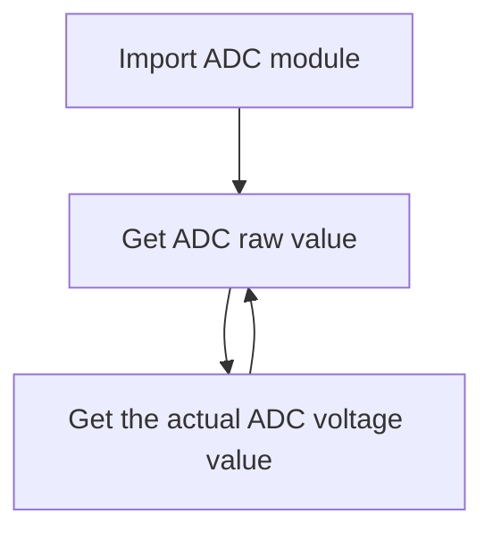

# ADC（Voltage measurement）

## Foreword
ADC(analog to digital conversion) means converting analog signals into digital signals. Since the microcontroller can only recognize binary numbers, external analog signals are often converted into digital information that it can recognize through ADC. A common application is to convert the changing voltage into a digital signal to measure the voltage value.


## Experiment Purpose
Learn ADC programming.

## Experimental Explanation

K230 contains an ADC hardware module with 6 channels, a sampling resolution of 12bit (0-4095), and a sampling rate of 1M. 01Studio CanMV K230 development board leads to 4 channels 0~3. The range of channels 0 and 1 is 0-3.6V, and the range of channels 2 and 3 is 0-1.8V.** Do not exceed the measurement range, which may cause the main control chip to burn out!**

Let's take a look at the constructor and usage of the ADC module.

## Class ADC

### Constructors
```python
adc = machine.ADC(channel)
```
Construct ADC object, the ADC channels are as follows:

- `channel` ：Channel selection 1-3, such as: ADC(0). 

    - `0`: ADC0（PIN 32 , range 0-3.6V）
    - `1`: ADC1（PIN 36 , range 0-3.6V）
    - `2`: ADC2（PIN 38 , range 0-1.8V）
    - `3`: ADC3（PIN 40 , range 0-1.8V）

### Methods
```python
adc.read_u16()
```
Get ADC value, the measurement accuracy is 12 bits, and the return value is 0-4095. The range of channels 0 and 1 is 0-3.6V, and the range of channels 2 and 3 is 0-1.8V.

<br></br>

```python
adc.read_uv()
```
Get ADC voltage value, return 0-1.8, the Unit is V. The actual range of channels 0 and 1 is 0-3.6V, and the range of channels 2 and 3 is 0-1.8V

<br></br>

After learning how to use ADC, we can use code to periodically measure the voltage of the specified channel pin. The code programming flow chart is as follows:



## Codes

```python
'''
Demo Name：ADC
Version：v1.0
Author：01Studio
Platform：01Studio CanMV K230
Description：The ADC has 4 channels in total, of which channels 0 and 1 have an actual range of 0-3.6V, and channels 2 and 3 have a range of 0-1.8V.(Please do not exceed the measurement range, which may cause the main control chip to burn out!)
    
'''

from machine import ADC
import time

'''
Construct ADC object:
ADC0 (PIN 32, range 0-3.6V), ADC1 (PIN 36, range 0-3.6V),
ADC2 (PIN 38, range 0-1.8V), ADC3 (PIN 40, range 0-1.8V).
'''
adc = ADC(0) #Channel 0

while True:

    print(adc.read_u16()) # Get ADC value

    # Get the ADC channel voltage value, retaining 2 as a decimal. The actual range of channels 0 and 1 is 0-3.6V, and the return value is x2.
    print('%.2f'%(adc.read_uv()/1000000*2), "V")

    time.sleep(1) # Delay 1s
```

## Experimental Results

Run the code. For the convenience of testing, you can use a DuPont line to short-circuit the CanMV K230 ADC channel 0 pin and the adjacent GND pin (black pin header). You can see that the serial terminal displays the measured voltage as 0V:


Short-circuit the CanMV K230 ADC channel 0 and the 3.3V pin (yellow header) through a Dupont line, and you can see that the measured voltage on the serial terminal is 3.3V：


:::danger Danger
Do not exceed the maximum range of the ADC input voltage measurement, otherwise the main control chip may be burned out.
:::

You can use the ADC function to connect an ADC type sensor that matches the range or measure the voltage value of related equipment.