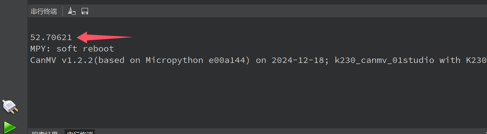

# Chip Temperature

K230芯片可以通过下面方式读取自身温度:

```python
temp = machine.temperature()
```

## 参考代码

```python
'''
实验名称：获取主控温度
实验平台：01Studio CanMV K230
教程：wiki.01studio.cc
'''

import machine

temp = machine.temperature() #获取温度值

print(temp) #打印温度值

```

## 实验结果

运行代码，结果如下图：

