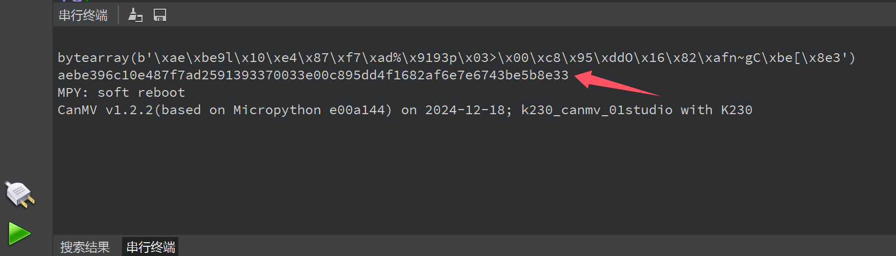

# CHIP ID

每一个K230芯片都有唯一ID编号用于区分，可以通过下面方式读取:

```python
chipid = machine.chipid()
```

## 参考代码

```python
'''
实验名称：获取主控ID编号
实验平台：01Studio CanMV K230
教程：wiki.01studio.cc
'''

import machine

#原始ID，32位
chipid = machine.chipid()
print(chipid)

#转成字符串方便查看
hex_str = ''
for i in range(len(chipid)):
    hex_str = hex_str + "{:02x}".format(chipid[i])
print(hex_str)

```

## 实验结果

运行代码，结果如下图：

